## Planar Linkages {#chap-10-planar-linkages}

```{r setup-101, include=FALSE}
## include the helpers.R file for pdf output of youtube on pdfs as a clickable link
source("R/helpers.R")
inject_jquery()
## include the required packages to make sure the page can be built.
source("R/required_packages.R")

## Set a consistent theme for all plots
theme_linkage10 <- theme_minimal() +
  theme(
    plot.title = element_text(hjust = 0.5, size = 14 * diagram_text_scale, face = "bold"),
    plot.subtitle = element_text(hjust = 0.5, size = 10 * diagram_text_scale),
    axis.text = element_blank(),
    axis.title = element_blank(),
    axis.ticks = element_blank(),
    panel.grid = element_blank(),
    plot.background = element_rect(fill = "white", color = NA),
    panel.background = element_rect(fill = "white", color = NA)
  )
```

### Learning Objectives {#sec-objectives-linkages}

By the end of this chapter, you will be able to:

1. **Classify** joints as lower pair, higher pair, or compound and state the DOF removed by each
2. **Identify** the six lower-pair joint types and their standard letter symbols
3. **Sketch** the schematic representation of planar linkages using standard conventions
4. **Apply** the numbering system for links and joints in a planar linkage diagram
5. **Define** degrees of freedom and mobility and explain their physical meaning
6. **Calculate** the mobility of any planar linkage using the Gruebler–Kutzbach formula
7. **Handle** compound (coincident) joints and higher pairs correctly in a mobility calculation
8. **Recognise** common M = 1 linkage families including six-bar chains
9. **Explain** the concept of linkage inversion and identify industrial applications of inversions

::: {.callout-think}
**Before You Read:** A car door opens and closes smoothly along a precise arc. A folding chair locks rigid under your weight but folds flat for storage. An excavator arm digs with enormous force and then repositions with surprising speed. All of these are *mechanisms* — assemblies of rigid bodies connected by joints. Before reading on, ask yourself: what makes one joint different from another, and how would you count how many ways a mechanism can move?
:::

### Introduction to Planar Linkages {#sec-linkages10-intro}

A **mechanism** is an assembly of rigid bodies (**links**) connected by **joints** in such a way that a constrained, predictable motion is produced. When all links move in parallel planes, the mechanism is called a **planar linkage**. Planar linkages are by far the most common class of mechanism in engineering: four-bar linkages, slider-cranks, toggle clamps, windshield wipers, recliner chairs, and landing gear retractors are all examples.

Understanding planar linkages begins with two fundamental questions:

1. **What kind of joint connects two links?** The joint type determines how many ways the connected bodies can move relative to each other.
2. **How many ways can the whole mechanism move?** This is the concept of **mobility** or **degrees of freedom**, and it determines whether a mechanism needs one input, two inputs, or none at all.

::: {.callout-industry}
**Industry Application:** In an automotive assembly plant, robot arms are planar (or near-planar) linkages. The number of controllable joints — each requiring a separate motor and controller — directly determines cost. Engineers minimise mobility to the minimum needed for the task.
:::

***

### Types of Joints {#sec-joint-types-10}

A **joint** (also called a **kinematic pair**) is a connection between two links that permits relative motion while constraining other motions. Joints are classified into three families:

- **Lower pair joints** — surface (area) contact between mating surfaces
- **Higher pair joints** — point or line contact between mating surfaces
- **Compound joints** — multiple links sharing a single joint location

The classification matters because each joint type removes a specific number of degrees of freedom from the connected pair of bodies.

#### Lower Pair Joints {#sec-lower-pairs-10}

Lower pairs have **surface-to-surface** contact. Because load is distributed over an area, lower pairs can transmit large forces and are preferred in heavy-duty applications. There are exactly **six** lower pair types.

```{r fig-lower-pair-table-10, echo=FALSE, fig.cap="The six lower-pair joint types with their connectivity (degrees of freedom permitted), standard letter symbols, typical physical form, and sketch symbol. (R) Revolute, (P) Prismatic, (H) Helical/Screw, (C) Cylindric, (S) Spherical, (PL) Planar.", fig.align='center', out.width='85%'}
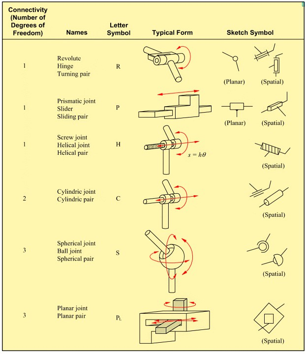
```

Table @tbl-lower-pair-summary-10 summarises the key characteristics of each lower-pair joint.

```{r tbl-lower-pair-summary-10, echo=FALSE, message=FALSE}
lower_pairs <- tribble(
  ~Symbol, ~Names,                        ~DOF_Allowed, ~DOF_Removed, ~Description,
  "R",  "Revolute / Pin / Hinge",          1, 2, "Pure rotation about one axis",
  "P",  "Prismatic / Slider",              1, 2, "Pure translation along one axis",
  "H",  "Helical / Screw",                 1, 2, "Coupled rotation and translation (s = h·θ)",
  "C",  "Cylindric",                        2, 1, "Rotation and translation about/along same axis",
  "S",  "Spherical / Ball-and-Socket",     3, 0, "Rotation about any axis through the centre",
  "PL", "Planar",                           3, 0, "Translation in a plane plus rotation about normal"
)

lower_pairs %>%
  kbl(caption = "Summary of the six lower-pair joint types",
      col.names = c("Symbol", "Names", "DOF Permitted", "DOF Removed (planar)", "Description"),
      booktabs = TRUE) %>%
  kable_styling(latex_options = c("hold_position", "scale_down"), full_width = knitr::is_html_output()) %>%
  row_spec(0, background = "#1565C0", color = "white") %>%
  row_spec(c(1, 2), background = "#E3F2FD") %>%
  row_spec(c(3, 4), background = "#FFF8E1") %>%
  row_spec(c(5, 6), background = "#F3E5F5")
```

::: {.callout-check}
**Quick Check:** A pin joint in a four-bar linkage is which lower-pair type? How many degrees of freedom does it remove in a planar mechanism?
:::

::: {.question}
Why does a **revolute (R)** joint remove **2 DOF** in a planar mechanism?
:::

::: {.answer}
A free rigid body in a plane has **3 DOF** — it can translate in x, translate in y, and rotate about the z-axis. A revolute joint constrains the two connected links to share the same pivot point, eliminating both x and y translation relative to each other. Only rotation remains — 1 DOF allowed, 2 DOF removed.
:::

***

#### Higher Pair Joints {#sec-higher-pairs-10}

Higher pairs have **point or line contact** between the two mating bodies. Because contact area is small, stress concentrations are high and higher pairs are typically used for force transmission over short distances (cams, gears) rather than structural support. The number of DOF a higher pair removes depends on the geometry of contact.

```{r fig-higher-pair-table-10, echo=FALSE, fig.cap="Higher-pair joint types: from a cylindrical roller (1 DOF) up to a spatial point contact (5 DOF). Note how the connectivity (DOF allowed) increases as geometric constraint is reduced.", fig.align='center', out.width='85%'}
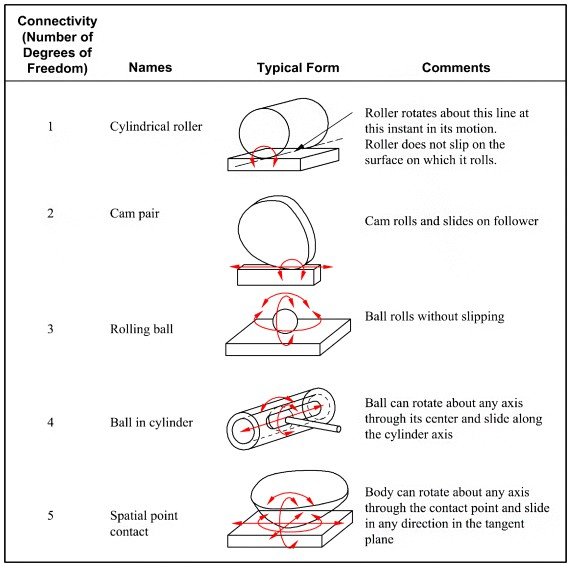
```

The two higher-pair types most common in planar mechanisms are:

| Joint | DOF Permitted | DOF Removed (planar) | Notes |
|:------|:-------------:|:--------------------:|:------|
| **Cylindrical roller** (rolling without slip) | 1 | 2 | Rolls on a flat surface; no sliding |
| **Cam pair** | 2 | 1 | Cam rolls *and* slides on follower |

::: {.callout-industry}
**Industry Application:** Automotive overhead cam engines use cam pairs to open and close valves. The cam (rotating) pushes against a follower (translating). The 2 DOF of the cam pair (roll + slide) is essential — it allows the follower to rise and fall smoothly regardless of cam profile shape, without binding.
:::

***

#### Compound Joints {#sec-compound-joints-10}

A **compound joint** (also called a **multiple joint**) occurs when **three or more links** share the same joint location. This is common in complex linkages where multiple links pivot about the same point.

```{r fig-compound-joint-table-10, echo=FALSE, fig.cap="Compound joints: ball bearing / anti-friction bearing (connectivity 1), universal / Hooke / Cardan joint (connectivity 2), and roller slide / roller guide (connectivity 1). These combine features of lower and higher pairs.", fig.align='center', out.width='80%'}
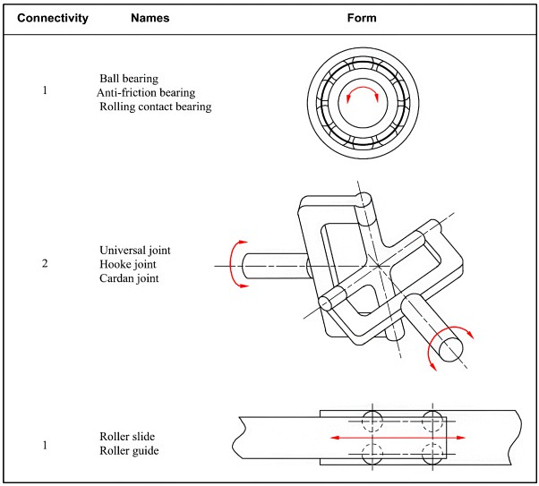
```

The critical rule for counting compound joints in mobility calculations is:

> **If $m$ links are all connected at the same joint location, that joint counts as $(m - 1)$ full joints.**

For example, if links 2, 3, and 4 all share a common revolute axis, that location counts as **2** full (1-DOF) joints, not 1.

::: {.callout-discussion}
**Group Discussion:** Look at the universal (Hooke/Cardan) joint shown in Figure @fig-compound-joint-table-10. It has connectivity 2. Where do you see this joint used in an automobile drivetrain, and why is the 2-DOF flexibility important there?
:::

***

### Schematic Representation of Planar Linkages {#sec-schematics-10}

Real mechanisms — water pumps, recliner chairs, robotic arms — are complex, three-dimensional objects. Before analysing them, engineers abstract them into **kinematic schematics**: simplified line diagrams that preserve the topology (what connects to what) and the joint types, but discard all shape, size, and material detail not needed for motion analysis.

#### Link Shapes and Their Schematic Equivalents {#sec-link-shapes-10}

The first step is recognising that physical link shapes reduce to simple schematic symbols:

```{r fig-link-schematics-10, echo=FALSE, fig.cap="Kinematic abstraction of links: (a) any binary link — regardless of physical shape — becomes a straight line segment with a circle at each joint; (b) ternary links (3 joints) become a triangle; (c) quaternary links (4 joints) become a quadrilateral. The physical shape between joints is irrelevant to the kinematic analysis.", fig.align='center', out.width='80%'}
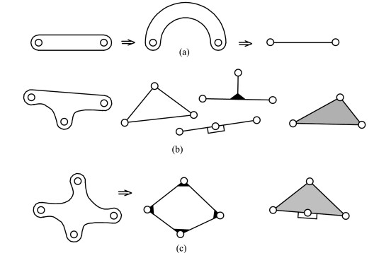
```

Links are classified by the number of joints they carry:

| Link Type | Joints | Schematic Shape | Example |
|:----------|:------:|:----------------|:--------|
| **Unary (singular)** | 1 | Single node | Fixed pivot (ground attachment) |
| **Binary** | 2 | Line segment with end nodes | Connecting rod, crank, rocker |
| **Ternary** | 3 | Triangle | Coupler with extension, rocker arm |
| **Quaternary** | 4 | Quadrilateral | Complex coupler, body with 4 joints |

::: {.callout-activity}
**Try This:** Look at the recliner chair or excavator in Figure @fig-practice-links-10 below. Sketch the kinematic schematic and classify each link as binary, ternary, or quaternary before checking the chapter practice section.
:::

```{r fig-practice-links-10, echo=FALSE, fig.cap="Practice: identify binary, ternary, and quaternary links in a recliner chair (adjustable mechanism) and a backhoe excavator arm.", fig.align='center', out.width='90%'}
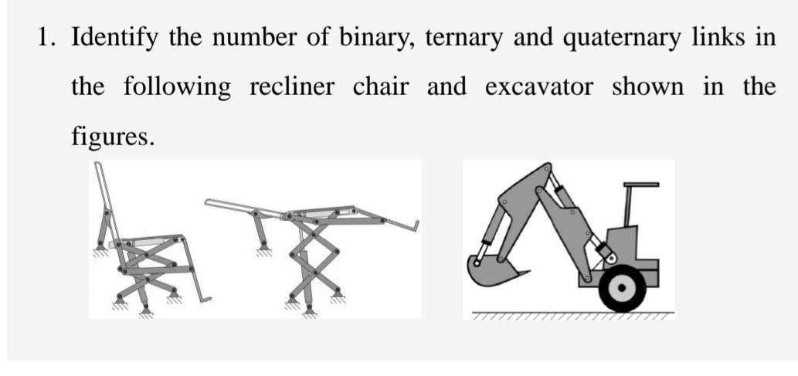
```

***

#### Joint Schematic Symbols {#sec-joint-symbols-10}

In kinematic schematics:

- A **revolute (pin) joint** is shown as a **small circle** at the connection between two links
- A **prismatic (slider) joint** is shown as a **rectangle (slider block)** on a line (the guide)
- A **fixed pivot** (joint attached to ground) uses **hatch marks** on the ground link
- A **compound joint** is still drawn as one circle but *labelled* or counted accordingly

#### Numbering Links and Joints {#sec-numbering-10}

The standard engineering convention for numbering is:

1. **Link 1** is always the **ground link** (the frame, base, or fixed link)
2. **Remaining links** are numbered 2, 3, 4, … in sequence, typically starting from the input link
3. **Joints** are labelled alphabetically (A, B, C, …) or by the joint type with a subscript (R₁, R₂, …)

```{r fig-linkage-numbering-10, echo=FALSE, fig.cap="Standard schematic and numbering for two common planar linkages. Left: RRRR (four-bar) linkage — link 1 is ground, links 2–4 are moving, joints R1–R4 are all revolute. Right: RRRP (slider-crank) linkage — link 4 is the slider (prismatic joint P1 connects it to ground).", fig.align='center', out.width='90%'}
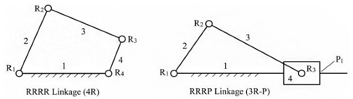
```

::: {.callout-industry}
**Industry Application:** The water pump shown in Figure @fig-water-pump-10 is a real-world RRRP (slider-crank) mechanism. Link 1 is the pump body (ground). The handle (link 2) and the connecting links (links 3 and 4) transmit motion from the operator's hand down to the piston. Joints A, B, and C are revolute pin joints. Note how the schematic numbering makes the mechanism instantly readable by any engineer, regardless of the physical shape of the pump body.
:::

```{r fig-water-pump-10, echo=FALSE, fig.cap="Water pump mechanism with kinematic numbering: link 1 = pump body (ground), links 2, 3, 4 = moving links, joints A, B, C = revolute (pin) joints. This is a RRRP slider-crank mechanism.", fig.align='center', out.width='60%'}
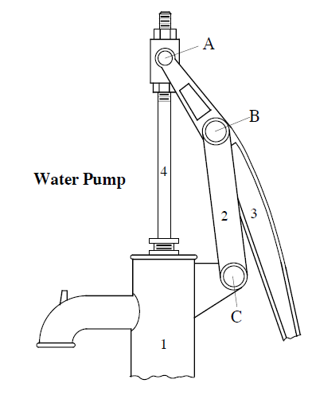
```

The naming convention **RRRR** or **RRRP** describes the joint sequence around the closed loop:

- **RRRR** — four-bar linkage (four revolute joints) → Figure @fig-linkage-numbering-10, left
- **RRRP** — slider-crank (three revolute + one prismatic) → Figure @fig-linkage-numbering-10, right

***

### Degrees of Freedom and Mobility {#sec-dof-10}

#### The Concept of Degrees of Freedom {#sec-dof-concept-10}

The **degree of freedom (DOF)** of a body is the number of **independent coordinates** needed to completely describe its position and orientation.

```{r fig-dof-body-10, echo=FALSE, fig.cap="A rigid body moving freely in a plane requires exactly three independent coordinates to specify its configuration: the x-position (X0), the y-position (Y0), and the orientation angle (θ). Therefore, a free planar body has 3 DOF.", fig.align='center', out.width='70%'}
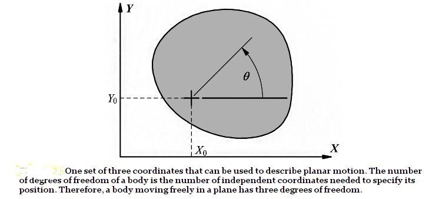
```

As Figure @fig-dof-body-10 shows, a single rigid body moving freely in a plane has **3 DOF**:

$$DOF_{free\ body} = 3 \quad (x_0,\ y_0,\ \theta)$$

When bodies are connected by joints, DOF are *removed*. Each full joint (1 DOF permitted, like a revolute or prismatic joint) removes **2 DOF** from the pair. Each half joint (2 DOF permitted, like a cam pair) removes **1 DOF** from the pair.

**Mobility** $M$ is the total DOF of the assembled mechanism — the number of independent inputs needed to fully control it:

- $M = 0$: **Structure** — no motion possible (rigid)
- $M = 1$: **Mechanism** — one input drives the entire system (ideal for most machines)
- $M = 2$: **Underconstrained** — requires two independent inputs (or uncontrolled motion)
- $M < 0$: **Overconstrained** — redundant constraints (statically indeterminate)

::: {.callout-think}
**Before You Calculate:** A bicycle frame is rigid ($M = 0$). A four-bar windshield wiper mechanism has $M = 1$. A car steering system with two independent inputs has $M = 2$. Can you think of a mechanism in your industry area that has $M = 1$?
:::

***

#### The Gruebler–Kutzbach Formula {#sec-gruebler-10}

The mobility of a **planar** mechanism is calculated using the **Gruebler–Kutzbach equation**:

$$
M = 3(n - 1) - 2j_1 - j_2
$$ {#eq-gruebler-10}

**Where:**

| Symbol | Meaning |
|:-------|:--------|
| $M$ | Mobility (total degrees of freedom of the mechanism) |
| $n$ | Total number of links, **including the ground link** |
| $j_1$ | Number of **full joints** (1 DOF each: revolute, prismatic, helical) |
| $j_2$ | Number of **half joints** (2 DOF each: cam pair, gear pair) |

The term $3(n-1)$ gives the DOF if all links were free (3 DOF each, minus 3 for the ground which is fixed). The terms $2j_1$ and $j_2$ subtract the constraints imposed by each joint.

::: {.callout-check}
**Quick Check:** Where does the "3" in $3(n-1)$ come from? Why is it $(n-1)$ and not $n$?

The 3 represents the 3 planar DOF of a free rigid body. The $(n-1)$ subtracts 1 because the ground link (link 1) is fixed — it contributes 0 free DOF.
:::

**Handling compound joints:** When $m$ links all meet at the same point, that location contributes $(m-1)$ full joints to $j_1$, not 1.

```{r fig-gruebler-visual-10, echo=FALSE, fig.width=10, fig.height=5, fig.align='center', fig.cap="Visual summary of the Gruebler-Kutzbach formula. Each free link contributes 3 DOF; each full joint (revolute, prismatic) removes 2; each half joint (cam, gear) removes 1. The ground link is already counted as fixed."}
ggplot() +
  geom_rect(aes(xmin = 1, xmax = 11, ymin = 5.5, ymax = 6.5), fill = "#1565C0", color = "black") +
  annotate("text", x = 6, y = 6,
           label = "M  =  3(n \u2212 1)  \u2212  2 j\u2081  \u2212  j\u2082",
           fontface = "bold", size = 6 * diagram_text_scale, color = "white") +
  geom_rect(aes(xmin = 1, xmax = 4, ymin = 3.5, ymax = 5.2), fill = "#E3F2FD", color = "#1565C0", linewidth = 1.2) +
  annotate("text", x = 2.5, y = 4.9, label = "n  =  number of links", fontface = "bold", size = 4 * diagram_text_scale, color = "#1565C0") +
  annotate("text", x = 2.5, y = 4.4, label = "Include ground link (link 1)", size = 3.2 * diagram_text_scale) +
  annotate("text", x = 2.5, y = 3.9, label = "Each free link = 3 DOF", size = 3.2 * diagram_text_scale, color = "steelblue") +
  geom_rect(aes(xmin = 4.3, xmax = 7.5, ymin = 3.5, ymax = 5.2), fill = "#FFF8E1", color = "#F57F17", linewidth = 1.2) +
  annotate("text", x = 5.9, y = 4.9, label = "j\u2081  =  full joints", fontface = "bold", size = 4 * diagram_text_scale, color = "#F57F17") +
  annotate("text", x = 5.9, y = 4.4, label = "Revolute (R), Prismatic (P)", size = 3.2 * diagram_text_scale) +
  annotate("text", x = 5.9, y = 3.9, label = "Each removes 2 DOF", size = 3.2 * diagram_text_scale, color = "#E65100") +
  geom_rect(aes(xmin = 7.8, xmax = 11, ymin = 3.5, ymax = 5.2), fill = "#F3E5F5", color = "#7B1FA2", linewidth = 1.2) +
  annotate("text", x = 9.4, y = 4.9, label = "j\u2082  =  half joints", fontface = "bold", size = 4 * diagram_text_scale, color = "#7B1FA2") +
  annotate("text", x = 9.4, y = 4.4, label = "Cam pair, Gear pair", size = 3.2 * diagram_text_scale) +
  annotate("text", x = 9.4, y = 3.9, label = "Each removes 1 DOF", size = 3.2 * diagram_text_scale, color = "#4A148C") +
  geom_rect(aes(xmin = 1, xmax = 11, ymin = 1.8, ymax = 3.2), fill = "#E8F5E9", color = "#2E7D32", linewidth = 1) +
  annotate("text", x = 6, y = 2.9, label = "Compound Joint Rule", fontface = "bold", size = 4 * diagram_text_scale, color = "#2E7D32") +
  annotate("text", x = 6, y = 2.45,
           label = "If m links share one joint location  \u2192  count it as (m \u2212 1) full joints", size = 3.5 * diagram_text_scale) +
  annotate("text", x = 6, y = 2.0,
           label = "Example: 3 links at one pin = 2 full joints  (j\u2081 += 2, not 1)", size = 3.2 * diagram_text_scale, color = "gray30") +
  coord_cartesian(xlim = c(0.5, 11.5), ylim = c(1.5, 7)) +
  theme_linkage10 +
  labs(title = "Gruebler\u2013Kutzbach Mobility Formula for Planar Mechanisms")
```

***

### Calculating Mobility: Worked Examples {#sec-mobility-examples-10}

#### Example 1: Simple Four-Bar Linkage {-}

```{r fig-ex1-fourbar-10, echo=FALSE, fig.cap="Example 1 — Simple planar four-bar linkage (RRRR). Link 1 is the ground (hatched). Links 2–4 are moving links. Four revolute joints connect them in a closed loop.", fig.align='center', out.width='70%'}
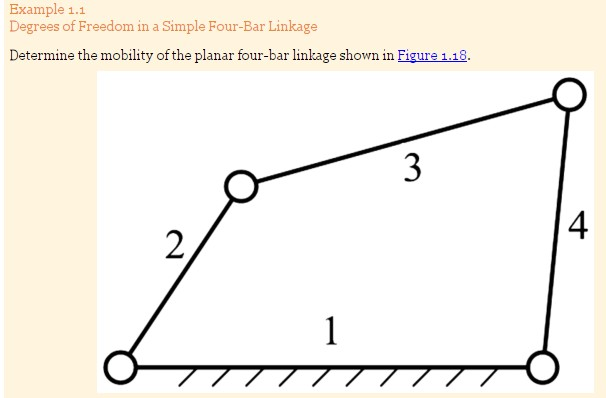
```

::: {.question}
###### Problem Statement {-}

Determine the mobility of the planar four-bar linkage shown in Figure @fig-ex1-fourbar-10. All joints are revolute (pin) joints.
:::

::: {.answer}
###### Solution {-}

**Step 1: Count links ($n$)**

| Link | Description |
|:-----|:------------|
| Link 1 | Ground (fixed frame) |
| Link 2 | Input crank |
| Link 3 | Coupler |
| Link 4 | Output rocker |

$$n = 4$$

**Step 2: Count full joints ($j_1$)**

There are 4 revolute (pin) joints — one at each corner of the four-bar loop.

$$j_1 = 4$$

**Step 3: Count half joints ($j_2$)**

No cam or gear pairs are present.

$$j_2 = 0$$

**Step 4: Apply Equation** @eq-gruebler-10

$$M = 3(4 - 1) - 2(4) - 0 = 9 - 8 = \boxed{1}$$

**Conclusion:** The four-bar linkage has **M = 1** — it is a proper mechanism requiring exactly one input (e.g., a motor driving the crank).
:::

```{r mobility-ex1-calc-10, echo=FALSE, message=FALSE}
n <- 4; j1 <- 4; j2 <- 0
M <- 3*(n-1) - 2*j1 - j2
ex1 <- tribble(
  ~Step, ~Value, ~Running_Total,
  "Free DOF: 3(n-1) = 3(4-1)", "3 \u00d7 3 = 9", "9",
  "Subtract full joints: -2j\u2081 = -2(4)", "-8", "9 - 8 = 1",
  "Subtract half joints: -j\u2082 = 0", "0", "1 - 0 = 1",
  "Result: M", "", paste0("M = ", M, " \u2192 Mechanism (1 input needed)")
)
ex1 %>%
  kbl(caption = "Mobility calculation for the four-bar linkage",
      col.names = c("Calculation Step", "Value", "Running Total"),
      booktabs = TRUE) %>%
  kable_styling(latex_options = "hold_position", full_width = knitr::is_html_output()) %>%
  row_spec(0, background = "#1565C0", color = "white") %>%
  row_spec(4, background = "#C8E6C9", bold = TRUE)
```

***

#### Example 2: Complex Multi-Link Mechanism {-}

```{r fig-ex2-complex-10, echo=FALSE, fig.cap="Example 2 — Complex planar linkage with 7 links, 3 fixed pivots (ground joints), and 8 revolute joints total. All joints have connectivity 1 (full joints). Link numbering follows standard convention.", fig.align='center', out.width='75%'}
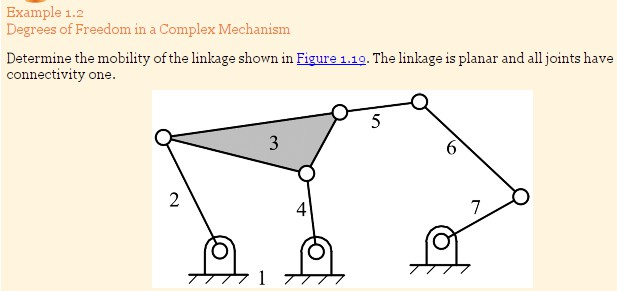
```

::: {.question}
###### Problem Statement {-}

Determine the mobility of the planar linkage shown in Figure @fig-ex2-complex-10. The mechanism is planar and **all joints have connectivity 1**.
:::

::: {.answer}
###### Solution {-}

**Step 1:** $n = 7$ (links 1 through 7, link 1 = ground)

**Step 2:** $j_1 = 8$ (count all joint circles — three ground pivots + five moving pivots)

**Step 3:** $j_2 = 0$

**Step 4:**

$$M = 3(7 - 1) - 2(8) - 0 = 18 - 16 = \boxed{2}$$

**Conclusion:** This mechanism has **M = 2** — it requires **two independent inputs** to be fully controlled.
:::

```{r mobility-ex2-calc-10, echo=FALSE, message=FALSE}
n2 <- 7; j1_2 <- 8; j2_2 <- 0
M2 <- 3*(n2-1) - 2*j1_2 - j2_2
ex2 <- tribble(
  ~Step, ~Calculation, ~Result,
  "n = 7 links (incl. ground)", "3(7-1) = 3 \u00d7 6", "18",
  "j\u2081 = 8 full joints", "-2 \u00d7 8", "-16",
  "j\u2082 = 0 half joints", "0", "0",
  "M = 18 - 16 - 0", "", paste0("M = ", M2, " \u2192 Requires 2 inputs")
)
ex2 %>%
  kbl(caption = "Mobility calculation for the complex 7-link mechanism",
      col.names = c("Step", "Calculation", "Result"),
      booktabs = TRUE) %>%
  kable_styling(latex_options = "hold_position", full_width = knitr::is_html_output()) %>%
  row_spec(0, background = "#1565C0", color = "white") %>%
  row_spec(4, background = "#FFF9C4", bold = TRUE)
```

***

#### Example 3: Compound Joints (Coincident Links) {-}

```{r fig-ex3-compound-10, echo=FALSE, fig.cap="Example 3 — Planar linkage where links 3, 4, and 5 all share the same revolute joint axis (compound joint). The right-hand detail shows the physical slider-pin arrangement. This compound joint counts as (3-1) = 2 full joints.", fig.align='center', out.width='90%'}
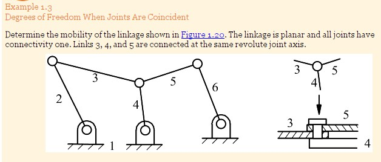
```

::: {.question}
###### Problem Statement {-}

Determine the mobility of the planar linkage in Figure @fig-ex3-compound-10. All joints have connectivity 1. **Links 3, 4, and 5 are all connected at the same revolute joint axis** (compound joint).
:::

::: {.answer}
###### Solution {-}

**Step 1:** $n = 6$ (links 1 through 6)

**Step 2: Count full joints — applying the compound joint rule**

At the location where links 3, 4, and 5 share the same axis: $m = 3 \Rightarrow (m-1) = 2$ full joints.

- Simple revolute joints elsewhere: 5 joints
- Compound joint (links 3, 4, 5): $(3-1) = 2$ joints

$$j_1 = 5 + 2 = 7$$

**Step 3:** $j_2 = 0$

**Step 4:**

$$M = 3(6 - 1) - 2(7) - 0 = 15 - 14 = \boxed{1}$$

**Conclusion:** Despite its apparent complexity, this mechanism has **M = 1**.

::: {.callout-check}
**Common Mistake:** Counting the compound joint as 1 (not 2) gives $M = 3(5) - 2(6) = 3$ — wrong. Always apply the $(m-1)$ rule.
:::
:::

***

#### Example 4: Mechanism Containing a Higher Pair {-}

```{r fig-ex4-higher-pair-10, echo=FALSE, fig.cap="Example 4 — Complex planar linkage with 11 links and a pin-in-slot joint (higher pair, fi = 2). The pin-in-slot allows both rotation and sliding between the connected links, so it removes only 1 DOF (half joint, j2 = 1).", fig.align='center', out.width='85%'}
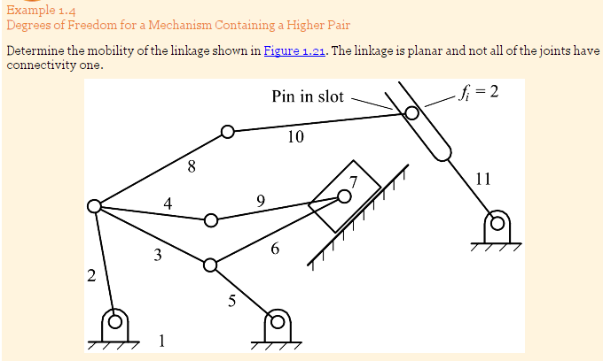
```

::: {.question}
###### Problem Statement {-}

Determine the mobility of the planar linkage shown in Figure @fig-ex4-higher-pair-10. The mechanism has 11 links and is planar. **One joint is a pin-in-slot** (labelled $f_i = 2$, meaning it permits 2 DOF, i.e. it is a half joint). All other joints are full revolute joints.
:::

::: {.answer}
###### Solution {-}

**Step 1: Count links ($n$)**

Counting from Figure @fig-ex4-higher-pair-10: links 1 through 11.

$$n = 11$$

**Step 2: Count full joints ($j_1$)**

All joints except the pin-in-slot are full revolute joints. Counting carefully from the figure: 13 full joints.

$$j_1 = 13$$

**Step 3: Count half joints ($j_2$)**

The pin-in-slot has $f_i = 2$ — it permits 2 DOF (rotation *and* sliding), so it removes only 1 DOF. This counts as a **half joint**.

$$j_2 = 1$$

**Step 4: Apply Equation** @eq-gruebler-10

$$M = 3(11 - 1) - 2(13) - 1 = 30 - 26 - 1 = \boxed{3}$$

**Conclusion:** This mechanism has **M = 3**, meaning three independent inputs are needed to fully define its configuration. In practice, if only one input is driven (say a motor on link 2), the remaining links have 2 uncontrolled degrees of freedom — useful only if additional constraints are imposed by loads or secondary actuators.
:::

```{r mobility-ex4-calc-10, echo=FALSE, message=FALSE}
n4 <- 11; j1_4 <- 13; j2_4 <- 1
M4 <- 3*(n4-1) - 2*j1_4 - j2_4
ex4 <- tribble(
  ~Step, ~Calculation, ~Result,
  "n = 11 links", "3(11-1) = 3 \u00d7 10", "30",
  "j\u2081 = 13 full joints (revolute)", "-2 \u00d7 13", "-26",
  "j\u2082 = 1 half joint (pin-in-slot)", "-1 \u00d7 1", "-1",
  "M = 30 - 26 - 1", "", paste0("M = ", M4, " \u2192 3 independent inputs needed")
)
ex4 %>%
  kbl(caption = "Mobility calculation for the mechanism with higher pair",
      col.names = c("Step", "Calculation", "Result"),
      booktabs = TRUE) %>%
  kable_styling(latex_options = "hold_position", full_width = knitr::is_html_output()) %>%
  row_spec(0, background = "#1565C0", color = "white") %>%
  row_spec(4, background = "#FFF9C4", bold = TRUE)
```

***

### Mobility Chart: Quick Reference {#sec-mobility-chart-10}

```{r fig-mobility-chart-10, echo=FALSE, fig.width=10, fig.height=5.5, fig.align='center', fig.cap="Mobility values and their physical meaning. M = 1 is the target for most single-actuator mechanisms."}
mob_data <- data.frame(
  M     = c(-1, 0, 1, 2, 3),
  label = c("M = -1\nOver-constrained\n(Redundant constraints)",
            "M = 0\nStructure\n(Rigid, no motion)",
            "M = 1\nMechanism\n(1 input needed) \u2713",
            "M = 2\nUnder-constrained\n(2 inputs needed)",
            "M = 3\nUnder-constrained\n(3 inputs needed)"),
  fill  = c("#FFCDD2", "#CFD8DC", "#C8E6C9", "#FFF9C4", "#F3E5F5"),
  border = c("#C62828", "#455A64", "#2E7D32", "#F9A825", "#6A1B9A")
)

ggplot(mob_data, aes(x = factor(M), y = 1)) +
  geom_tile(aes(fill = fill, color = border), linewidth = 1.5, width = 0.9, height = 0.6) +
  scale_fill_identity() +
  scale_color_identity() +
  geom_text(aes(label = label), size = 3.2 * diagram_text_scale, lineheight = 1.3, fontface = "bold") +
  geom_text(aes(x = "1", y = 1.45, label = "TARGET"), color = "#2E7D32", fontface = "bold", size = 4.5 * diagram_text_scale) +
  geom_segment(aes(x = "1", xend = "1", y = 1.35, yend = 1.32),
               arrow = arrow(length = unit(0.25, "cm"), type = "closed"),
               color = "#2E7D32", linewidth = 1.2) +
  scale_x_discrete(labels = c("M = -1", "M = 0", "M = 1", "M = 2", "M = 3")) +
  labs(title = "Mobility (M) and Physical Interpretation", x = "Mobility Value") +
  theme_linkage10 +
  theme(axis.text.x = element_text(size = 10 * diagram_text_scale, face = "bold"),
        plot.title = element_text(hjust = 0.5, size = 13 * diagram_text_scale, face = "bold")) +
  coord_cartesian(ylim = c(0.6, 1.6))
```

***

### Common M = 1 Linkage Families {#sec-m1-families-10}

Once you know how to calculate mobility, a natural next question is: *which combinations of links and joints give M = 1?* The Gruebler–Kutzbach formula rearranged for the M = 1 case shows that specific $(n, j_1)$ pairs satisfy this condition.

#### Structural Numbers for M = 1 {#sec-structural-numbers-10}

Setting $M = 1$ and $j_2 = 0$ in Equation @eq-gruebler-10 and solving gives the relationship $j_1 = \frac{3n - 4}{2}$, which requires $n$ to be even. Table @tbl-m1-solutions-10 lists valid combinations.

```{r fig-m1-solutions-table-10, echo=FALSE, fig.cap="Valid combinations of link count (n) and joint count (j) for planar linkages with M = 1 and all full joints. As n increases, the number of distinct topological configurations grows rapidly — from 1 configuration with 4 links up to 6856 configurations with 12 links.", fig.align='center', out.width='60%'}
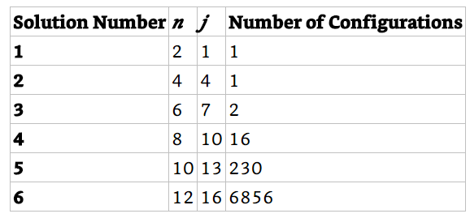
```

```{r tbl-m1-solutions-10, echo=FALSE, message=FALSE}
m1_sols <- tribble(
  ~n, ~j1, ~Configurations, ~Common_Name,
  2,  1,   1,     "Simple dyad (not a closed loop)",
  4,  4,   1,     "Four-bar linkage / slider-crank",
  6,  7,   2,     "Six-bar: Watt chain or Stephenson chain",
  8,  10,  16,    "Eight-bar linkages",
  10, 13,  230,   "Ten-bar linkages",
  12, 16,  6856,  "Twelve-bar linkages"
)
m1_sols %>%
  kbl(caption = "Valid (n, j) combinations for planar M = 1 mechanisms (all full joints)",
      col.names = c("Links (n)", "Full Joints (j\u2081)", "Distinct Configurations", "Common Name"),
      booktabs = TRUE) %>%
  kable_styling(latex_options = "hold_position", full_width = knitr::is_html_output()) %>%
  row_spec(0, background = "#1565C0", color = "white") %>%
  row_spec(2, background = "#C8E6C9", bold = TRUE) %>%
  row_spec(3, background = "#E3F2FD", bold = TRUE)
```

```{r fig-m1-solutions-diagrams-10, echo=FALSE, fig.cap="The two topologically distinct solutions of M = 1 for n = 4 links: (a) dyad (open chain, 2 links), (b) four-bar RRRR linkage, (c) slider-crank RRRP linkage. With n = 4 there is only 1 closed-loop configuration.", fig.align='center', out.width='80%'}
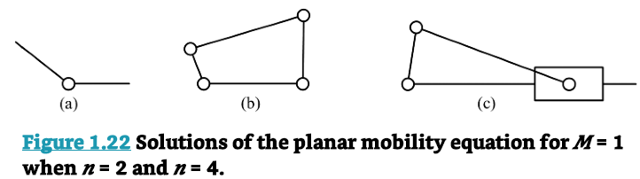
```

The key practical insight is that the **four-bar linkage** (n = 4, j₁ = 4) is the simplest closed-loop M = 1 mechanism, which explains why it is so ubiquitous in engineering. Moving to n = 6 opens up the **six-bar** families.

***

#### Four-Bar Linkage Variants {#sec-fourbar-variants-10}

The M = 1, n = 4 family includes both the RRRR and RRRP configurations:

```{r fig-fourbar-variants-10, echo=FALSE, fig.cap="Two M = 1 four-link linkage configurations: left — RRRR (four-bar, all revolute joints, closed loop), right — RRRP (slider-crank, three revolute plus one prismatic joint). Both produce M = 1 with n = 4 links.", fig.align='center', out.width='80%'}
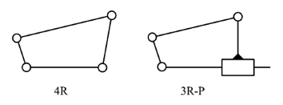
```

These are the two building blocks of most simple single-actuator machines. The RRRR four-bar converts rotation to oscillation (or rotation), while the RRRP slider-crank converts rotation to translation — the basis of piston engines and pumps.

***

#### Six-Bar Linkage Families {#sec-sixbar-10}

Moving to n = 6 gives two topologically distinct M = 1 chains, both with $j_1 = 7$:

```{r fig-watt-stephenson-10, echo=FALSE, fig.cap="The two six-bar M = 1 linkage families: Watt chain (left) — two ternary links are not directly connected; Stephenson chain (right) — two ternary links share a joint. Both have 6 links and 7 full joints. Shaded triangles represent ternary links.", fig.align='center', out.width='80%'}
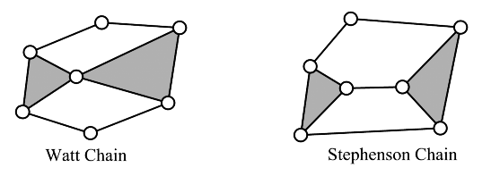
```

| Family | Ternary Link Connection | DOF Check | Application |
|:-------|:------------------------|:---------:|:------------|
| **Watt chain** | Two ternary links not adjacent | $3(5) - 2(7) = 1$ ✓ | Suspension linkages, six-bar presses |
| **Stephenson chain** | Two ternary links share a joint | $3(5) - 2(7) = 1$ ✓ | Variable-dwell mechanisms, walking machines |

::: {.callout-industry}
**Industry Application:** Six-bar Watt and Stephenson chains appear in stamping press feed mechanisms, where the additional link (versus a four-bar) allows independent control of both the stroke profile and the dwell period — something a four-bar alone cannot achieve.
:::

#### Linkages with Mixed Joint Types {#sec-mixed-joints-10}

When prismatic joints replace some revolute joints, new M = 1 families emerge with different motion characteristics:

```{r fig-2r2p-rprp-10, echo=FALSE, fig.cap="Alternative M = 1 four-link configurations using prismatic joints: left — 2R-2P linkage (two revolute, two prismatic joints); right — RPRP linkage (alternating revolute and prismatic). Both produce M = 1 with n = 4 links and j1 = 4.", fig.align='center', out.width='80%'}
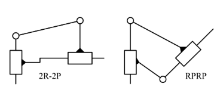
```

These mixed-joint families are used in:

- **2R-2P**: Scotch-yoke mechanisms (converts rotation to purely sinusoidal linear motion)
- **RPRP**: Oldham coupling (transmits rotation between parallel, offset shafts)

::: {.callout-discussion}
**Group Discussion:** In a food processing plant, a filling machine needs to move a nozzle in a pure straight line to fill bottles on a moving conveyor. Which linkage family (4R, 3R-P, 2R-2P, or RPRP) would you investigate first, and why?
:::

***

### Linkage Inversions {#sec-inversions-10}

A **kinematic inversion** is produced by **fixing a different link** of the same kinematic chain as the ground link. The relative motion between any two links remains unchanged — but which link appears to move and which appears fixed changes completely. This is a powerful design technique: one kinematic chain can produce multiple distinct machines.

> Inversion does not change the motion of any pair of links relative to each other. It only changes which link is observed as fixed.

#### Slider-Crank Inversions {#sec-slider-crank-inversions-10}

The RRRP slider-crank chain has **four possible inversions**, depending on which of the four links is fixed as ground:

```{r fig-slider-crank-inversions-10, echo=FALSE, fig.cap="Four inversions of the slider-crank (RRRP) kinematic chain. (a) Standard: link 1 (cylinder block) is ground — classic engine/pump; (b) link 2 is ground — oscillating cylinder mechanism; (c) link 3 is ground — Whitworth quick-return mechanism; (d) link 4 is ground — rotating cylinder mechanism. The relative motion between any two links is the same in all inversions.", fig.align='center', out.width='90%'}
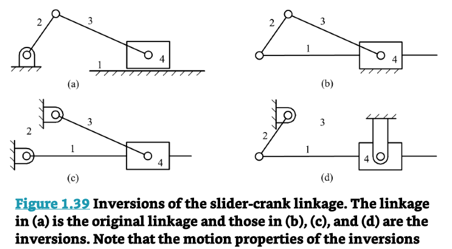
```

| Inversion | Fixed Link | Mechanism Type | Application |
|:----------|:----------:|:---------------|:------------|
| (a) Standard | Link 1 (cylinder) | Slider-crank | Piston engine, air compressor |
| (b) | Link 2 (crank) | Oscillating cylinder | Pneumatic actuator swing |
| (c) | Link 3 (coupler) | Whitworth quick-return | Shaper machine, fast-return tool |
| (d) | Link 4 (slider) | Rotating cylinder | Radial aircraft engine |

::: {.callout-industry}
**Industry Application (Defense):** The Whitworth quick-return mechanism (inversion c) was used in metal shaper machines to machine flat surfaces. The return stroke is faster than the cutting stroke, saving cycle time. In modern CNC machines, the same kinematic principle underlies asymmetric motion profiles programmed into servo controllers.
:::

#### Pin-in-Slot Inversions {#sec-pin-slot-inversions-10}

A pin-in-slot chain (which contains a higher pair) also yields multiple inversions with very different motion outputs:

```{r fig-pin-slot-inversions-10, echo=FALSE, fig.cap="Inversions of the pin-in-slot linkage chain. Left: pin-in-slot chain schematic. Centre: one inversion converts rotary input (ω3) to oscillatory output — useful for intermittent motion. Right: another inversion becomes a walking toy mechanism, where the output link traces a complex path resembling a walking gait.", fig.align='center', out.width='90%'}
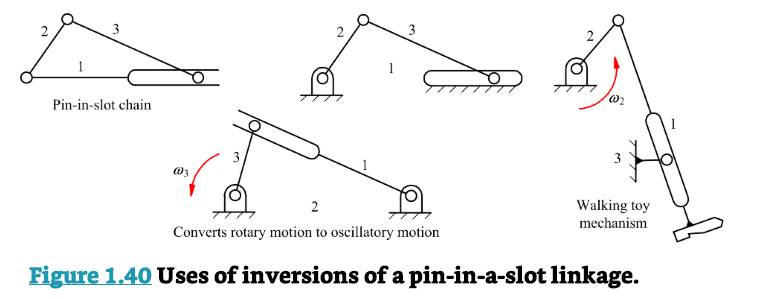
```

::: {.callout-think}
**Think About It:** The same kinematic chain produces both an industrial oscillation drive and a walking toy — just by fixing a different link. How does changing the ground link transform what the mechanism "does"?
:::

***

### Industrial Case Study: Front-End Loader Bucket Linkage {#sec-frontend-loader-10}

The front-end loader is an excellent example of planar linkage analysis in a real machine. The bucket support system is a multi-link planar linkage that must:

1. Lift the bucket from ground level to full height
2. Keep the bucket approximately level (parallel to ground) throughout the lift stroke
3. Allow the bucket to tilt for dumping

```{r fig-frontend-loader-photo-10, echo=FALSE, fig.cap="A front-end loader. If analysed using the planar mobility equation, the bucket support linkage will be found to have less than one degree of freedom by itself — parallel actuators are used on both sides of the machine to balance the load and increase stiffness, effectively creating a redundant (overconstrained) structure under symmetry assumptions.", fig.align='center', out.width='80%'}
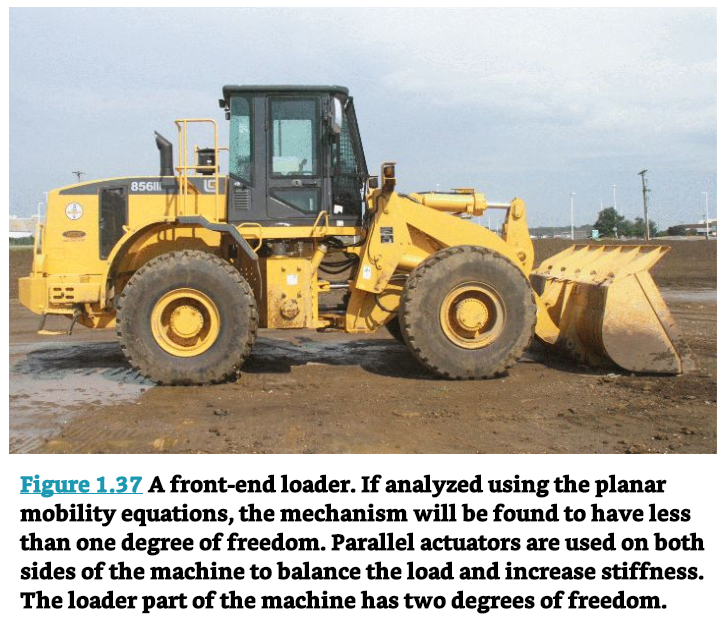
```

```{r fig-frontend-loader-schematic-10, echo=FALSE, fig.cap="Kinematic schematic of the bucket-support linkage for a front-end loader. Links are numbered 1 (frame/ground) through 4. The linkage is a four-bar chain (RRRR) that controls the bucket path during lift. A separate hydraulic cylinder (not shown) provides the tilt function.", fig.align='center', out.width='75%'}
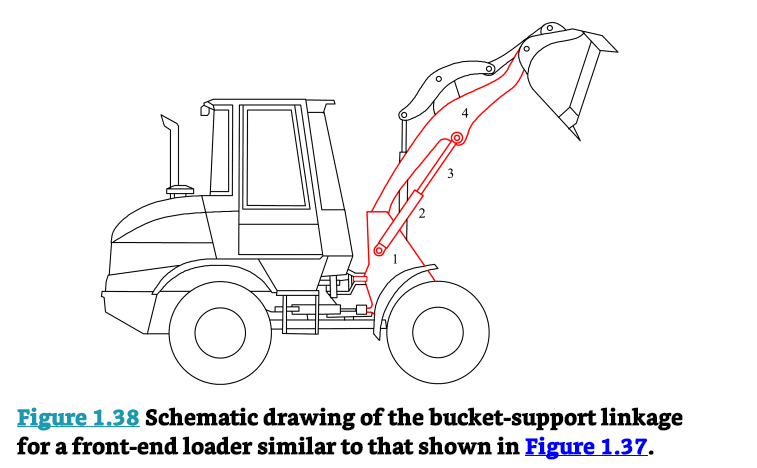
```

::: {.question}
###### Case Study Problem {-}

From the schematic in Figure @fig-frontend-loader-schematic-10:

a) Identify $n$, $j_1$, $j_2$ for the bucket-support linkage (links 1–4, all revolute joints)
b) Calculate mobility $M$
c) Explain why the real machine uses **parallel actuators** on both sides and what this implies about $M$
:::

::: {.answer}
###### Solution {-}

**a) Count links and joints:**

$n = 4$ (links 1, 2, 3, 4 as shown) $\quad j_1 = 4$ (four revolute joints) $\quad j_2 = 0$

**b) Mobility:**

$$M = 3(4-1) - 2(4) - 0 = 9 - 8 = 1$$

The bucket linkage itself is an M = 1 four-bar mechanism.

**c) Parallel actuators and real-world overconstrained design:**

In practice, the front-end loader has *identical* linkage assemblies on the left *and* right sides of the machine, both driven by the same hydraulic cylinder. If both sides are perfectly rigid and perfectly identical, the system is **overconstrained** (M < 1 when you count the full 3D structure). However, slight flexibility in the frame and hydraulic lines accommodates the redundancy while providing:

- Doubled load capacity (force shared across both linkages)
- Increased lateral stability (bucket does not tip sideways)
- Redundancy (one linkage can sustain partial loads if the other fails)

This deliberate overconstrained design is common in heavy equipment and is a key reason why the Gruebler–Kutzbach formula gives a different answer than the real-world behaviour — the formula assumes rigid links and perfect geometry.
:::

***

### Summary of Key Formulas {#sec-summary-formulas-10}

| Formula | Equation | When to Use |
|:--------|:---------|:------------|
| **DOF of free planar body** | $DOF = 3$ | Before any joints are added |
| **Gruebler–Kutzbach** | $M = 3(n-1) - 2j_1 - j_2$ | Any planar mechanism |
| **Compound joint rule** | $j_1\text{ contribution} = m - 1$ | When $m \geq 3$ links share one joint |
| **Full joint DOF removed** | 2 per joint | Revolute (R), Prismatic (P), Helical (H) |
| **Half joint DOF removed** | 1 per joint | Cam pair, Gear pair, Pin-in-slot |
| **M = 1 condition (all full joints)** | $j_1 = \frac{3n-4}{2}$ | Finding valid (n, j) combinations |

***

### Design Checklist {#sec-checklist-10}

**When analysing or designing a planar linkage:**

- [ ] Draw or obtain the kinematic schematic (not the physical drawing)
- [ ] Number all links starting from 1 (ground) in sequence
- [ ] Label all joints with type symbol (R, P, H, etc.) and number/letter
- [ ] Count $n$ — include the ground link (do not forget it)
- [ ] Count $j_1$: apply the $(m-1)$ compound joint rule at every multi-link joint
- [ ] Count $j_2$: identify all cam, gear, and pin-in-slot (higher) pairs
- [ ] Apply the Gruebler–Kutzbach formula: $M = 3(n-1) - 2j_1 - j_2$
- [ ] Interpret the result: $M = 1$ is desired for single-actuator machines
- [ ] If $M \neq 1$: add/remove links or joints to reach target mobility
- [ ] Consider inversions: can a different fixed link give a simpler or better mechanism?

***

### Practice Problems {#sec-practice-10}

::: {.question}
###### Problem 1 {-}

A slider-crank mechanism (RRRP) consists of: a crank (link 2), a connecting rod (link 3), a slider/piston (link 4), and the engine block as ground (link 1). There are three revolute joints and one prismatic joint.

a) Identify $n$, $j_1$, $j_2$
b) Calculate the mobility using Equation @eq-gruebler-10
c) What does this mobility value tell you about the number of actuators needed?
:::

::: {.answer}
###### Solution 1 {-}

a) $n = 4$, $j_1 = 4$ (three R + one P, all full joints), $j_2 = 0$

b) $M = 3(4-1) - 2(4) - 0 = 9 - 8 = 1$

c) $M = 1$ — exactly one motor drives the crankshaft, and the entire piston mechanism follows deterministically.
:::

::: {.question}
###### Problem 2 {-}

A folding chair mechanism has 5 links (including ground) and uses a pin-in-slot joint where the seat pin (a revolute joint on one link) rides in a slot (a prismatic guide) on another link. There are also 4 regular revolute joints.

a) Identify $n$, $j_1$, $j_2$
b) Calculate the mobility
c) Is this a valid single-actuator mechanism?
:::

::: {.answer}
###### Solution 2 {-}

a) $n = 5$, $j_1 = 4$ (four standard revolute joints), $j_2 = 1$ (the pin-in-slot = half joint)

b) $M = 3(5-1) - 2(4) - 1 = 12 - 8 - 1 = 3$

c) No — $M = 3$ means the chair has three unconstrained DOF in this configuration. In practice, the user's weight and contact with the floor impose additional constraints that make it behave as a structure ($M = 0$) when loaded, and collapsible ($M > 0$) when unloaded.
:::

::: {.question}
###### Problem 3 {-}

A Watt six-bar linkage has $n = 6$ links and $j_1 = 7$ full joints.

a) Calculate the mobility
b) How many more full joints would need to be added to convert it into a rigid structure ($M = 0$)?
c) Name one industrial application of a Watt six-bar mechanism
:::

::: {.answer}
###### Solution 3 {-}

a) $M = 3(6-1) - 2(7) - 0 = 15 - 14 = 1$ ✓

b) Adding one full joint reduces $M$ by 2 (from 1 to -1), which overshoots. Instead, adding a binary link with one joint adds $+3 - 2(1) = +1$ to $M$, and adding a binary link with 2 joints adds $+3 - 2(2) = -1$ to $M$. To go from $M = 1$ to $M = 0$ requires adding $+\frac{1}{2}$ of a full joint worth of constraint — i.e., adding one **half joint** ($j_2 = 1$) reduces $M$ by exactly 1.

c) Stamping press feeder, walking machine leg, variable-dwell mechanism.
:::

::: {.question}
###### Problem 4 (Challenge) {-}

An excavator arm (see Figure @fig-practice-links-10) has the following schematic: ground link + 4 moving links, 5 revolute joints, and 1 compound joint where 3 links share the same pin axis.

a) Determine $j_1$ correctly using the compound joint rule
b) Calculate the mobility
c) How many hydraulic actuators are needed to fully control this arm?
d) Name each inversion of a four-bar linkage and give one real-world application of each
:::

***

\newpage

### Key Takeaways {#sec-takeaways-10}

1. **Joint type determines constraint.** Lower pairs (surface contact) remove 2 DOF each (revolute, prismatic) or fewer; higher pairs (point/line contact) remove only 1 DOF. Compound joints count as $(m-1)$ full joints.

2. **Schematics strip away physical shape** and retain only topology and joint types. Standard conventions — link numbering from 1 (ground), alphabetic joint labels, circle symbols for revolute, rectangle for prismatic — allow any engineer to read a mechanism diagram.

3. **Mobility governs actuator count.** A well-designed single-actuator machine has $M = 1$. The Gruebler–Kutzbach formula $M = 3(n-1) - 2j_1 - j_2$ calculates this directly from the count of links and joints.

4. **Compound joints and higher pairs are the most common sources of errors.** Always check every joint location for compound joints (apply the $(m-1)$ rule) and correctly classify higher pairs as half joints ($j_2$).

5. **M = 1 requires specific (n, j) pairs.** With n = 4 there is one distinct closed-loop configuration; with n = 6 there are two (Watt and Stephenson chains). The number of configurations grows rapidly with link count.

6. **Inversion changes perspective, not physics.** Fixing a different link of the same kinematic chain produces a mechanically different machine while preserving all relative motions. Slider-crank inversions include the engine, the oscillating cylinder, the Whitworth quick-return, and the rotating cylinder mechanisms.

7. **The formula has limits.** Geometrically special mechanisms (e.g., parallelogram four-bar linkage) appear overconstrained by the formula but move freely in practice. Real heavy equipment often uses deliberate overconstrained designs for stiffness and load sharing. These cases require geometric analysis beyond Gruebler–Kutzbach.
