## Cam-Follower Mechanisms {#chap-10-cam-follower}

```{r setup-106, include=FALSE}
## include the helpers.R file for pdf output of youtube on pdfs as a clickable link
source("R/helpers.R")
## include the required packages to make sure the page can be built.
source("R/required_packages.R")

## Set a consistent theme for all plots in this chapter
theme_cam <- theme_minimal() +
  theme(
    plot.title    = element_text(hjust = 0.5, size = 14, face = "bold"),
    plot.subtitle = element_text(hjust = 0.5, size = 10),
    axis.title    = element_text(size = 11, face = "bold"),
    axis.text     = element_text(size = 9),
    panel.grid.minor  = element_blank(),
    legend.position   = "bottom",
    legend.title      = element_text(size = 10, face = "bold"),
    legend.text       = element_text(size = 9),
    plot.background   = element_rect(fill = "white", color = NA),
    panel.background  = element_rect(fill = "white", color = NA)
  )
```

### Learning Objectives {#sec:objectives-cam}

By the end of this chapter, you will be able to:

1. **Identify** the components and geometry of a cam-follower system
2. **Classify** follower types by contact geometry and motion type
3. **Distinguish** between force closure and form closure joint types
4. **Explain** the physical meaning of displacement, velocity, acceleration, jerk, snap, crackle, pop, lock, and drop
5. **Construct** a follower displacement diagram and calculate follower position using uniform, parabolic, harmonic, and cycloidal motion equations
6. **Evaluate** which motion type is most appropriate for a given operating speed and application

::: {.callout-think}
**Before You Read:** Every time you start a car, a cam is doing precision work. The engine's camshaft pushes small metal followers to open and close the intake and exhaust valves — sometimes more than 50 times per second at highway speed. What would happen if those followers moved too abruptly? What forces would be created? What would break first?
:::

***

### Introduction {#sec:cam-intro}

The **cam-follower mechanism** is one of mechanical engineering's most elegant solutions to a deceptively simple problem: *how do you convert smooth rotational motion into a precisely programmed up-and-down (or rocking) motion?*

A cam is a specially shaped rotating body. As it turns, it pushes against a **follower** — a component that traces the cam's profile. By designing the cam's shape, an engineer can program *exactly* how the follower moves: when it rises, how fast, when it pauses, and when it returns. This is far more flexible than a crank or linkage, which produce mathematically fixed motion curves.

Cam-follower systems are found in:

- **Automotive engines** — camshafts open and close valves with microsecond precision
- **Printing presses** — ink rollers are lifted and lowered for each impression
- **Food packaging machines** — filling heads rise and fall to dispense exact portions
- **Textile looms** — heddle frames are lifted in complex patterns to weave fabric
- **Automated assembly** — pick-and-place heads follow programmed rise-dwell-return sequences

::: {.callout-industry}
**Industry Application:** A typical automotive inline-four engine has two camshafts (one for intake, one for exhaust), each with eight lobes — one per valve. At 6,000 RPM, each lobe completes a full cycle 100 times per second. The cam profile must be designed so the follower never bounces, never slams, and opens the valve at precisely the right moment. A poorly designed cam profile at this speed causes valve float, noise, and engine damage.
:::

```{r cam-system-overview, echo=FALSE, out.width="80%", fig.align="center", fig.cap="Elements of a cam-follower system showing the cam, follower, and return spring (top), and a grooved cam with an oscillating follower (bottom). The spring provides force closure, keeping the follower in contact with the cam at all times."}
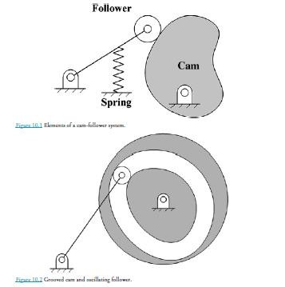
```

As seen in Figure \@ref(fig:cam-system-overview), the fundamental elements of any cam-follower system are:

| Component | Role |
|:----------|:-----|
| **Cam** | Rotating body whose profile defines the follower's motion program |
| **Follower** | Traces the cam profile; delivers the output motion |
| **Return spring** (force closure) | Keeps the follower pressed against the cam |
| **Frame / Housing** | Fixed ground that supports the cam shaft and guides the follower |

***

### Cam Geometry Terminology {#sec:cam-geometry}

Before designing any cam, you must understand the standard geometric terms. These terms define the relationship between the cam's physical shape and the follower's motion.

```{r cam-geometry-diagram, echo=FALSE, out.width="80%", fig.align="center", fig.cap="Cam geometry terminology: the base circle defines the smallest cam radius; the prime circle is the base circle plus the roller radius; the pitch curve is the path traced by the roller centre; the pressure angle is the angle between the follower motion direction and the normal to the pitch curve."}
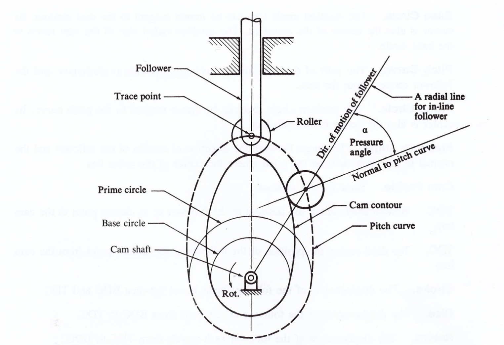
```

| Term | Definition | Engineering Significance |
|:-----|:-----------|:------------------------|
| **Base Circle** | Smallest circle centred on the cam shaft that the cam profile touches | Sets the minimum cam size; all follower positions measured outward from this |
| **Prime Circle** | Base circle + roller follower radius | The reference circle for roller-follower cam design |
| **Pitch Curve** | Path traced by the centre of a roller follower as the cam rotates | The true design curve; the physical cam profile is offset inward by the roller radius |
| **Cam Profile** | The actual machined surface of the cam | What gets cut; offset from the pitch curve |
| **Trace Point** | The theoretical contact point (centre of roller, tip of knife-edge) | The point whose path IS the pitch curve |
| **Pressure Angle** ($\alpha$) | Angle between the follower's direction of travel and the normal to the pitch curve | Controls side forces on the follower stem; must stay below ~30° for translating followers |
| **Lift** ($L$) | Total follower travel from lowest to highest position | Sets the design stroke; also called "stroke" or "rise" |

::: {.callout-check}
**Quick Check:** If the base circle radius is 25 mm and the roller follower radius is 8 mm, what is the prime circle radius?

*Answer: 25 + 8 = 33 mm. The pitch curve starts at 33 mm from the cam centre.*
:::

***

### Types of Cams {#sec:cam-types}

Cams come in many shapes. The profile shape and the axis of follower motion relative to the cam shaft define the cam type.

```{r cam-types-variety, echo=FALSE, out.width="95%", fig.align="center", fig.cap="Common types of cams. Top row (left to right): face cam, drum/barrel cam, OD/plate cam. Middle row: constant-diameter cam, yoke-type follower for positive-motion cam, wiper/involute cam. Bottom row: main-and-return cam, rectilinear-motion cam, tangential cam with roller follower, curved-flank cam with mushroom follower."}
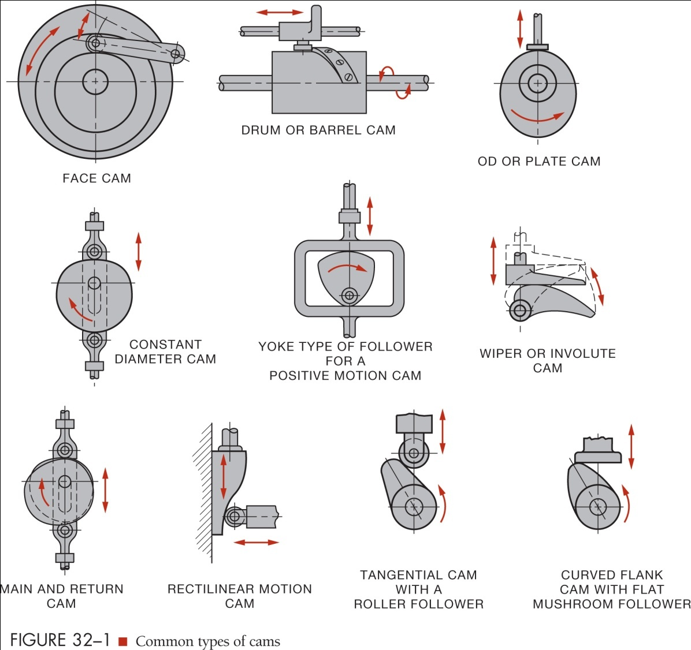
```

```{r cam-types-configurations, echo=FALSE, out.width="90%", fig.align="center", fig.cap="Cam configurations showing: (a) offset translating follower on a disc cam, (b) flat-faced follower, (c) mushroom follower, (d) knife-edge follower, (e) wedge cam with translating follower, (f) cylindrical cam with oscillating follower, (g) face cam, (h) dual plate cam with two followers."}
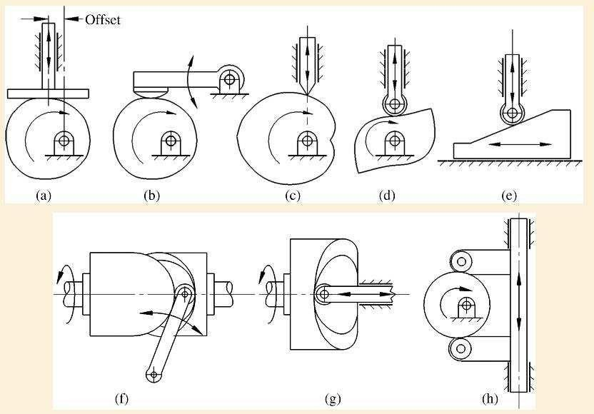
```

```{r cam-types-table, echo=FALSE, message=FALSE}
cam_types <- tribble(
  ~Type,                ~Description,                          ~Follower_Motion,         ~Application,
  "Disc / Radial Cam",  "Flat plate with profiled edge; most common type", "Translating or oscillating", "Engine camshafts, general machinery",
  "Cylindrical / Barrel Cam", "Groove cut into a cylinder; 3D cam", "Translating axially",  "Textile looms, machine tool tables",
  "Face Cam",           "Groove cut into the face (end) of a disc", "Translating radially",  "Indexing mechanisms, timing devices",
  "Wedge Cam",          "Translating wedge-shaped cam; not rotating", "Translating perpendicular", "Presses, clamping fixtures",
  "Constant-Diameter",  "Two parallel flanks; follower always between two points", "Translating or oscillating", "Pump mechanisms"
)

cam_types %>%
  kbl(caption = "Common Cam Types and Their Applications",
      col.names = c("Cam Type", "Description", "Follower Motion", "Typical Applications"),
      booktabs = TRUE) %>%
  kable_styling(latex_options = c("hold_position", "scale_down"), full_width = knitr::is_html_output()) %>%
  row_spec(0, background = "#D81B60", color = "white")
```

***

### Types of Cam Followers {#sec:follower-types}

The **follower** is the output link of the cam mechanism. Followers are classified by the geometry of their contact surface with the cam. Each type has trade-offs between friction, wear, allowable pressure angle, and manufacturing complexity.

```{r follower-types-norton, echo=FALSE, out.width="85%", fig.align="center", fig.cap="Three common follower types: (a) roller follower — a freely spinning wheel that rolls on the cam surface; (b) mushroom follower — a curved face that slides on the cam; (c) flat-faced follower — a flat plate that slides across the cam surface."}
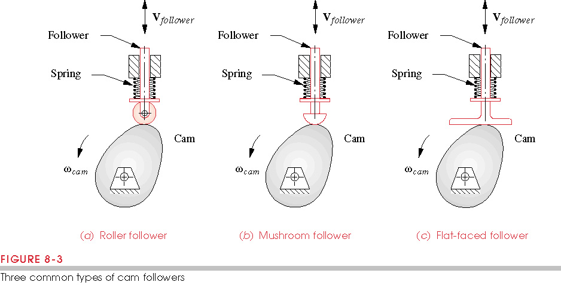
```

```{r follower-types-drawings, echo=FALSE, out.width="75%", fig.align="center", fig.cap="Follower cross-sections: (a) roller follower on disc cam showing the roller bearing; (b) mushroom (spherical-faced) follower; (c) flat-faced follower; (d) knife-edge follower showing the sharp point contact."}
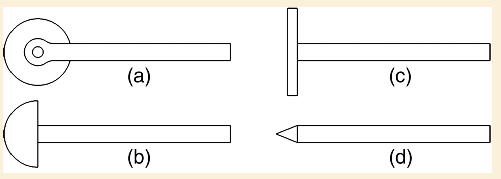
```

#### Knife-Edge Follower {-}

The **knife-edge follower** has a sharp pointed tip that contacts the cam at a single point. It is the simplest follower to analyse mathematically and is used extensively in textbook problems. In practice, however, the concentrated contact stress at the sharp tip leads to rapid wear of both the follower and the cam surface. Knife-edge followers are occasionally used in low-load, low-speed mechanisms where simplicity outweighs durability.

#### Roller Follower {-}

The **roller follower** has a small rotating wheel (the roller) at the tip, supported by a needle or ball bearing. The roller rolls along the cam surface, converting the sliding friction of other follower types into rolling friction. This dramatically reduces wear and allows for higher contact forces and higher operating speeds. The roller follower is the most widely used follower type in industrial machinery.

**Important design constraint:** The roller radius must be smaller than the minimum radius of curvature of the *pitch curve* at any concave section. If the roller is too large, it will undercut the cam profile and physically cannot follow the intended curve.

#### Mushroom (Spherical) Follower {-}

The **mushroom follower** has a convex spherical or curved face that slides on the cam surface. The curved face allows the follower to handle some side-loading without binding, making it useful when space constraints prevent using a roller. Mushroom followers are common in automotive overhead valve (OHV) engines where the cam lobe acts directly on a tappet (lifter) with a curved face.

#### Flat-Faced (Plate) Follower {-}

The **flat-faced follower** has a wide, flat contact surface. Because the contact area is large, the contact stress is lower than the knife-edge, and the flat face can accommodate cam profiles that would undercut a roller. The contact point between the cam and flat face shifts laterally as the cam rotates — the follower face must be wide enough to always remain in contact with the cam. Flat-faced followers are compact and commonly used in overhead-camshaft (OHC) automotive engines (you may have seen them called "bucket tappets").

```{r follower-comparison-table, echo=FALSE, message=FALSE}
follower_comp <- tribble(
  ~Type,           ~Contact,     ~Friction,   ~Wear_Rate, ~Side_Load,  ~Application,
  "Knife-edge",    "Point",      "High (sliding)", "Very high", "Poor",    "Textbook analysis only; instruments",
  "Roller",        "Line (rolling)", "Low",   "Low",       "Moderate",  "Industrial machinery, high-speed cams",
  "Mushroom",      "Area (curved face)", "Medium", "Medium", "Good",   "Automotive OHV lifters, limited space",
  "Flat-faced",    "Area (flat)", "Medium (sliding)", "Medium", "Poor", "Automotive OHC bucket tappets, compact drives"
)

follower_comp %>%
  kbl(caption = "Comparison of Cam Follower Types",
      col.names = c("Type", "Contact Geometry", "Friction", "Wear Rate", "Side Load Tolerance", "Typical Application"),
      booktabs = TRUE) %>%
  kable_styling(latex_options = c("hold_position", "scale_down"), full_width = knitr::is_html_output()) %>%
  row_spec(0, background = "#D81B60", color = "white") %>%
  row_spec(2, background = "#E8F5E9")
```

***

### Types of Follower Motion {#sec:follower-motion-types}

Followers are also classified by the *type of motion* they produce: translating (straight-line) or oscillating (rocking).

```{r follower-motion-types, echo=FALSE, out.width="85%", fig.align="center", fig.cap="(a) An oscillating cam-follower is kinematically equivalent to a four-bar linkage. (b) A translating cam-follower is equivalent to a slider-crank mechanism. Both can be analysed using these effective linkage models."}
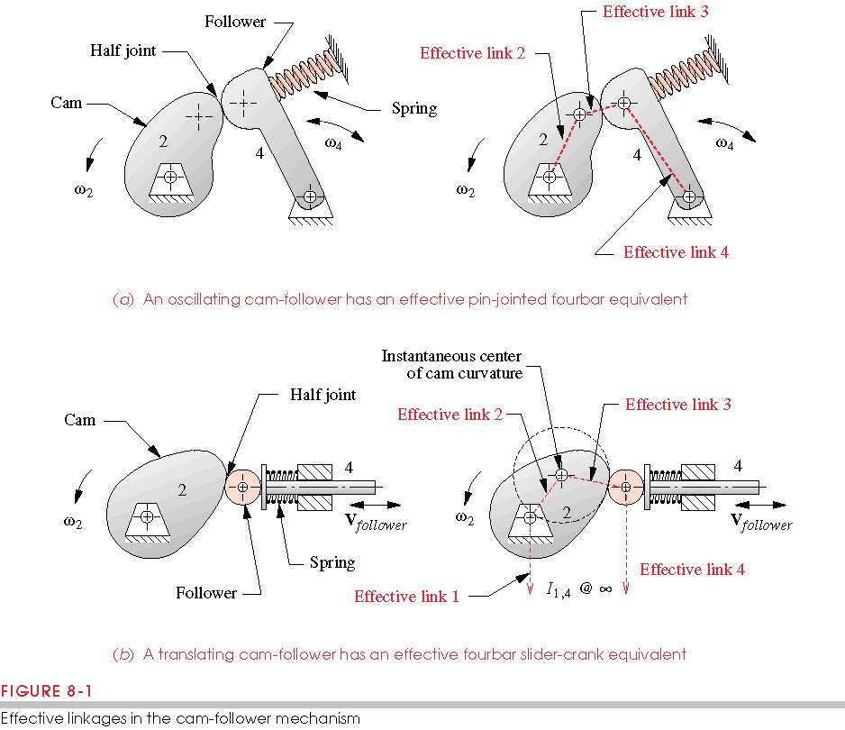
```

#### Translating Follower {-}

A **translating follower** moves in a straight line — either directly toward and away from the cam centre (**in-line** or **radial** follower) or offset to one side (**offset follower**). The follower is constrained to move along a fixed guide (a bore or slot in the housing).

- **In-line (radial) translating follower:** The follower stem passes through the cam axis. Simple to design and analyse.
- **Offset translating follower:** The follower axis is displaced laterally from the cam centre. The offset changes the pressure angle distribution and can reduce side forces on the follower stem — useful for high-force applications.

A translating follower is kinematically equivalent to a **slider-crank mechanism**, as shown in Figure \@ref(fig:follower-motion-types)(b). The cam replaces the crank and coupler, and the follower replaces the slider.

#### Oscillating (Pivoting) Follower {-}

An **oscillating follower** (also called a **rocker follower** or **pivoting follower**) is pinned to the frame at a fixed pivot point. Instead of moving in a straight line, it rocks back and forth through an arc as the cam rotates. This type of follower is kinematically equivalent to a **four-bar linkage**, as shown in Figure \@ref(fig:follower-motion-types)(a).

Oscillating followers are very common in internal combustion engine valve trains — the rocker arm is an oscillating follower. They can transmit large forces with low stem side-loads, and their geometry can be used to create mechanical advantage (lever ratio) between the cam and the valve.

::: {.callout-discussion}
**Group Discussion:** A diesel engine uses an overhead camshaft with oscillating followers (rocker arms) to operate the valves. An older pushrod gasoline engine uses translating followers (lifters) with pushrods. What are the tradeoffs between these two configurations? Think about: valve timing accuracy, component mass, friction, manufacturing cost, and maximum RPM.
:::

***

### Joint Closure: Keeping Follower on Cam {#sec:joint-closure}

The cam surface pushes the follower upward (during rise) but cannot pull it back down. Something must hold the follower *against* the cam at all times — especially during return and dwell. If the follower loses contact, it is called **follower jump** or **follower bounce**, and the programmed motion is completely lost. There are two families of solutions: **force closure** and **form closure**.

#### Force Closure {-}

In **force closure**, an external force (almost always a compressed spring) holds the follower against the cam surface at all times. The spring is preloaded so that its force always exceeds the maximum inertial force trying to lift the follower off the cam.

**Advantages:** Simple, inexpensive, and allows the cam and follower to be separated for assembly. The same principle is used in engine valve springs.

**Limitation:** At high speeds, the follower's own inertia can exceed the spring force during rapid return, causing follower jump. This sets a practical speed limit for any force-closed cam system.

#### Form Closure — Radial {-}

In **form closure**, the follower is mechanically trapped in a groove or track cut into the cam, so it cannot separate from the cam regardless of speed. The follower is constrained on both sides — it is *positively driven* in both directions.

In **radial form closure**, the groove is cut into the face of a disc cam (Figure \@ref(fig:form-closed-systems)(a) and (b)). The follower roller rides inside the groove and is physically unable to leave the cam surface. No return spring is needed.

**Advantage:** No follower jump possible — suitable for very high-speed applications.
**Disadvantage:** More complex to manufacture; the groove must be machined to tight tolerances; backlash in the groove can cause impact.

#### Form Closure — Axial {-}

In **axial form closure**, the groove is cut into the surface of a **cylindrical (barrel) cam** (Figure \@ref(fig:barrel-cam-photo)). The follower rides in the helical or patterned groove and is driven axially (parallel to the cam shaft axis) in both directions. This is common in textile machinery, automatic screw machines, and multi-spindle lathes where the cam must produce complex axial motion.

```{r form-closed-systems, echo=FALSE, out.width="85%", fig.align="center", fig.cap="Form-closed cam systems: (a) disc cam with groove for radial form closure with translating follower; (b) disc cam with groove for radial form closure with oscillating follower; (c) conjugate cam pair — two cams on the same shaft drive the follower in both directions, eliminating the need for a groove."}
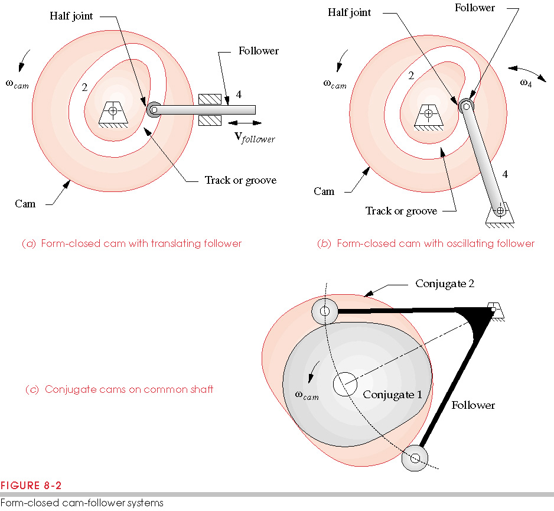
```

```{r barrel-cam-photo, echo=FALSE, out.width="80%", fig.align="center", fig.cap="Axial/cylindrical (barrel) cam with form-closed translating follower. The follower rides in a groove machined into the cylinder surface and translates parallel to the cam shaft axis — a classic example of axial form closure."}
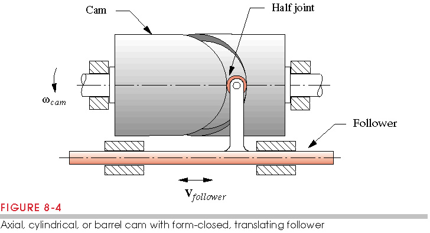
```

```{r closure-comparison-table, echo=FALSE, message=FALSE}
closure_comp <- tribble(
  ~Type,                  ~How_It_Works,                            ~Spring_Needed, ~Max_Speed,   ~Complexity,  ~Example,
  "Force Closure",        "Return spring holds follower on cam",     "Yes",          "Limited by spring force vs. inertia", "Low-Medium", "Automotive valve train",
  "Form Closure — Radial","Follower trapped in groove on cam face",   "No",           "High",       "Medium",     "Indexing dials, printing cams",
  "Form Closure — Axial", "Follower trapped in groove on cylinder",   "No",           "High",       "High",       "Textile looms, CNC feed cams"
)

closure_comp %>%
  kbl(caption = "Comparison of Joint Closure Methods",
      col.names = c("Closure Type", "How It Works", "Spring Needed?", "Max Speed", "Complexity", "Typical Application"),
      booktabs = TRUE) %>%
  kable_styling(latex_options = c("hold_position", "scale_down"), full_width = knitr::is_html_output()) %>%
  row_spec(0, background = "#D81B60", color = "white") %>%
  row_spec(1, background = "#FFF9E6") %>%
  row_spec(2:3, background = "#E8F5E9")
```

***

### The Displacement Diagram {#sec:displacement-diagram}

Before a cam profile can be designed or machined, the engineer must define a **displacement diagram** (also called a **follower motion program**). This is a graph showing how the follower position changes as the cam rotates through one complete revolution (0° to 360°).

```{r displacement-terminology, echo=FALSE, out.width="85%", fig.align="center", fig.cap="Follower displacement diagram terminology. The horizontal axis is cam rotation angle (0° to 360°); the vertical axis is normalized follower displacement (0 = lowest position, 1.0 = full lift). The four segments are: Rise (follower moves up), Dwell (follower holds position), Return (follower moves down), and Dwell again. Inflection points mark where the displacement curve changes concavity."}
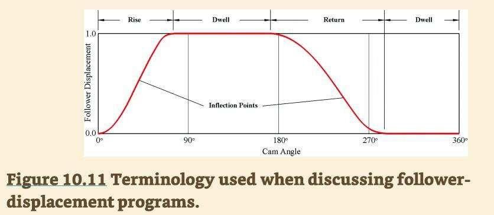
```

#### The Four Segments {-}

Every cam displacement program is built from combinations of four basic segments:

| Segment | Symbol | Description |
|:--------|:-------|:------------|
| **Rise** | $\beta_r$ | Follower travels from its lowest position to its highest position (lift $L$) over a cam angle of $\beta_r$ degrees |
| **Dwell** (high) | — | Follower holds at the highest position while the cam rotates |
| **Return** | $\beta_f$ | Follower travels from highest back to lowest position over cam angle $\beta_f$ degrees |
| **Dwell** (low) | — | Follower holds at the lowest position before the cycle repeats |

The **total lift** $L$ is the distance the follower travels from its lowest to its highest position, measured in mm or inches.

::: {.callout-think}
**Think About It:** Why would you ever want a dwell? Imagine a machine that fills bottles. The filling head rises to the bottle mouth (rise), holds position while liquid fills the bottle (dwell), then returns to the starting position (return) and waits for the next bottle (dwell). Without dwells, the filling time would be zero!
:::

#### Constructing the Displacement Diagram {-}

Here is the step-by-step process for creating a cam displacement diagram:

1. **Define the motion program:** List the required segments and their cam angles. Make sure all angles sum to 360°.
   - Example: Rise over 90°, Dwell for 90°, Return over 120°, Dwell for 60°

2. **Choose the total lift $L$:** This is the required follower stroke (e.g., 30 mm).

3. **Choose a motion type** for each rise and return segment (uniform, harmonic, cycloidal, etc. — discussed in the next section).

4. **Apply the displacement equation** for each segment at regular cam angle increments (every 10° is typical).

5. **Plot the results:** Cam angle ($\theta$) on the horizontal axis; follower displacement ($y$) on the vertical axis.

6. **Check the boundary conditions:** At the start and end of every segment, the displacement values must match smoothly.

```{r displacement-example-diagram, echo=FALSE, out.width="80%", fig.align="center", fig.cap="Example follower displacement diagram with harmonic motion: the follower rises 30 mm over approximately 90–200° of cam rotation, using a smooth harmonic curve with visible inflection points."}
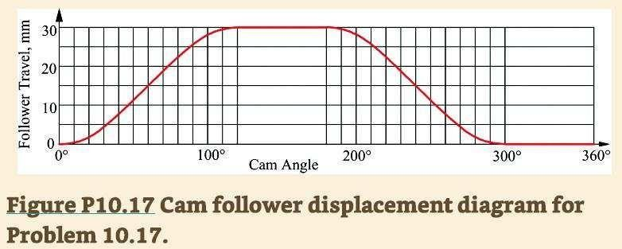
```

***

### Calculus in Cam Design: From Displacement to Drop {#sec:calculus-cams}

Here is one of the most important ideas in cam design: *the shape of the displacement curve controls everything else — velocity, acceleration, forces, vibration, and noise.* To understand why, we need to connect the displacement diagram to its mathematical derivatives. Don't worry — we'll explain the physics first.

#### What Does Differentiation Mean? {-}

**Differentiation** means finding the *slope* (rate of change) of a curve at any point.

> If the displacement curve is steep, the follower is moving fast → **high velocity**.
> If the displacement curve is flat (dwell), the slope is zero → **zero velocity**.
> If the velocity is changing rapidly, the follower is accelerating → **high acceleration**.

When you differentiate the displacement $s$ with respect to time $t$, you get velocity $v$. Differentiate velocity with respect to time, and you get acceleration $a$. Keep going, and you get jerk, snap, crackle, pop, lock, and drop.

$$\frac{ds}{dt} = v \quad \rightarrow \quad \frac{dv}{dt} = a \quad \rightarrow \quad \frac{da}{dt} = j \quad \rightarrow \quad \frac{dj}{dt} = \text{snap} \quad \rightarrow \quad \ldots$$

#### What Does Integration Mean? {-}

**Integration** is the reverse operation — it finds the *area under a curve*.

> Integrate the velocity curve → you get displacement (how far the follower has moved).
> Integrate the acceleration curve → you get velocity (how fast the follower is moving).

In cam design, we mostly *differentiate* the displacement to check how violent the motion is. But integration is useful when you have measured acceleration data from a sensor and want to reconstruct the velocity and displacement (a technique used in vibration analysis).

#### Connecting Displacement to Cam Angle {-}

In cam analysis, we often express derivatives in terms of cam angle $\theta$ (in degrees or radians) rather than time. The conversion uses the cam shaft angular velocity $\omega$ (in rad/s):

$$v = \frac{ds}{dt} = \frac{ds}{d\theta} \cdot \omega$$

$$a = \frac{d^2s}{dt^2} = \frac{d^2s}{d\theta^2} \cdot \omega^2$$

$$j = \frac{d^3s}{dt^3} = \frac{d^3s}{d\theta^3} \cdot \omega^3$$

This tells us something crucial: **the faster the cam spins ($\omega$ larger), the larger the acceleration and jerk become — even if the cam profile stays the same.** A cam that runs smoothly at 100 RPM may produce violent impacts at 1000 RPM.

#### The Complete Chain of Derivatives {-}

The table below lists every derivative of displacement from the 0th through the 8th order. In everyday engineering, only the first four (displacement through jerk) are routinely calculated. The higher-order derivatives are of academic and theoretical interest, though they matter in ultra-precision systems.

```{r derivatives-table, echo=FALSE, message=FALSE}
derivatives <- tribble(
  ~Order, ~Formal_Name,       ~Alt_Name,          ~Symbol,     ~Units_SI,       ~Physical_Meaning,                            ~Engineering_Importance,
  "0th",  "Displacement",     "—",                "$s$",        "mm",            "Position of the follower from datum",       "Defines the stroke; what the cam is designed to produce",
  "1st",  "Velocity",         "—",                "$v$",        "mm/s",          "Rate of change of position",                "Determines speed of follower; affects dynamic forces",
  "2nd",  "Acceleration",     "Abseleration*",    "$a$",        "mm/s²",         "Rate of change of velocity",               "Directly proportional to inertial force (F = ma); dominant concern at high speed",
  "3rd",  "Jerk",             "Abserk*",          "$j$",        "mm/s³",         "Rate of change of acceleration",           "Causes impact loads at transitions; infinite jerk = hammering; primary concern in cam design",
  "4th",  "Snap / Jounce",    "Absounce*",        "snap",       "mm/s⁴",        "Rate of change of jerk",                   "Drives structural vibration and fatigue; important in high-speed and precision cams",
  "5th",  "Crackle",          "—",                "—",          "mm/s⁵",        "Rate of change of snap",                   "Material stress waves; relevant in ultraprecision and micro-mechanisms",
  "6th",  "Pop",              "—",                "—",          "mm/s⁶",        "Rate of change of crackle",                "Acoustic emission; audible snap/crack in mechanisms",
  "7th",  "Lock",             "—",                "—",          "mm/s⁷",        "Rate of change of pop",                    "System resonance and mode coupling effects",
  "8th",  "Drop",             "—",                "—",          "mm/s⁸",        "Rate of change of lock",                   "Beyond practical design; theoretical completeness"
)

derivatives %>%
  kbl(caption = "The Complete Derivative Chain for Displacement. (*) Informal/humorous names sometimes used in teaching. Formal names should always be used in professional practice.",
      col.names = c("Order", "Formal Name", "Informal Name", "Symbol", "SI Units", "Physical Meaning", "Engineering Importance"),
      booktabs = TRUE) %>%
  kable_styling(latex_options = c("hold_position", "scale_down"), full_width = knitr::is_html_output()) %>%
  row_spec(0, background = "#D81B60", color = "white") %>%
  row_spec(1, background = "#E3F2FD") %>%
  row_spec(2, background = "#E8F5E9") %>%
  row_spec(3, background = "#FFF3E0") %>%
  row_spec(4, background = "#FCE4EC", bold = TRUE) %>%
  row_spec(5, background = "#EDE7F6") %>%
  row_spec(6:9, background = "#F5F5F5")
```

::: {.callout-think}
**The Snap-Crackle-Pop Connection:** The names snap, crackle, and pop for the 4th, 5th, and 6th derivatives are a physics community joke referencing the Rice Krispies cereal mascots. Lock and drop continue the sequence. The informal teaching names "abseleration," "abserk," and "absounce" are playful extensions of this naming tradition — but in a professional report or exam, always use the formal terms: acceleration, jerk, and snap/jounce.
:::

#### Why Jerk Matters Most {-}

The most important derivative to control in cam design is **jerk**. Here is why:

- **Displacement** ($s$): defines what we need — the follower stroke.
- **Velocity** ($v$): tells us how fast the follower moves.
- **Acceleration** ($a$): creates inertial forces ($F = ma$). At high speed, these can be very large, but they are *predictable and steady*. Springs and structure can be designed to handle them.
- **Jerk** ($j$): is the *rate of change of force*. When jerk is infinite (as we will see with uniform motion), the force changes instantaneously — like a hammer blow. No spring or structure can properly absorb an instantaneous change in force. This causes **impact loading**, which leads to noise, vibration, and premature wear.

> **The Golden Rule of Cam Design:** *Never allow infinite jerk in a high-speed cam.* The choice of motion type (next section) is all about controlling jerk.

***

### Motion Types for Cam Design {#sec:motion-types}

The "shape" of the rise and return segments in the displacement diagram determines whether the follower motion is smooth or violent. There are five standard motion types, ranging from simple-but-dangerous to complex-but-smooth.

We will use a standard example throughout this section:
- **Total lift:** $L = 1.0$ (normalized)
- **Rise:** cam angle $\theta = 0°$ to $90°$ ($\beta_{rise} = 90°$)
- **Dwell high:** $90°$ to $180°$
- **Return:** $180°$ to $300°$ ($\beta_{return} = 120°$)
- **Dwell low:** $300°$ to $360°$

```{r motion-type-comparison, echo=FALSE, message=FALSE, fig.width=11, fig.height=7, fig.align='center', fig.cap="Displacement comparison of the four main follower motion types over a full 360° cam rotation. The program is: rise 0–90°, dwell 90–180°, return 180–300°, dwell 300–360°. All types reach the same lift (L = 1.0) and have the same rise and return angles, but the shape of the curve differs significantly."}

## Define the motion program
L        <- 1.0
beta_r   <- 90    ## rise angle, degrees
beta_f   <- 120   ## return (fall) angle, degrees
dwell1_end  <- 180  ## end of high dwell
theta_seq   <- seq(0, 360, by = 0.5)

## Compute displacement for a given type over the full cycle
compute_disp <- function(theta, L, beta_r, dwell1_end, beta_f, type) {
  rise_start   <- 0
  rise_end     <- beta_r
  fall_start   <- dwell1_end
  fall_end     <- dwell1_end + beta_f

  y <- numeric(length(theta))
  for (i in seq_along(theta)) {
    t <- theta[i]
    if (t <= rise_end) {
      ## Rise segment
      tb <- t - rise_start
      b  <- beta_r
      if (type == "uniform") {
        y[i] <- L * tb / b
      } else if (type == "parabolic") {
        if (tb <= b/2) {
          y[i] <- 2*L*(tb/b)^2
        } else {
          y[i] <- L - 2*L*((b - tb)/b)^2
        }
      } else if (type == "harmonic") {
        y[i] <- L/2 * (1 - cos(pi * tb / b))
      } else if (type == "cycloidal") {
        y[i] <- L * (tb/b - (1/(2*pi)) * sin(2*pi*tb/b))
      }
    } else if (t <= fall_start) {
      y[i] <- L  ## Dwell high
    } else if (t <= fall_end) {
      ## Return segment
      tb <- t - fall_start
      b  <- beta_f
      if (type == "uniform") {
        y[i] <- L - L * tb / b
      } else if (type == "parabolic") {
        if (tb <= b/2) {
          y[i] <- L - 2*L*(tb/b)^2
        } else {
          y[i] <- 2*L*((b - tb)/b)^2
        }
      } else if (type == "harmonic") {
        y[i] <- L/2 * (1 + cos(pi * tb / b))
      } else if (type == "cycloidal") {
        y[i] <- L * (1 - (tb/b - (1/(2*pi)) * sin(2*pi*tb/b)))
      }
    } else {
      y[i] <- 0  ## Dwell low
    }
  }
  return(y)
}

## Compute for all four types
df_disp <- data.frame(
  theta     = rep(theta_seq, 4),
  y         = c(compute_disp(theta_seq, L, beta_r, dwell1_end, beta_f, "uniform"),
                compute_disp(theta_seq, L, beta_r, dwell1_end, beta_f, "parabolic"),
                compute_disp(theta_seq, L, beta_r, dwell1_end, beta_f, "harmonic"),
                compute_disp(theta_seq, L, beta_r, dwell1_end, beta_f, "cycloidal")),
  type      = rep(c("Uniform", "Parabolic", "Harmonic", "Cycloidal"), each = length(theta_seq))
)
df_disp$type <- factor(df_disp$type, levels = c("Uniform","Parabolic","Harmonic","Cycloidal"))

ggplot(df_disp, aes(x = theta, y = y, colour = type, linetype = type)) +
  geom_line(linewidth = 1.1) +
  ## Segment labels
  annotate("rect", xmin=0,   xmax=90,  ymin=-0.08, ymax=-0.04, fill="#FFCCCC", colour="black", size=0.3) +
  annotate("rect", xmin=90,  xmax=180, ymin=-0.08, ymax=-0.04, fill="#CCFFCC", colour="black", size=0.3) +
  annotate("rect", xmin=180, xmax=300, ymin=-0.08, ymax=-0.04, fill="#CCE5FF", colour="black", size=0.3) +
  annotate("rect", xmin=300, xmax=360, ymin=-0.08, ymax=-0.04, fill="#CCFFCC", colour="black", size=0.3) +
  annotate("text", x=45,  y=-0.06, label="Rise\n(90°)",   size=3, fontface="bold") +
  annotate("text", x=135, y=-0.06, label="Dwell\n(90°)",  size=3, fontface="bold") +
  annotate("text", x=240, y=-0.06, label="Return\n(120°)",size=3, fontface="bold") +
  annotate("text", x=330, y=-0.06, label="Dwell\n(60°)",  size=3, fontface="bold") +
  scale_colour_manual(values = c("Uniform"="#E53935","Parabolic"="#8E24AA","Harmonic"="#1E88E5","Cycloidal"="#43A047"),
                      name = "Motion Type") +
  scale_linetype_manual(values = c("Uniform"="dashed","Parabolic"="dotted","Harmonic"="solid","Cycloidal"="twodash"),
                        name = "Motion Type") +
  scale_x_continuous(breaks = seq(0,360,30)) +
  scale_y_continuous(breaks = seq(0,1,0.2), limits = c(-0.1,1.15)) +
  labs(title = "Follower Displacement — Four Motion Types Compared",
       x = "Cam Angle θ (degrees)", y = "Follower Displacement (normalized)") +
  theme_cam
```

#### Uniform Motion (Constant Velocity) {-}

**Uniform motion** produces a perfectly straight line on the displacement diagram. The follower moves at a constant speed throughout the rise or return.

**Displacement equation (rise):**

\begin{equation}
y = \frac{L}{\beta} \cdot \bar{\theta}
(\#eq:uniform-10)
\end{equation}

where $\bar{\theta}$ is the cam angle measured from the start of the segment, and $\beta$ is the total angle of the segment.

The velocity is constant: $dy/d\theta = L/\beta$. The acceleration is zero throughout the segment. This sounds ideal — but there is a catastrophic flaw.

```{r uniform-motion-img, echo=FALSE, out.width="75%", fig.align="center", fig.cap="Uniform motion displacement diagram: the straight line produces constant velocity within the segment, but at the boundaries (where the line meets the dwell segments) the velocity changes instantly from zero to maximum. This velocity discontinuity produces theoretically infinite jerk — shown as the infinity symbols at the transition points."}
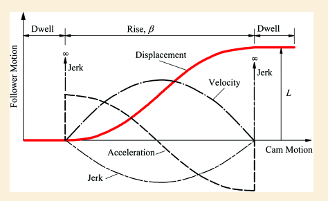
```

At the transition from dwell to rise ($\theta = 0$), the follower is at rest ($v = 0$). The instant the rise begins, the follower velocity jumps to $L/\beta$ — a sudden, finite change from zero. A step change in velocity means the acceleration at that instant is theoretically **infinite** ($a = \Delta v / \Delta t \rightarrow \infty$ as $\Delta t \rightarrow 0$). This causes **infinite jerk**.

> **Conclusion:** Uniform motion causes violent impact loading at every segment transition. It is acceptable only in very low-speed applications (< 30 RPM) where inertial forces are negligible.

#### Parabolic Motion (Constant Acceleration) {-}

**Parabolic motion** divides the rise into two equal halves: constant acceleration in the first half, and equal constant deceleration in the second half. This produces parabolic curves (the displacement trace looks like a parabola).

**Displacement equations (rise):**

\begin{equation}
y = 2L\left(\frac{\bar{\theta}}{\beta}\right)^2 \quad \text{for } 0 \leq \bar{\theta} \leq \beta/2
(\#eq:parabolic-rise1-10)
\end{equation}

\begin{equation}
y = L - 2L\left(\frac{\beta - \bar{\theta}}{\beta}\right)^2 \quad \text{for } \beta/2 \leq \bar{\theta} \leq \beta
(\#eq:parabolic-rise2-10)
\end{equation}

```{r parabolic-img, echo=FALSE, out.width="75%", fig.align="center", fig.cap="Parabolic motion displacement diagram. The curve consists of two parabolic arcs that meet at the midpoint of the rise/return segment. Velocity starts and ends at zero, but there is an infinite jerk at the midpoint (where acceleration reverses sign) and at the dwell-to-rise boundaries (where acceleration jumps from zero to its maximum value)."}
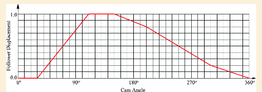
```

Parabolic motion improves over uniform motion: velocity is now zero at the start and end of each segment ($v = 0$ at $\bar{\theta} = 0$ and $\bar{\theta} = \beta$), which eliminates the velocity-jump jerk at the segment boundaries. However, there is still an **infinite jerk at the midpoint** of each segment, where the acceleration instantaneously reverses from $+4L/\beta^2$ to $-4L/\beta^2$.

> **Conclusion:** Better than uniform, but still has infinite jerk at the midpoint. Suitable for low-to-moderate speeds.

#### Harmonic Motion (Simple Harmonic Motion) {-}

**Harmonic motion** uses a cosine curve to shape the displacement. It is equivalent to the vertical projection of a point moving at constant angular velocity around a circle.

**Displacement equations:**

\begin{equation}
y = \frac{L}{2}\left(1 - \cos\frac{\pi\bar{\theta}}{\beta}\right) \quad \text{(rise)}
(\#eq:harmonic-rise-10)
\end{equation}

\begin{equation}
y = \frac{L}{2}\left(1 + \cos\frac{\pi\bar{\theta}}{\beta}\right) \quad \text{(return)}
(\#eq:harmonic-return-10)
\end{equation}

```{r harmonic-img, echo=FALSE, out.width="75%", fig.align="center", fig.cap="Harmonic motion displacement diagram. The smooth S-shaped curve has zero velocity at both endpoints, giving a much gentler transition than uniform or parabolic motion. The curve is a pure cosine function."}
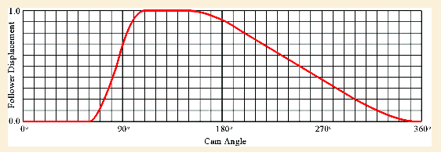
```

```{r harmonic-formula-img, echo=FALSE, out.width="65%", fig.align="center", fig.cap="Harmonic rise formula applied: with L = 0.8, β = 60°, and θ̄ = θ − 120°, the follower rises from 120° to 180° of cam rotation. The parameter θ̄ measures the angle from the start of the rise segment."}
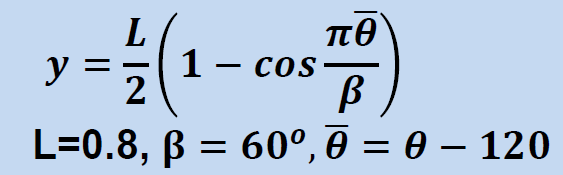
```

Harmonic motion has these properties at the segment endpoints ($\bar{\theta} = 0$ and $\bar{\theta} = \beta$):
- Velocity = 0 ✓ (smooth velocity transition with adjacent dwells)
- Acceleration = $\pm L\pi^2/(2\beta^2)$ ✗ (non-zero → still a jerk discontinuity at dwell boundaries)

> **Conclusion:** Harmonic motion has zero velocity at boundaries, giving smooth velocity transitions. However, the acceleration is non-zero at the endpoints, so there is still an infinite jerk at the dwell-to-segment boundaries. Harmonic motion is excellent for moderate-speed cams and is simple to calculate.

#### Cycloidal Motion {-}

**Cycloidal motion** is traced by a point on the rim of a circle rolling along a straight line (a cycloid curve). It has a remarkable property: both velocity *and* acceleration are exactly zero at the start and end of each segment.

**Displacement equations:**

\begin{equation}
y = L\left(\frac{\bar{\theta}}{\beta} - \frac{1}{2\pi}\sin\frac{2\pi\bar{\theta}}{\beta}\right) \quad \text{(rise)}
(\#eq:cycloidal-rise-10)
\end{equation}

\begin{equation}
y = L\left(1 - \frac{\bar{\theta}}{\beta} + \frac{1}{2\pi}\sin\frac{2\pi\bar{\theta}}{\beta}\right) \quad \text{(return)}
(\#eq:cycloidal-return-10)
\end{equation}

At the endpoints:
- Velocity = 0 ✓
- Acceleration = 0 ✓ (jerk is finite at the boundary — much better than harmonic!)

> **Conclusion:** Cycloidal motion is the gold standard for high-speed cams. No infinite jerk anywhere in the cycle. It produces the smoothest possible follower motion, minimizing vibration, noise, and wear. The tradeoff is that the peak acceleration is higher than harmonic motion for the same lift and beta angle (by a factor of $\pi/2 \approx 1.57$).

#### General Polynomial Motion {-}

**General polynomial (spline) motion** uses a polynomial of the form:

\begin{equation}
y = C_0 + C_1\bar{\theta} + C_2\bar{\theta}^2 + C_3\bar{\theta}^3 + \ldots + C_n\bar{\theta}^n
(\#eq:polynomial-10)
\end{equation}

The coefficients $C_0, C_1, \ldots, C_n$ are determined by specifying the required values of $y$, $dy/d\theta$, $d^2y/d\theta^2$, etc. at both endpoints of the segment. By choosing more boundary conditions, higher-order polynomials can be used to match displacement, velocity, AND acceleration at segment endpoints — giving even smoother motion than cycloidal.

The **3-4-5 polynomial** (so named for the powers used) is a popular choice for matching zero velocity and acceleration at both ends of a rise segment:

\begin{equation}
y = L\left[10\left(\frac{\bar{\theta}}{\beta}\right)^3 - 15\left(\frac{\bar{\theta}}{\beta}\right)^4 + 6\left(\frac{\bar{\theta}}{\beta}\right)^5\right]
(\#eq:polynomial345-10)
\end{equation}

General polynomial motion is used in computer-aided cam design where the motion profile can be fully customised to meet multiple conflicting requirements.

***

### Velocity, Acceleration, and Jerk: The Full Picture {#sec:svaj-comparison}

The real power of understanding motion types comes when we look at all four curves — displacement, velocity, acceleration, and jerk — together. In cam design, this is called the **SVAJ diagram** ($S$-displacement, $V$-velocity, $A$-acceleration, $J$-jerk).

```{r svaj-harmonic, echo=FALSE, message=FALSE, fig.width=11, fig.height=10, fig.align='center', fig.cap="SVAJ diagram for harmonic motion over a rise segment (0° to 90°). Top to bottom: displacement (S), normalized velocity (V), normalized acceleration (A), normalized jerk (J). The jerk is a cosine wave within the rise segment, but it is discontinuous at the endpoints (jerk jumps from zero in the dwell to a finite value at the start of rise — shown by the dashed vertical lines). This finite discontinuity in jerk is why harmonic motion is acceptable for moderate but not high speeds."}

## Compute SVAJ for harmonic rise only (0 to 90 degrees)
theta_rise <- seq(0, 90, by = 0.5)
beta  <- 90  ## degrees, converted to radians in formulas
L     <- 1.0

## Convert beta to radians
beta_r <- beta * pi/180

## Harmonic - analytical derivatives w.r.t. theta (in radians)
theta_rad <- theta_rise * pi/180

s_harm  <- L/2 * (1 - cos(pi * theta_rad / beta_r))
v_harm  <- L * pi / (2 * beta_r) * sin(pi * theta_rad / beta_r)
a_harm  <- L * pi^2 / (2 * beta_r^2) * cos(pi * theta_rad / beta_r)
j_harm  <- -L * pi^3 / (2 * beta_r^3) * sin(pi * theta_rad / beta_r)

## Normalise to peak values for display
v_norm <- max(abs(v_harm))
a_norm <- max(abs(a_harm))
j_norm <- max(abs(j_harm))

df_svaj <- data.frame(
  theta = rep(theta_rise, 4),
  value = c(s_harm,
            v_harm / v_norm,
            a_harm / a_norm,
            j_harm / j_norm),
  curve = rep(c("S — Displacement", "V — Velocity (normalised)", "A — Acceleration (normalised)", "J — Jerk (normalised)"),
              each = length(theta_rise))
)
df_svaj$curve <- factor(df_svaj$curve,
  levels = c("S — Displacement","V — Velocity (normalised)","A — Acceleration (normalised)","J — Jerk (normalised)"))

colours_svaj <- c("S — Displacement" = "#E53935",
                  "V — Velocity (normalised)" = "#1E88E5",
                  "A — Acceleration (normalised)" = "#43A047",
                  "J — Jerk (normalised)" = "#8E24AA")

ggplot(df_svaj, aes(x = theta, y = value, colour = curve)) +
  geom_line(linewidth = 1.3) +
  geom_vline(xintercept = c(0, 90), linetype = "dashed", colour = "gray50", linewidth = 0.8) +
  annotate("text", x = 2, y = 1.15, label = "Start of Rise\n(from dwell)", size = 3, colour = "gray40", hjust = 0) +
  annotate("text", x = 88, y = 1.15, label = "End of Rise\n(to dwell)", size = 3, colour = "gray40", hjust = 1) +
  scale_colour_manual(values = colours_svaj, name = NULL) +
  scale_x_continuous(breaks = seq(0, 90, 15)) +
  scale_y_continuous(breaks = seq(-1, 1, 0.25)) +
  facet_wrap(~curve, ncol = 1, scales = "free_y") +
  labs(title = "SVAJ Diagram — Harmonic Rise (0° to 90°)",
       x = "Cam Angle θ̄ (degrees from start of rise)",
       y = "Normalised Value") +
  theme_cam +
  theme(legend.position = "none",
        strip.text = element_text(face = "bold", size = 10))
```

```{r jerk-comparison, echo=FALSE, message=FALSE, fig.width=11, fig.height=6, fig.align='center', fig.cap="Jerk comparison for the four motion types over a rise segment. Uniform motion has theoretically infinite jerk at both endpoints — shown as large red spikes. Parabolic motion has infinite jerk at the midpoint (θ̄ = β/2) where acceleration reverses. Harmonic motion has a finite jerk within the segment but a step discontinuity at both ends (shown by the dashed vertical lines). Cycloidal motion has finite, smooth jerk everywhere — making it the best choice for high-speed cams."}

## Compute jerk for each type over the rise segment
theta_r <- seq(0, 90, by = 0.5)
beta_r  <- 90
b       <- beta_r * pi/180  ## radians
th      <- theta_r * pi/180
L       <- 1.0
eps     <- 0.5  ## small region for simulating ∞ jerk spike

## Uniform jerk: 0 within segment, spike at endpoints
j_uniform <- rep(0, length(theta_r))
j_uniform[theta_r <  eps] <- 12.0   ## large finite spike representing ∞
j_uniform[theta_r > (beta_r - eps)] <- -12.0

## Parabolic jerk: 0 within each half, spike at midpoint and endpoints
j_parabolic <- rep(0, length(theta_r))
j_parabolic[theta_r <  eps]  <- 8.0
j_parabolic[abs(theta_r - beta_r/2) < eps] <- -8.0
j_parabolic[theta_r > (beta_r - eps)] <- 8.0

## Harmonic jerk (analytical)
j_harmonic  <- -L * pi^3 / (2 * b^3) * sin(pi * th / b)
## Add boundary discontinuity markers
j_harmonic[theta_r < eps] <- max(abs(j_harmonic)) * 1.2
j_harmonic[theta_r > (beta_r - eps)] <- -max(abs(j_harmonic)) * 1.2

## Cycloidal jerk (analytical)
j_cycloidal <- L * 4*pi^2 / b^3 * cos(2*pi*th/b)

## Normalise all to the cycloidal maximum for fair comparison
j_max <- max(abs(j_cycloidal))
df_jerk <- data.frame(
  theta = rep(theta_r, 4),
  jerk  = c(j_uniform  / j_max,
            j_parabolic / j_max,
            j_harmonic  / j_max,
            j_cycloidal / j_max),
  type  = rep(c("Uniform","Parabolic","Harmonic","Cycloidal"), each = length(theta_r))
)
df_jerk$type <- factor(df_jerk$type, levels = c("Uniform","Parabolic","Harmonic","Cycloidal"))

ggplot(df_jerk, aes(x = theta, y = jerk, colour = type, linetype = type)) +
  geom_line(linewidth = 1.1) +
  geom_vline(xintercept = c(0, 45, 90), linetype = "dotted", colour = "gray60") +
  geom_hline(yintercept = 0, linewidth = 0.5, colour = "gray40") +
  annotate("text", x = 2, y = 11, label = "∞ jerk\n(spike)", colour = "#E53935", size = 3) +
  annotate("text", x = 44, y = 8, label = "∞ jerk\n(parabolic\nmidpoint)", colour = "#8E24AA", size = 3) +
  scale_colour_manual(values = c("Uniform"="#E53935","Parabolic"="#8E24AA","Harmonic"="#1E88E5","Cycloidal"="#43A047"),
                      name = "Motion Type") +
  scale_linetype_manual(values = c("Uniform"="dashed","Parabolic"="dotted","Harmonic"="solid","Cycloidal"="twodash"),
                        name = "Motion Type") +
  scale_x_continuous(breaks = seq(0, 90, 15)) +
  scale_y_continuous(limits = c(-13, 13)) +
  labs(title = "Jerk Comparison for Rise Segment (0° to β)",
       subtitle = "Large spikes represent theoretically infinite jerk — the key failure mode in poor cam design",
       x = "Cam Angle θ̄ (degrees from start of rise)",
       y = "Normalised Jerk  (J / J_cycloidal_max)") +
  theme_cam
```

#### Motion Type Selection Guide {-}

```{r motion-selection-table, echo=FALSE, message=FALSE}
motion_sel <- tribble(
  ~Type,          ~v_endpoints, ~a_endpoints, ~Jerk_finite, ~Peak_accel, ~Best_for,           ~Avoid_when,
  "Uniform",       "No (v ≠ 0)", "—",          "No (∞ at all boundaries)", "Very low",  "Very slow machines (< 30 RPM)", "Any application with significant inertia",
  "Parabolic",     "Yes (v = 0)","No (a ≠ 0)", "No (∞ at midpoint)",  "Low",         "Low speed (30–100 RPM)",       "Moderate or high speed",
  "Harmonic",      "Yes (v = 0)","No (a ≠ 0)", "No (∞ at boundaries)","Medium",      "Moderate speed (100–500 RPM)", "High speed or precision",
  "Cycloidal",     "Yes (v = 0)","Yes (a = 0)","Yes (finite everywhere)","High (×1.57)","High speed (> 500 RPM)",     "Minimizing peak force is critical",
  "Polynomial 3-4-5","Yes","Yes","Yes","Medium-High","High speed and smooth force",  "Simple calculations preferred"
)

motion_sel %>%
  kbl(caption = "Motion Type Selection Guide",
      col.names = c("Type","Zero v at Ends?","Zero a at Ends?","Finite Jerk?","Peak Accel.","Best For","Avoid When"),
      booktabs = TRUE) %>%
  kable_styling(latex_options = c("hold_position","scale_down"), full_width = knitr::is_html_output()) %>%
  row_spec(0, background = "#D81B60", color = "white") %>%
  row_spec(1, background = "#FFEBEE") %>%
  row_spec(2, background = "#FFF3E0") %>%
  row_spec(3, background = "#E3F2FD") %>%
  row_spec(4, background = "#E8F5E9", bold = TRUE) %>%
  row_spec(5, background = "#EDE7F6")
```

::: {.callout-industry}
**Industry Application — Automotive Camshaft:** Modern automotive overhead camshaft (OHC) engines typically use **polynomial motion profiles** (often 3-4-5 or higher) for the valve lift curves. At 6,000 RPM, jerk must be finite everywhere to prevent valve bounce and follower wear. Engine calibration engineers use computer-optimised cam profiles that may not match any single standard motion type — they are optimised point-by-point to maximise airflow while controlling dynamics. The displacement diagram is literally the program that determines how much power the engine produces.
:::

***

\newpage

### Applied Example: Harmonic Motion Displacement Calculation {#cam-example-1}

::: {.question}
###### Problem Statement {-}

A cam is designed with the following motion program:

- **Dwell low:** 0° to 120° (follower at $y = 0$)
- **Rise:** 120° to 180° using **harmonic motion** ($\beta = 60°$, $L = 0.8$ units)
- **Dwell high:** 180° to 210° (follower at $y = 0.8$)
- **Return:** 210° to 360° using **harmonic motion** ($\beta = 150°$)

Calculate the follower displacement at:
1. $\theta = 150°$ (during the rise)
2. $\theta = 270°$ (during the return)
3. Verify both answers using the tabulated values provided.

:::

::: {.answer}
###### Solution {-}

**Part 1: Displacement at θ = 150° (during rise)**

The rise segment spans 120° to 180°, so $\beta_{rise} = 60°$.
The local angle measured from the start of rise: $\bar{\theta} = 150° - 120° = 30°$

Using Equation \@ref(eq:harmonic-rise-10):

$$y = \frac{L}{2}\left(1 - \cos\frac{\pi\bar{\theta}}{\beta}\right) = \frac{0.8}{2}\left(1 - \cos\frac{\pi \times 30°}{60°}\right)$$

$$y = 0.4\left(1 - \cos(90°)\right) = 0.4\left(1 - 0\right) = 0.4 \text{ units}$$

**Part 2: Displacement at θ = 270° (during return)**

The return segment spans 210° to 360°, so $\beta_{return} = 150°$.
The local angle: $\bar{\theta} = 270° - 210° = 60°$

Using Equation \@ref(eq:harmonic-return-10):

$$y = \frac{L}{2}\left(1 + \cos\frac{\pi\bar{\theta}}{\beta}\right) = \frac{0.8}{2}\left(1 + \cos\frac{\pi \times 60°}{150°}\right)$$

$$y = 0.4\left(1 + \cos(72°)\right) = 0.4\left(1 + 0.309\right) = 0.4 \times 1.309 = 0.5236 \text{ units}$$

```{r harmonic-example-calc, echo=FALSE, message=FALSE}
## Given parameters
L_ex       <- 0.8
beta_rise  <- 60   ## degrees
beta_return<- 150  ## degrees
rise_start <- 120
fall_start <- 210

calc_table <- tribble(
  ~Step, ~Parameter, ~Calculation, ~Result,
  "Part 1", "Cam angle", "θ = 150°", "—",
  "Part 1", "Local angle (rise)", "θ̄ = θ − 120° = 150° − 120°", "θ̄ = 30°",
  "Part 1", "Harmonic rise formula", "y = L/2 × (1 − cos(π × 30°/60°))", "y = 0.4 × (1 − cos 90°)",
  "Part 1", "cos(90°) = 0", "y = 0.4 × (1 − 0)", "y = 0.400 units",
  "Part 2", "Cam angle", "θ = 270°", "—",
  "Part 2", "Local angle (return)", "θ̄ = θ − 210° = 270° − 210°", "θ̄ = 60°",
  "Part 2", "Harmonic return formula", "y = L/2 × (1 + cos(π × 60°/150°))", "y = 0.4 × (1 + cos 72°)",
  "Part 2", "cos(72°) = 0.309", "y = 0.4 × 1.309", "y = 0.524 units"
)

calc_table %>%
  kbl(caption = "Harmonic Motion Displacement Calculation",
      col.names = c("Part", "Parameter", "Calculation", "Result"),
      booktabs = TRUE) %>%
  kable_styling(latex_options = "hold_position", full_width = knitr::is_html_output()) %>%
  row_spec(0, background = "#D81B60", color = "white") %>%
  row_spec(4, background = "#E3F2FD", bold = TRUE) %>%
  row_spec(8, background = "#E8F5E9", bold = TRUE)
```

**Part 3: Verification from Tabulated Values**

```{r harmonic-tables-rise, echo=FALSE, out.width="80%", fig.align="center", fig.cap="Tabulated harmonic rise values from θ = 120° to θ = 180°. At θ = 150°, the table gives y = 0.4000 — confirming our calculation."}
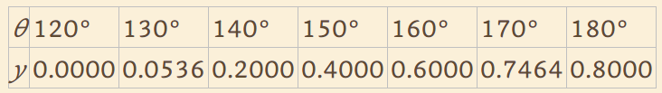
```

```{r harmonic-tables-return, echo=FALSE, out.width="80%", fig.align="center", fig.cap="Tabulated harmonic return values from θ = 210° to θ = 360°. At θ = 270°, the table gives y = 0.5236 — confirming our calculation."}
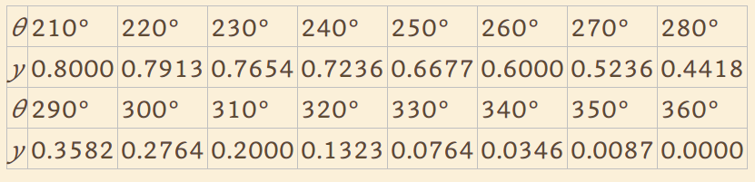
```

The tabulated values in Figure \@ref(fig:harmonic-tables-rise) and Figure \@ref(fig:harmonic-tables-return) confirm both results:
- At θ = 150°: $y = 0.4000$ ✓
- At θ = 270°: $y = 0.5236$ ✓

```{r harmonic-example-plot, echo=FALSE, message=FALSE, fig.width=10, fig.height=5, fig.align='center', fig.cap="Complete displacement diagram for the worked example. The dwell-rise-dwell-return program using harmonic motion for both rise and return segments. Black dots mark the two calculated points at θ = 150° (y = 0.400) and θ = 270° (y = 0.524)."}

theta_ex   <- seq(0, 360, by = 1)
L_ex       <- 0.8
y_ex       <- numeric(length(theta_ex))
rise_s     <- 120; rise_e     <- 180; b_r <- 60
fall_s     <- 210; fall_e     <- 360; b_f <- 150

for (i in seq_along(theta_ex)) {
  t <- theta_ex[i]
  if (t < rise_s) {
    y_ex[i] <- 0
  } else if (t <= rise_e) {
    tb <- t - rise_s
    y_ex[i] <- L_ex/2 * (1 - cos(pi*tb/b_r))
  } else if (t < fall_s) {
    y_ex[i] <- L_ex
  } else if (t <= fall_e) {
    tb <- t - fall_s
    y_ex[i] <- L_ex/2 * (1 + cos(pi*tb/b_f))
  } else {
    y_ex[i] <- 0
  }
}

pts <- data.frame(theta = c(150, 270), y = c(0.400, 0.5236),
                  label = c("θ=150°, y=0.400", "θ=270°, y=0.524"))

ggplot(data.frame(theta = theta_ex, y = y_ex), aes(x = theta, y = y)) +
  annotate("rect", xmin=120,  xmax=180, ymin=-0.05, ymax=0,  fill="#FFCCCC") +
  annotate("rect", xmin=180,  xmax=210, ymin=-0.05, ymax=0,  fill="#CCFFCC") +
  annotate("rect", xmin=210,  xmax=360, ymin=-0.05, ymax=0,  fill="#CCE5FF") +
  annotate("text", x=c(60,150,195,285), y=c(-0.025,-0.025,-0.025,-0.025),
           label=c("Dwell Low","Rise (Harmonic)","Dwell","Return (Harmonic)"),
           size=2.8, fontface="bold") +
  geom_line(colour = "#1E88E5", linewidth = 1.4) +
  geom_point(data = pts, aes(x = theta, y = y), colour = "black", size = 4) +
  geom_label(data = pts, aes(x = theta, y = y + 0.07, label = label),
             size = 3, fill = "white", colour = "black", label.size = 0.3) +
  scale_x_continuous(breaks = seq(0, 360, 30)) +
  scale_y_continuous(breaks = seq(0, 0.8, 0.2), limits = c(-0.07, 0.95)) +
  labs(title = "Worked Example: Harmonic Motion Displacement Diagram",
       x = "Cam Angle θ (degrees)", y = "Follower Displacement y (units)") +
  theme_cam
```

:::

***

\newpage

### Cam Layout: From Displacement Diagram to Cam Profile {#sec:cam-layout}

Once the displacement diagram is complete, the physical shape of the cam can be determined. The process is called **kinematic inversion**: instead of rotating the cam and tracking the follower, we hold the follower fixed and rotate the cam layout *backwards*.

```{r cam-layout-diagram, echo=FALSE, out.width="80%", fig.align="center", fig.cap="Cam layout (graphical design) method for a roller follower: the follower is held stationary while the cam centre is rotated through equal angular increments. At each position, the follower circle is drawn; the cam profile is then the curve tangent to all these follower circles (the envelope). Key elements visible: prime circle, base circle, pressure angle α, follower rotation relative to cam, cam rotation direction."}
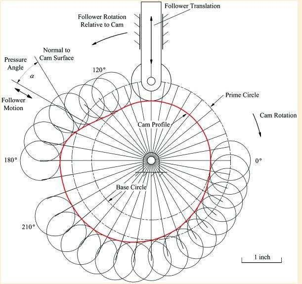
```

The graphical layout procedure:

1. Draw the **base circle** (radius = minimum cam radius) and **prime circle** (base circle + roller radius).
2. Divide the cam rotation into equal increments (e.g., every 10°).
3. At each increment, mark the follower's radial position using the displacement diagram value.
4. Draw the follower circle at each position.
5. Draw the **cam profile** as the inner envelope of all follower circles.

In modern practice, this is done computationally using CAD software (SolidWorks, Autodesk Inventor) or dedicated cam design software. The graphical method is still taught because it builds strong intuition about how the displacement program maps onto the physical cam shape.

::: {.callout-check}
**Quick Check:** Why do we use the prime circle (not the base circle) as the reference for positioning the follower during layout?

*Answer: The roller follower's centre must be placed on the pitch curve, which is offset from the cam surface by one roller radius. The prime circle = base circle + roller radius defines this offset reference.*
:::

***

### Summary Equations {#sec:cam-summary-eqs}

#### Follower Motion Equations {-}

| Motion Type | Displacement (Rise) | Key Property |
|:------------|:--------------------|:-------------|
| Uniform | $y = \dfrac{L\bar{\theta}}{\beta}$ | Constant velocity — infinite jerk at boundaries |
| Parabolic (1st half) | $y = 2L\left(\dfrac{\bar{\theta}}{\beta}\right)^2$ | Constant acceleration — infinite jerk at midpoint |
| Harmonic | $y = \dfrac{L}{2}\left(1 - \cos\dfrac{\pi\bar{\theta}}{\beta}\right)$ | Zero velocity at ends — finite jerk within segment |
| Cycloidal | $y = L\left(\dfrac{\bar{\theta}}{\beta} - \dfrac{1}{2\pi}\sin\dfrac{2\pi\bar{\theta}}{\beta}\right)$ | Zero velocity AND acceleration at ends — finite jerk everywhere |

#### Derivative Relationships {-}

| Quantity | Time Domain | Cam Angle Domain |
|:---------|:------------|:-----------------|
| Velocity | $v = ds/dt$ | $v = (ds/d\theta) \cdot \omega$ |
| Acceleration | $a = d^2s/dt^2$ | $a = (d^2s/d\theta^2) \cdot \omega^2$ |
| Jerk | $j = d^3s/dt^3$ | $j = (d^3s/d\theta^3) \cdot \omega^3$ |

***

### Design Checklist {-}

**For Cam-Follower Design:**

- [ ] Define the complete motion program: list all rise, dwell, and return segments with their angles (sum to 360°)
- [ ] Choose follower type based on load, speed, and space: roller for general use, flat-faced for compact automotive, knife-edge for instruments only
- [ ] Select joint closure method: force closure (spring) for simplicity, form closure for high-speed or critical applications
- [ ] Choose motion type based on operating speed: cycloidal or polynomial for high speed, harmonic for moderate, parabolic only for low speed
- [ ] Verify the displacement diagram: check all boundary conditions, ensure segment angles sum to 360°
- [ ] Calculate peak velocity, acceleration, and jerk — confirm spring force exceeds maximum inertial force (for force closure)
- [ ] Check pressure angle: keep $\alpha < 30°$ for translating followers ($< 35°$ for oscillating)
- [ ] Verify roller radius is less than minimum radius of curvature of pitch curve (avoid undercutting)
- [ ] Check minimum cam radius: larger base circle reduces pressure angle but increases cam size and mass
- [ ] Verify follower guidance: follower stem must be long enough, guide clearance must prevent jamming from side forces

***

### Practice Problems {-}

**Problem 1.** A cam has the following motion program:
- Rise over 120° using **harmonic motion**, $L = 25$ mm
- Dwell at top for 60°
- Return over 180° using **cycloidal motion**

Calculate the follower displacement at (a) $\theta = 60°$ and (b) $\theta = 210°$.

---

**Problem 2.** For the cam in Problem 1:
(a) Write the velocity equation (in terms of $\theta$, not time) for the rise segment.
(b) At what cam angle does the maximum velocity occur during the rise?
(c) If the cam rotates at 300 RPM, what is the maximum follower velocity in mm/s?

---

**Problem 3.** A disc cam with a roller follower has: base circle radius = 30 mm, roller radius = 6 mm, lift = 18 mm. The cam uses harmonic motion for a 90° rise.

(a) What is the prime circle radius?
(b) Write and evaluate the displacement equation at $\theta = 45°$ into the rise.
(c) Why is cycloidal motion preferred over harmonic for this cam if it runs at 600 RPM?

---

**Problem 4 (Application):**

```{r practice-problem-img, echo=FALSE, out.width="85%", fig.align="center", fig.cap="Practice problem: a cam shaft completes one full revolution every 3 minutes. Using the displacement diagram, determine the time for the follower to rise 1.50 inches, drop 1.50 inches, and the dwell times at upper and lower positions."}
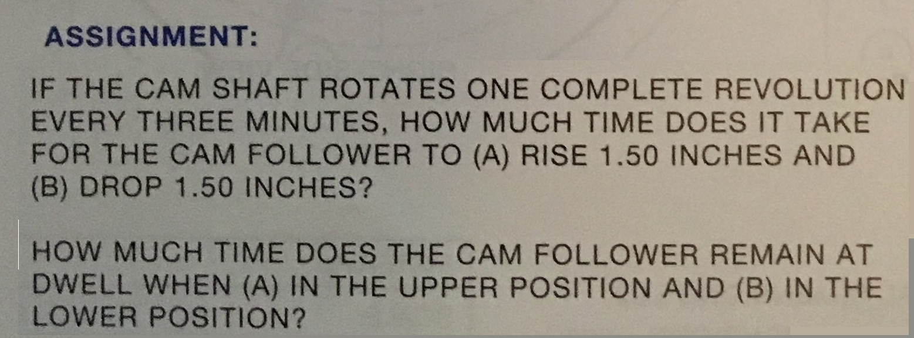
```

For the cam described in Figure \@ref(fig:practice-problem-img), the cam shaft completes one full revolution every three minutes. From the displacement diagram (not shown — sketch one based on the description): the follower rises 1.50 inches over 90° of cam rotation, dwells at the top for 90°, returns 1.50 inches over 120°, and dwells at the bottom for 60°.

(a) How long does it take for the follower to rise 1.50 inches?
(b) How long does it take for the follower to drop 1.50 inches?
(c) How long does the follower remain at the upper dwell position?
(d) How long does the follower remain at the lower dwell position?

---

::: {.callout-activity}
**R Activity:** In the R chunk below, modify the `beta_r` and `beta_f` angles in the displacement comparison plot from Section \@ref(sec:motion-types) to see how the curve shapes change. Try: rise 60° / return 180°, then rise 180° / return 60°. Which combination results in lower peak velocity? Why does a longer beta angle always reduce peak velocity for a given lift?

*Hint: peak harmonic velocity = $L\pi/(2\beta)$ — what happens as $\beta$ increases?*
:::

