## Automotive Drivetrains {#chap-13-drivetrains}

```{r setup-13, include=FALSE}
source("R/helpers.R")
source("R/required_packages.R")

theme_drivetrain <- theme_minimal() +
  theme(
    plot.title       = element_text(hjust = 0.5, size = 14, face = "bold"),
    plot.subtitle    = element_text(hjust = 0.5, size = 10),
    axis.title       = element_text(size = 11, face = "bold"),
    axis.text        = element_text(size = 9),
    panel.grid.minor = element_blank(),
    legend.position  = "bottom",
    legend.title     = element_text(size = 10, face = "bold"),
    legend.text      = element_text(size = 9),
    plot.background  = element_rect(fill = "white", color = NA),
    panel.background = element_rect(fill = "white", color = NA)
  )
```

### Learning Objectives {#sec-objectives-13}

By the end of this chapter, you will be able to:

1. **Identify** the major components of an automotive drivetrain and explain the function of each
2. **Compare** front-wheel drive, rear-wheel drive, all-wheel drive, and four-wheel drive systems, evaluating the advantages and trade-offs of each
3. **Explain** why an internal combustion engine requires a multi-speed transmission while an electric motor does not, with reference to torque-speed characteristics
4. **Describe** the operating principle of a torque converter and automatic transmission, including the role of the planetary gear set
5. **Explain** the function of a manual transmission, clutch, dual-clutch transmission, and continuously variable transmission
6. **Distinguish** between single-motor, dual-motor, triple-motor, quad-motor, and in-hub EV drivetrain configurations, and evaluate their trade-offs

::: {.callout-think}
**Before You Read:** You press the accelerator pedal of a car from rest. The engine is already spinning before the wheels start to turn — how does that work? And if electric cars have no multi-speed gearbox, why can they still accelerate smoothly from 0 to 120 km/h without any gear changes?
:::

***

### Introduction {#sec-drivetrain-intro}

Every time you drive a car, a complex system of mechanical and electromechanical components is working together to do one thing: **transfer power from the energy source to the road**. This system — the **drivetrain** — includes everything from the engine and transmission to the differential, drive shafts, and CV joints.

Understanding drivetrains is fundamental for any engineer working in the automotive industry. Whether you are designing powertrain systems, troubleshooting faults on an assembly line, or evaluating new vehicle platforms, you need to know how power flows from source to wheel — and what happens to it along the way. The rapid shift from internal combustion engines (ICE) to electric vehicles (EV) is also transforming drivetrain design in profound ways: EVs eliminate several major mechanical components entirely and introduce new configurations with capabilities that were impossible with a single crankshaft.

```{r fig-drivetrain-components-overview-13, echo=FALSE, out.width="90%", fig.align="center", fig.cap="Major components of a four-wheel drive drivetrain, including the transfer case, front and rear drive shafts, front and rear differentials, transmission, and CV axles. Each component plays a specific role in routing power from the engine to the road surface."}
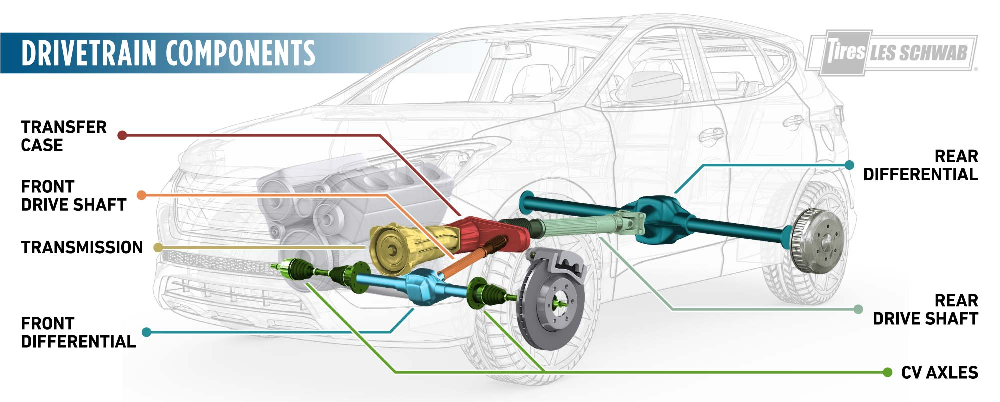
```

As shown in Figure @fig-drivetrain-components-overview-13, a typical AWD or 4WD drivetrain contains many precision-engineered components. The major drivetrain components are:

| Component | Function |
|:----------|:---------|
| **Transmission** | Multiplies and varies torque; matches engine output to wheel load demand |
| **Transfer Case** | Splits torque between front and rear axles (AWD/4WD only) |
| **Drive Shaft (Propshaft)** | Transmits rotary torque from transmission to rear differential |
| **Differential** | Allows inner and outer wheels to rotate at different speeds during cornering |
| **CV Axle** | Transmits torque to driven wheels through varying steering and suspension angles |

***

### Drive Wheel Configurations {#sec-drive-configs}

::: {.callout-think}
**Think About It:** Why does a high-performance sports car typically use rear-wheel drive, while most economy sedans use front-wheel drive? And why would you want all four wheels driven on a Canadian winter road?
:::

The **drive configuration** of a vehicle describes which wheels receive power from the engine. There are four primary configurations used in passenger cars and SUVs.

```{r fig-fwd-rwd-diagram-13, echo=FALSE, out.width="80%", fig.align="center", fig.cap="Schematic comparison of Front-Wheel Drive (FWD, left) and Rear-Wheel Drive (RWD, right) layouts. In FWD, the engine (1), transaxle gearbox (2-4), and driven wheels are all at the front axle. In RWD, the engine (1) sits at the front and drives the rear axle (4) through a separate gearbox (2-3) and propeller shaft (5)."}
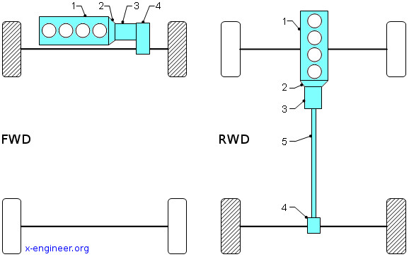
```

#### Front-Wheel Drive (FWD) {#sec-fwd-13}

In a **front-wheel drive** (FWD) vehicle, the engine and transaxle (combined gearbox and differential) are packaged at the front, and only the front wheels are driven. As shown in Figure @fig-fwd-rwd-diagram-13, this creates a compact layout with no rear driveshaft.

**Advantages of FWD:**

- Lower manufacturing cost — no rear differential, no propshaft, fewer components
- Better interior space — no driveshaft tunnel running through the cabin floor
- Good traction in wet or light snow — engine weight sits over the driven wheels
- Lighter overall vehicle weight, improving fuel economy

**Disadvantages of FWD:**

- **Torque steer** — in high-power FWD vehicles, unequal CV joint angles cause the car to pull sideways under hard acceleration
- The front axle must simultaneously steer *and* drive — complex CV joint geometry, especially at full lock
- Reduced lateral traction: the outer front wheel, which bears the most cornering load, is also the driven wheel
- Practically limited to engine outputs below ~200 kW before wheel spin and torque steer become unmanageable

::: {.callout-industry}
**Industry Application:** The Toyota Corolla, Honda Civic, and Chevrolet Bolt are all FWD platforms — this layout dominates the compact and mid-size car segment globally. On the assembly line, precise front subframe alignment is critical: a misaligned subframe creates asymmetric CV joint angles that cause torque steer complaints in service.
:::

#### Rear-Wheel Drive (RWD) {#sec-rwd-13}

In a **rear-wheel drive** (RWD) vehicle, the engine is typically at the front, but power is delivered to the rear wheels through a propeller shaft and rear differential. Figure @fig-fwd-rwd-diagram-13 shows how the transmission output (item 3) connects to the rear axle (4) via the propshaft (5).

**Advantages of RWD:**

- Better **weight distribution** — engine weight at the front is balanced by the rear differential and drive components
- No torque steer — the front wheels steer only; the rear wheels drive only, each task independently optimized
- Well-suited to high-power applications — can handle engines exceeding 400–600 kW
- Superior handling balance for performance driving

**Disadvantages of RWD:**

- Higher cost and weight: additional propshaft, rear differential, and universal joints
- Reduced interior space: the propshaft tunnel runs the length of the cabin floor
- Reduced traction on snow and ice — the driven rear wheels carry less weight in an unladen, front-heavy vehicle
- **Oversteer** tendency — rear wheel traction loss is less intuitive to correct than front-wheel slip

::: {.callout-industry}
**Industry Application:** BMW maintains RWD as a core design principle for its performance lineup. On the production line, the propshaft is dynamically balanced to tolerances below 1 g·cm to prevent vibration at highway speeds — a 100% inspection check performed after final assembly.
:::

#### All-Wheel Drive (AWD) and Four-Wheel Drive (4WD) {#sec-awd-4wd-13}

```{r fig-awd-4wd-diagram-13, echo=FALSE, out.width="80%", fig.align="center", fig.cap="Schematic comparison of All-Wheel Drive (AWD, left) and Four-Wheel Drive (4WD, right) layouts. AWD uses a centre differential (9) to continuously split torque to both axles, allowing different speeds during cornering. 4WD uses a lockable transfer case (6) that rigidly links the front and rear driveshafts for maximum off-road traction."}
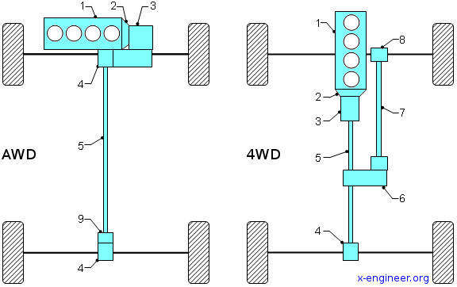
```

Both AWD and 4WD send power to all four wheels, but they work differently and suit different use cases.

**All-Wheel Drive (AWD):**

- Power is *continuously* distributed to all four wheels through a centre differential (item 9 in Figure @fig-awd-4wd-diagram-13)
- The centre differential allows the front and rear axles to rotate at different speeds — essential for cornering on dry pavement without binding
- The front/rear torque split is managed automatically by electronics — the driver has no manual control
- Modern AWD systems use electronically controlled clutch packs to vary the torque split dynamically (e.g., 40:60 front-rear in normal driving, 0:100 when the front wheels lose grip)
- Suited to all road surfaces, including normal dry driving

**Four-Wheel Drive (4WD):**

- The transfer case (item 6 in Figure @fig-awd-4wd-diagram-13) mechanically locks the front and rear propshafts together — both axles are forced to rotate at the same speed
- Ideal for **off-road** conditions (deep mud, sand, rock) where maximum traction matters more than cornering behaviour
- On hard dry pavement, locked 4WD causes **drivetrain binding** — the front and rear axles fight each other in corners because they are forced to turn at the same speed
- Modern 4WD systems offer: **2H** (two-wheel drive, highway), **4H** (four-wheel high, for slippery roads), and **4L** (four-wheel low, maximum torque multiplication for serious off-roading)

::: {.callout-discussion}
**Group Discussion:** A customer is choosing between an AWD sedan and a part-time 4WD truck for daily commuting in Ontario winters, with occasional weekend camping trips on cottage roads. What drivetrain would you recommend? Consider traction, fuel economy, cost, and on-road handling trade-offs in your answer.
:::

```{r drive-config-comparison-13, fig.cap="Comparison of the four major drive configurations across key attributes. Scores are indicative on a scale of 1 to 10, higher is better for that attribute.", fig.align='center', echo=FALSE}
library(ggplot2)
library(tidyr)
library(dplyr)

drive_data <- data.frame(
  Configuration = c("FWD", "RWD", "AWD", "4WD"),
  Dry_Traction  = c(6, 7, 9, 8),
  Snow_Traction = c(7, 4, 9, 10),
  Handling      = c(6, 9, 8, 5),
  Fuel_Economy  = c(9, 7, 6, 5),
  Cost          = c(9, 7, 6, 5)
)

drive_long <- pivot_longer(drive_data, -Configuration,
                           names_to = "Attribute", values_to = "Score")
drive_long$Attribute      <- gsub("_", " ", drive_long$Attribute)
drive_long$Configuration  <- factor(drive_long$Configuration,
                                    levels = c("FWD", "RWD", "AWD", "4WD"))

ggplot(drive_long, aes(x = Attribute, y = Score, fill = Configuration)) +
  geom_col(position = "dodge") +
  scale_fill_manual(values = c("#E63946", "#457B9D", "#2A9D8F", "#E9C46A")) +
  scale_y_continuous(limits = c(0, 10), breaks = seq(0, 10, 2)) +
  labs(
    title    = "Drive Configuration Comparison",
    subtitle = "Score out of 10 (higher = better for that attribute)",
    x        = NULL,
    y        = "Score",
    fill     = "Configuration"
  ) +
  theme_minimal() +
  theme(
    plot.title    = element_text(hjust = 0.5, size = 14, face = "bold"),
    plot.subtitle = element_text(hjust = 0.5, size = 10),
    axis.text.x   = element_text(angle = 20, hjust = 1),
    legend.position = "bottom"
  )
```

***

### Why Combustion Engines Need Transmissions — But Electric Motors Do Not {#sec-why-transmission-13}

This is one of the most important conceptual differences between ICE and EV powertrains. To understand it, you need to look at the **torque-speed characteristics** of each power source.

#### The ICE Problem: A Narrow Power Band {#sec-ice-power-band-13}

A gasoline or diesel engine can only operate within a limited RPM range — typically idle (~700 RPM) to redline (~6,500–8,000 RPM for gasoline). More importantly, the engine only delivers **useful torque** within a narrower band, often 2,000–5,000 RPM for a typical passenger car engine.

```{r fig-engine-torque-curve-13, echo=FALSE, out.width="75%", fig.align="center", fig.cap="Torque and horsepower versus engine RPM for two types of combustion engines. The 'flexible' engine (blue) maintains high torque across a wide RPM range. The 'peaky' engine (red) produces peak power only in a narrow high-RPM band. In both cases, torque falls to near zero below 1,000 RPM — the engine cannot start a vehicle moving from rest on its own."}
if (knitr::is_html_output()) {
  
} else {
  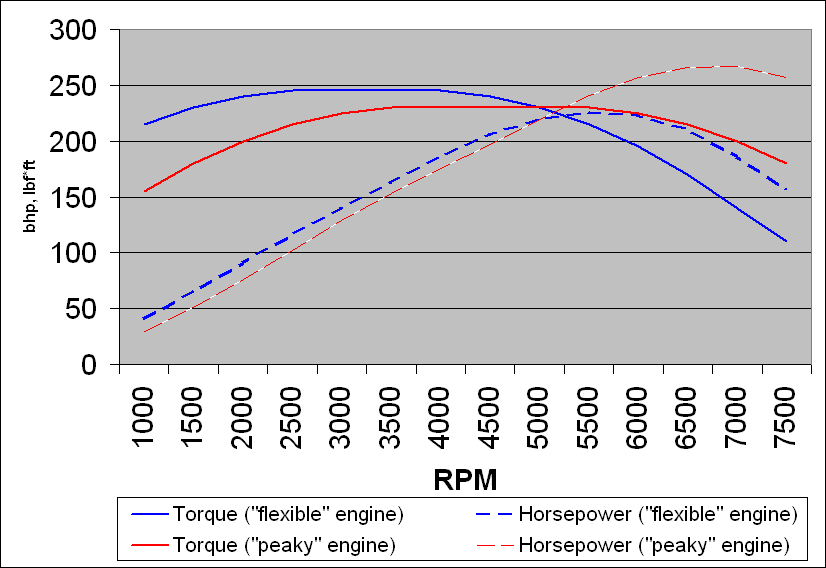
}
```

As Figure @fig-engine-torque-curve-13 shows, an ICE engine produces almost **no torque at very low RPM**. Yet a car must be able to start from rest — which demands *maximum* torque at *zero* wheel speed. This is the fundamental mismatch: the wheel needs maximum torque at zero speed, but the engine produces zero torque at zero RPM.

The transmission solves this through:

1. **Gear ratios** — a high gear ratio (e.g., 1st gear at 4:1) multiplies engine torque by a factor of 4 at the wheels, at the cost of wheel speed
2. **Multiple gears** — allow the engine to remain in its efficient RPM band across the full range of vehicle speeds
3. **Torque converter or clutch** — provide a controlled slip coupling that lets the engine spin while the vehicle is stationary

```{r gear-ratio-visualization-13, fig.cap="Wheel torque available at different vehicle speeds for each gear of a 6-speed transmission. Each gear maps a range of vehicle speeds onto the engine's useful torque band. Without the transmission, the engine would be far outside its power band for most driving conditions.", fig.align='center', echo=FALSE}
library(ggplot2)
library(dplyr)

rpm_range <- seq(1000, 7000, by = 50)
engine_torque_Nm <- 180 * exp(-((rpm_range - 3500)^2) / (2 * 1600^2)) + 120

gear_ratios <- c("1st (3.9:1)" = 3.9, "2nd (2.3:1)" = 2.3,
                 "3rd (1.5:1)" = 1.5, "4th (1.1:1)" = 1.1,
                 "5th (0.85:1)" = 0.85, "6th (0.65:1)" = 0.65)
final_drive <- 3.7

gear_df <- do.call(rbind, lapply(names(gear_ratios), function(g) {
  ratio        <- gear_ratios[g]
  wheel_torque <- engine_torque_Nm * ratio * final_drive * 0.92
  data.frame(RPM = rpm_range, Wheel_Torque = wheel_torque, Gear = g)
}))
gear_df$Gear <- factor(gear_df$Gear, levels = names(gear_ratios))

ggplot(gear_df, aes(x = RPM, y = Wheel_Torque, colour = Gear)) +
  geom_line(linewidth = 1.1) +
  scale_colour_brewer(palette = "Dark2") +
  labs(
    title  = "Available Wheel Torque vs Engine RPM by Gear",
    x      = "Engine Speed (RPM)",
    y      = "Wheel Torque (N·m)",
    colour = "Gear"
  ) +
  theme_minimal() +
  theme(
    plot.title      = element_text(hjust = 0.5, size = 14, face = "bold"),
    legend.position = "right"
  )
```

#### The EV Advantage: Maximum Torque from Zero RPM {#sec-ev-torque-13}

An electric motor has a fundamentally different torque-speed characteristic.

```{r fig-ev-torque-comparison-13, echo=FALSE, out.width="70%", fig.align="center", fig.cap="Torque versus speed comparison between an internal combustion engine (red/dashed) and an electric motor (solid). The electric motor delivers its maximum rated torque from zero speed, maintaining it through a constant-torque region before entering a constant-power region at higher speeds. The ICE builds torque gradually, peaks in the mid-RPM range, then declines — requiring multiple gears to keep it operating effectively at all vehicle speeds."}
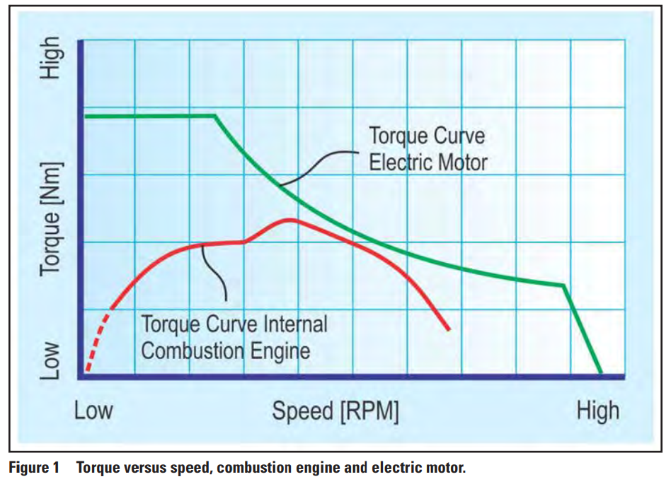
```

As Figure @fig-ev-torque-comparison-13 shows, an electric motor delivers **maximum torque from 0 RPM**. This is because motor torque is directly proportional to current:

$$
T = k_t \cdot I
$$ {#eq-motor-torque-13}

where $k_t$ is the motor torque constant (N·m/A) and $I$ is the stator current (A). Maximum current can be supplied instantaneously at any motor speed, so maximum torque is available the moment the motor is energized — including at standstill.

This means an EV does **not need a multi-speed transmission**. A single fixed-ratio reduction gear (typically 7:1 to 10:1) matches the motor's high rotational speed to a usable wheel speed. The motor varies its torque electronically across the full speed range.

**Key differences:**

| Property | ICE | Electric Motor |
|:---------|:----|:---------------|
| Torque at zero speed | Near zero (idle produces no drive torque) | Maximum rated torque |
| Useful speed range | ~2,000–6,000 RPM (narrow) | 0 RPM to 10,000+ RPM (very wide) |
| Transmission required | Yes — 6 to 10 speeds | No — single fixed reduction gear |
| Idle fuel consumption | Significant | None (motor is off at rest) |
| Gear changes | Required to maintain efficiency | Not required |

::: {.callout-check}
**Quick Check:** Because an electric motor delivers maximum torque at zero speed, what does this mean practically when you accelerate from a stop sign in an EV compared to an ICE vehicle?
:::

***

### Automatic Transmission {#sec-automatic-transmission-13}

```{r auto-trans-video-13, echo=FALSE, results='asis'}
embed_youtube("u_y1S8C0Hmc", "How an Automatic Transmission Works")
```

The **automatic transmission** (AT) is the dominant transmission type in North America. It selects gear ratios automatically based on vehicle speed and throttle position — the driver has no clutch pedal and no manual gear selection (unless using paddle shifters in sport mode).

#### The Planetary Gear Set {#sec-planetary-gearset-13}

The core of an automatic transmission is the **planetary gear set**, also called an epicyclic gear set. Unlike a manual gearbox with separate sliding gears, a planetary set achieves different ratios by selectively locking and releasing its elements while remaining in constant mesh.

A single planetary set has four members:

| Member | Description |
|:-------|:-----------|
| **Sun Gear** | Central gear, typically a transmission input |
| **Planet Gears** | Smaller gears orbiting the sun gear, mounted on the carrier |
| **Planet Carrier** | Frame holding the planet gears; can be an input, output, or held fixed |
| **Ring Gear (Annulus)** | Outer internally toothed gear that meshes with the planet gears |

By holding one element fixed while another is driven, different gear ratios result. The fundamental gear ratio when the ring gear is held fixed, the sun is the input, and the carrier is the output:

$$
i = \frac{N_{ring}}{N_{sun}} + 1
$$ {#eq-planetary-ratio-13}

For a planetary set with $N_{ring} = 72$ and $N_{sun} = 24$:

$$i = \frac{72}{24} + 1 = 4:1 \quad \text{(large torque multiplication in 1st gear)}$$

With all elements locked together (direct drive): $i = 1:1$.

With the carrier held fixed and the ring gear as output, the transmission is in reverse:

$$i = -\frac{N_{ring}}{N_{sun}} = -\frac{72}{24} = -3:1 \quad \text{(negative = reverse rotation)}$$

Modern automatic transmissions stack **two or three planetary sets** in series, combined with hydraulically actuated clutch packs and brake bands that selectively hold or release elements. This yields 6, 8, or 10 forward gear ratios from a compact package.

::: {.callout-industry}
**Industry Application:** The ZF 8HP eight-speed automatic, used in BMW, Chrysler, Land Rover, and Jeep vehicles, achieves eight forward gears from two planetary sets and four clutch packs. Its gear spread runs from 4.71:1 in first gear to 0.50:1 in eighth — a 9.4:1 span — allowing the engine to operate near its efficiency peak from city traffic to highway cruise.
:::

#### The Torque Converter {#sec-torque-converter-13}

```{r torque-converter-video-13, echo=FALSE, results='asis'}
embed_youtube("z5G2zQ_3xTc", "How a Torque Converter Works")
```

The **torque converter** replaces the manual clutch in an automatic transmission. It sits between the engine crankshaft and the transmission input shaft and performs three critical functions:

1. **Fluid coupling** — allows the engine to spin while the vehicle is stationary, with no mechanical connection between them
2. **Torque multiplication** — at launch, the converter multiplies engine torque by 2–3× before the car begins moving
3. **Lock-up clutch** — above approximately 50–70 km/h, a mechanical clutch inside the converter locks the pump and turbine together for 100% mechanical efficiency

**Internal construction:**

A torque converter contains three elements immersed in automatic transmission fluid (ATF):

| Element | Connected To | Function |
|:--------|:------------|:---------|
| **Pump (Impeller)** | Engine crankshaft | Spins with the engine; flings ATF radially outward by centrifugal action |
| **Turbine** | Transmission input shaft | Catches the fluid thrown by the pump; is driven by fluid momentum |
| **Stator** | Case (via one-way clutch) | Redirects fluid returning from the turbine back toward the pump; creates torque multiplication |

**At launch (engine spinning, vehicle stationary):**

The pump spins rapidly while the turbine is nearly stationary. The large speed ratio causes ATF to circulate in a loop: pump → turbine → stator → pump. The stator redirects the returning fluid so that it adds to the pump's rotational effort rather than opposing it. This reaction force is what creates the torque multiplication — the turbine output torque can be 2–3× the pump input torque at the moment of launch.

**At highway speed:**

As the turbine catches up to pump speed, the torque multiplication drops toward 1:1. The **lock-up clutch** then mechanically connects the pump and turbine housings, eliminating fluid slip and its associated heat loss. This is why modern automatic transmissions are far more fuel-efficient at highway speeds than early automatics.

::: {.callout-check}
**Quick Check:** The stator is mounted on a **one-way clutch** rather than being bolted rigidly to the case. Why is this necessary at higher vehicle speeds when the turbine is spinning nearly as fast as the pump?
:::

::: {.answer}
At high speed, the fluid exits the turbine in the same rotational direction as the pump. A stator fixed to the case would block this returning fluid and act as a brake on the turbine, absorbing power and generating heat. The one-way clutch allows the stator to free-wheel when the fluid pushes against its "wrong" face — it simply spins freely and stops redirecting. The converter then acts as a plain fluid coupling without the torque multiplication penalty.
:::

```{r torque-converter-efficiency-13, fig.cap="Torque converter torque ratio and efficiency as a function of the speed ratio (turbine speed divided by pump speed). At launch (speed ratio near zero), torque ratio peaks at 2–3×. As the turbine approaches pump speed, multiplication drops to 1:1 and the lock-up clutch engages near a speed ratio of 0.90 to recover full efficiency.", fig.align='center', echo=FALSE}
library(ggplot2)
library(tidyr)

speed_ratio   <- seq(0, 1, by = 0.01)
torque_ratio  <- 2.5 * (1 - speed_ratio)^1.1 + 1
efficiency    <- speed_ratio * (1 / torque_ratio) * 100
efficiency[speed_ratio >= 0.9] <- 97

tc_data <- data.frame(
  Speed_Ratio   = speed_ratio,
  "Torque Ratio" = torque_ratio,
  "Efficiency (%)" = efficiency,
  check.names = FALSE
)

tc_long <- pivot_longer(tc_data, -Speed_Ratio,
                        names_to = "Metric", values_to = "Value")

ggplot(tc_long, aes(x = Speed_Ratio, y = Value, colour = Metric)) +
  geom_line(linewidth = 1.3) +
  geom_vline(xintercept = 0.9, linetype = "dashed", colour = "grey50") +
  annotate("text", x = 0.92, y = 55, label = "Lock-up\nengages",
           hjust = 0, size = 3.2, colour = "grey40") +
  scale_colour_manual(values = c("#E63946", "#2A9D8F")) +
  labs(
    title  = "Torque Converter Characteristics",
    x      = "Speed Ratio  (Turbine Speed / Pump Speed)",
    y      = "Value",
    colour = "Metric"
  ) +
  theme_minimal() +
  theme(
    plot.title      = element_text(hjust = 0.5, size = 14, face = "bold"),
    legend.position = "bottom"
  )
```

***

### Manual Transmission and Clutch {#sec-manual-transmission-13}

```{r manual-trans-video-13, echo=FALSE, results='asis'}
embed_youtube("wCu9W9xNwtI", "How a Manual Transmission Works")
```

```{r clutch-video-13, echo=FALSE, results='asis'}
embed_youtube("devo3kdSPQY", "How a Clutch Works")
```

#### The Clutch {#sec-clutch-13}

The **clutch** is the driver-controlled mechanical disconnect between the engine and gearbox. It serves three purposes:

- Disconnect the engine from the drivetrain during gear changes, preventing gear clash
- Allow the engine to idle while the vehicle is stationary
- Gradually engage drive from rest without stalling the engine

A standard **single-disc dry clutch** consists of:

| Component | Function |
|:----------|:---------|
| **Flywheel** | Rotating disc bolted to the crankshaft; provides inertia and a friction surface |
| **Clutch Disc (Driven Plate)** | Splined to the gearbox input shaft; carries friction material on both faces |
| **Pressure Plate** | Spring-loaded plate that clamps the clutch disc against the flywheel |
| **Diaphragm Spring** | Conical spring providing clamping load; deflects when the pedal is pressed |
| **Release Bearing** | Pushes on the diaphragm spring fingers when the clutch pedal is depressed |

**Engagement cycle:**

1. **Pedal released — clutch engaged:** The diaphragm spring presses the pressure plate against the clutch disc, clamping it between the flywheel and pressure plate. Torque transfers from engine to gearbox.
2. **Pedal depressed — clutch disengaged:** The release bearing pushes the diaphragm spring centre inward, pulling the pressure plate away from the clutch disc. No torque is transferred. The driver can select a gear.
3. **Gradual release from rest (clutch slip):** The driver partially releases the pedal, allowing the clutch to slip. Engine speed and vehicle speed synchronize progressively, avoiding a jolt.

#### The Manual Gearbox {#sec-manual-gearbox-13}

A manual gearbox contains two parallel shafts:

- **Input shaft (countershaft/layshaft):** Driven by the clutch; carries constant-mesh input gear pairs
- **Output shaft (mainshaft):** Connected to the propshaft; carries freely rotating output gears

To select a gear, the driver moves a **synchronizer** — a toothed collar with conical friction surfaces — to slide between neutral and the desired gear. The synchronizer first matches the rotational speeds of the shaft and gear through friction, then locks them together mechanically. This speed-matching is what eliminates gear clash without requiring the driver to "double-clutch."

**Typical 6-speed manual gear ratios:**

| Gear | Typical Ratio | Primary Use |
|:-----|:-------------|:------------|
| 1st | 4.2:1 | Starting from rest; steep climbs |
| 2nd | 2.5:1 | Low-speed acceleration |
| 3rd | 1.7:1 | Urban speeds |
| 4th | 1.2:1 | Mixed driving |
| 5th | 1.0:1 | Highway driving |
| 6th | 0.8:1 | Highway cruise (overdrive — reduces RPM) |
| Reverse | 3.8:1 | Reversing |

```{r manual-rpms-13, fig.cap="Engine RPM required at each vehicle speed in each gear for a 6-speed manual transmission with a 3.9:1 final drive and 0.32 m tyre radius. The green band shows the efficient power band (2,000–4,500 RPM). Shifting gears keeps the engine within this band across all vehicle speeds.", fig.align='center', echo=FALSE}
library(ggplot2)
library(dplyr)

gear_ratios <- c("1st" = 4.2, "2nd" = 2.5, "3rd" = 1.7,
                 "4th" = 1.2, "5th" = 1.0, "6th" = 0.8)
final_drive   <- 3.9
tyre_radius_m <- 0.32
speed_kph     <- seq(5, 140, by = 1)

rpm_df <- do.call(rbind, lapply(names(gear_ratios), function(g) {
  ratio      <- gear_ratios[g]
  speed_ms   <- speed_kph / 3.6
  wheel_rps  <- speed_ms / tyre_radius_m
  engine_rpm <- wheel_rps * 60 * ratio * final_drive
  data.frame(Speed = speed_kph, RPM = engine_rpm, Gear = g)
}))
rpm_df <- rpm_df[rpm_df$RPM <= 7500 & rpm_df$RPM >= 600, ]
rpm_df$Gear <- factor(rpm_df$Gear, levels = names(gear_ratios))

ggplot(rpm_df, aes(x = Speed, y = RPM, colour = Gear)) +
  geom_line(linewidth = 1.1) +
  annotate("rect", xmin = -Inf, xmax = Inf, ymin = 2000, ymax = 4500,
           fill = "lightgreen", alpha = 0.25) +
  annotate("text", x = 8, y = 4350, label = "Efficient RPM band",
           hjust = 0, size = 3.1, colour = "darkgreen") +
  scale_colour_brewer(palette = "Dark2") +
  labs(
    title  = "Engine RPM vs Vehicle Speed — 6-Speed Manual",
    x      = "Vehicle Speed (km/h)",
    y      = "Engine Speed (RPM)",
    colour = "Gear"
  ) +
  theme_minimal() +
  theme(
    plot.title      = element_text(hjust = 0.5, size = 14, face = "bold"),
    legend.position = "right"
  )
```

::: {.callout-activity}
**Try This:** Modify the R code above by changing the final drive ratio from 3.9 to 4.5 (a "shorter" final drive used for city performance). How does this shift the RPM curves? What does it do to the maximum vehicle speed in 6th gear? What trade-offs does a shorter final drive create for highway fuel economy?
:::

***

### Dual Clutch Transmission (DCT) {#sec-dct-13}

```{r dct-video1-13, echo=FALSE, results='asis'}
embed_youtube("lFAtc-zOKZs", "How a Dual Clutch Transmission Works — Part 1")
```

```{r dct-video2-13, echo=FALSE, results='asis'}
embed_youtube("t8aGgSbtoJE", "How a Dual Clutch Transmission Works — Part 2")
```

The **Dual Clutch Transmission (DCT)** — marketed as DSG (Volkswagen), PDK (Porsche), M-DCT (BMW), or Powershift (Ford) — combines the mechanical efficiency of a manual gearbox with the convenience of an automatic. The key innovation is **two separate clutches acting on two concentric input shafts**.

**Architecture:**

- **Odd-shaft + Clutch 1:** Controls 1st, 3rd, 5th gears (and reverse)
- **Even-shaft + Clutch 2:** Controls 2nd, 4th, 6th gears

**The pre-selection principle:**

While you are driving in 3rd gear (Clutch 1 engaged), the transmission electronics immediately pre-select 4th gear on the even-shaft — but leave Clutch 2 disengaged. When an upshift is commanded:

1. Clutch 1 disengages (3rd gear disconnects) — takes ~50 ms
2. Clutch 2 simultaneously engages (4th gear connects) — takes ~50 ms
3. **Total shift time: less than 100 milliseconds**

There is virtually no torque interruption and no perceptible power loss during the shift. Compare this to a manual gearbox, where the clutch is fully disengaged for 300–500 ms per shift, or a traditional torque-converter automatic, which takes 200–400 ms to re-engage.

**Wet DCT vs Dry DCT:**

| Type | Clutches | Max Torque | Best For | Trade-off |
|:-----|:---------|:-----------|:---------|:----------|
| **Wet DCT** | Bathed in oil | High (>400 N·m) | High-performance, larger engines | Higher parasitic drag; complex oil circuit |
| **Dry DCT** | Operate in air | Moderate (<350 N·m) | Small/medium economy engines | Low drag; can shudder at very low creeping speeds |

::: {.callout-industry}
**Industry Application:** The Porsche 7-speed PDK (Porsche Doppelkupplung) wet DCT can complete gear changes in 100 ms — faster than any human with a manual gearbox. Independent track testing shows the PDK-equipped 911 GT3 is consistently faster around the Nürburgring than the same car with a manual, because the uninterrupted torque delivery out of corners results in higher corner exit speeds.
:::

::: {.callout-check}
**Quick Check:** In a DCT, if you are in 5th gear and the driver suddenly demands a skip downshift to 3rd gear, can the transmission execute this in a single clutch swap? Explain why or why not.
:::

::: {.answer}
No. Both 5th and 3rd gears are on the odd-shaft (Clutch 1). You cannot simultaneously disconnect 5th and connect 3rd through a single clutch swap because they share the same shaft. The DCT must first shift to 4th (Clutch 2, even-shaft), then immediately shift to 3rd (Clutch 1, odd-shaft). Modern DCT software performs these two sequential shifts extremely rapidly — still much faster than a human double downshift — but the architecture does prevent a true one-step skip between two gears on the same shaft.
:::

***

### Continuously Variable Transmission (CVT) {#sec-cvt-13}

```{r cvt-video-13, echo=FALSE, results='asis'}
embed_youtube("xHWqlfDZnmQ", "How a CVT (Continuously Variable Transmission) Works")
```

The **Continuously Variable Transmission (CVT)** takes a completely different approach from all the above. Instead of discrete gear ratios, it provides an **infinite number of ratios** within a continuous range, allowing the engine to operate at whatever RPM is most efficient for a given power demand.

#### How a Belt-and-Pulley CVT Works {#sec-cvt-mechanism-13}

The most common automotive CVT design uses two **variable-diameter pulleys** connected by a steel push-belt or link chain:

- **Primary (drive) pulley:** Connected to the engine; its effective diameter is controlled by hydraulic pressure acting on a moveable cone face
- **Secondary (driven) pulley:** Connected to the output shaft; its diameter changes *inversely* with the primary so the belt remains taut at a constant length

Each pulley has two conical faces. As the faces are pushed together, the belt is forced outward to a **larger effective radius**. As the faces spread apart, the belt drops inward to a **smaller effective radius**.

The CVT ratio is:

$$
i_{CVT} = \frac{r_{secondary}}{r_{primary}}
$$ {#eq-cvt-ratio-13}

- When $r_{primary}$ is small and $r_{secondary}$ is large → high reduction ratio → maximum torque multiplication (equivalent to 1st gear)
- When $r_{primary}$ is large and $r_{secondary}$ is small → low reduction ratio (overdrive) → maximum fuel economy at highway speed

A modern CVT covers a ratio range from approximately 2.5:1 to 0.5:1 — a 5:1 spread — continuously and seamlessly.

#### CVT Advantages {#sec-cvt-advantages-13}

1. **Fuel economy** — The engine can always operate at the RPM where its thermal efficiency is highest. In city stop-go driving, this can improve fuel economy by 10–15% compared to a conventional step-gear automatic.
2. **Smooth acceleration** — No gear shifts to feel; power delivery is perfectly continuous.
3. **Mechanical simplicity** — Far fewer moving parts than a planetary automatic; no clutch packs, bands, or solenoid valves for individual gears.
4. **Hill holding** — Ratio adjusts continuously to maintain engine RPM at the ideal point regardless of gradient.

#### CVT Disadvantages {#sec-cvt-disadvantages-13}

1. **The "rubber-band" effect** — Under hard acceleration, the engine revs immediately to its peak power RPM and holds there, while the car accelerates gradually. Drivers hear and feel a disconnect between engine sound and vehicle acceleration that many find unnatural and frustrating.
2. **Torque capacity limit** — Belt-and-pulley CVTs are limited to roughly 300–380 N·m of input torque. Beyond this, belt slip and accelerated wear occur. High-torque applications require a planetary automatic or DCT.
3. **Efficiency under sustained high load** — The compressive loading on the belt-pulley contact generates heat losses under sustained full-throttle driving (towing, long grades).
4. **Driver perception** — Many drivers associate the droning sound of a CVT at wide-open throttle with poor performance, leading to negative brand perception even when the vehicle accelerates quickly.
5. **Fluid sensitivity** — CVTs require a specific manufacturer-approved CVT fluid (CVTF). Using the wrong fluid or exceeding service intervals causes belt slippage, surging, and eventual failure.

```{r cvt-at-efficiency-13, fig.cap="Indicative drivetrain efficiency comparison between a 6-speed step-gear automatic (AT) and a CVT across different driving conditions. The CVT maintains the engine near its efficiency optimum more consistently, yielding better fuel economy in city and mixed driving, but the step-gear AT has a slight edge under high-load conditions.", fig.align='center', echo=FALSE}
library(ggplot2)

conditions <- c("City Stop-Go", "City Arterial", "Mixed", "Highway Cruise", "Full Throttle")
eff_data <- data.frame(
  Condition  = rep(conditions, 2),
  Efficiency = c(72, 80, 88, 91, 84,
                 84, 87, 91, 92, 80),
  Type       = rep(c("6-Speed Automatic", "CVT"), each = 5)
)
eff_data$Condition <- factor(eff_data$Condition, levels = conditions)

ggplot(eff_data, aes(x = Condition, y = Efficiency, fill = Type)) +
  geom_col(position = "dodge", width = 0.6) +
  scale_fill_manual(values = c("#E63946", "#2A9D8F")) +
  scale_y_continuous(limits = c(0, 100), breaks = seq(0, 100, 20)) +
  labs(
    title  = "Drivetrain Efficiency by Transmission Type and Driving Condition",
    x      = NULL,
    y      = "Drivetrain Efficiency (%)",
    fill   = "Transmission Type"
  ) +
  theme_minimal() +
  theme(
    plot.title      = element_text(hjust = 0.5, size = 13, face = "bold"),
    axis.text.x     = element_text(angle = 20, hjust = 1),
    legend.position = "bottom"
  )
```

::: {.callout-discussion}
**Group Discussion:** You are an engineer specifying the powertrain for a new compact SUV targeting Canadian commuters in a city environment. The customer profile values fuel economy and a smooth driving experience, but the marketing team wants to avoid the CVT's "rubber-band" reputation. Evaluate the 6-speed automatic, the DCT, and the CVT. Which do you recommend, and what are your key trade-offs? How does your answer change if the target customer is a driving-focused European buyer?
:::

***

### Electric Vehicle Drivetrains {#sec-ev-drivetrains-13}

```{r ev-drivetrain-video-13, echo=FALSE, results='asis'}
embed_youtube("6H5vtu5_SF4", "Electric Vehicle Drivetrain Configurations Explained")
```

Electric vehicles eliminate the multi-speed transmission but introduce new drivetrain architectures based on how many motors are used and where they are positioned. Each configuration offers different trade-offs between performance, traction, cost, and mechanical complexity.

#### Single Motor {#sec-ev-single-13}

```{r fig-ev-single-motor-13, echo=FALSE, out.width="55%", fig.align="center", fig.cap="Single-motor EV drivetrain. A single electric motor drives one axle (front or rear) through a fixed-ratio reduction gear and a conventional open differential. This is the simplest and lowest-cost EV powertrain configuration."}
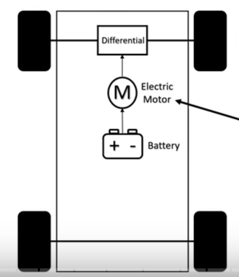
```

As shown in Figure @fig-ev-single-motor-13, the simplest EV drivetrain uses one motor to drive a single axle. The motor output passes through a fixed single-ratio reduction gear and then a conventional differential to the two driven wheels.

- **Examples:** Nissan Leaf (front motor, FWD), Chevrolet Bolt EV, base Tesla Model 3
- **Advantages:** Simple, low cost, lightweight, highly reliable, straightforward packaging
- **Disadvantages:** Two-wheel drive only; limited traction on slippery or loose surfaces; the single motor handles all traction demands, which can saturate it during aggressive use

#### Dual Motor (AWD) {#sec-ev-dual-13}

```{r fig-ev-dual-motor-13, echo=FALSE, out.width="55%", fig.align="center", fig.cap="Dual-motor EV drivetrain. One motor drives the front axle and a second drives the rear axle, each through its own fixed-ratio reduction gear and differential. The two motors can be independently and almost instantaneously controlled, providing true electronic AWD and torque vectoring capability."}
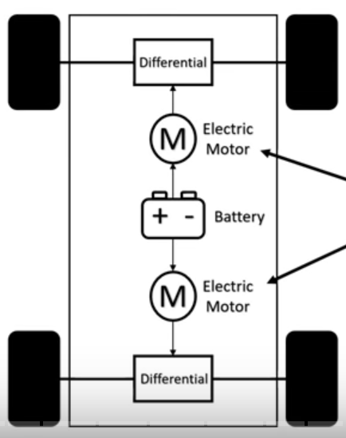
```

The most common performance EV layout uses **two motors**, one per axle (Figure @fig-ev-dual-motor-13). Each motor has its own reduction gear and differential, with no mechanical coupling between front and rear axles.

- **Examples:** Tesla Model 3 Long Range AWD, Audi e-tron, Ford Mustang Mach-E AWD
- **Advantages:** Full AWD traction; independent torque control for front-rear balance; front motor can be deactivated at highway cruise to save energy; significantly higher performance than single-motor
- **Torque vectoring:** By independently varying front and rear motor torque electronically, the vehicle's handling balance can be shifted in real time — adding yaw stability or enabling controlled oversteer at the limit
- **Disadvantages:** Higher cost and weight than single-motor; added power electronics for the second motor

#### Triple Motor {#sec-ev-triple-13}

```{r fig-ev-triple-motor-13, echo=FALSE, out.width="55%", fig.align="center", fig.cap="Triple-motor EV drivetrain. Two motors independently drive each rear wheel (or two motors at the rear through a differential), while a single motor drives the front axle. This provides true rear-axle torque vectoring and maximum all-wheel-drive performance."}
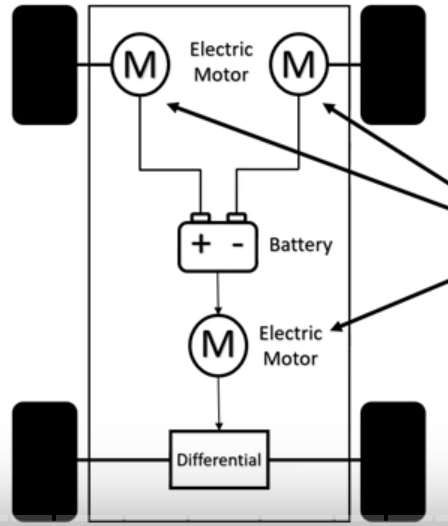
```

A **three-motor** configuration (Figure @fig-ev-triple-motor-13) typically places two motors at the rear — one per rear wheel — for **true rear-axle torque vectoring**, plus one motor at the front for AWD.

- **Examples:** Tesla Model S Plaid, Tesla Model X Plaid
- **Advantages:** Exceptional performance (Model S Plaid: 0–100 km/h in 2.1 s); precise rear torque vectoring; allows the outer rear wheel to receive more torque during cornering, actively yawing the car for sharper turn-in
- **Disadvantages:** High cost; high battery current demand requiring a large battery pack; complexity overkill for everyday commuting

#### Four Motor (Quad Motor) {#sec-ev-quad-13}

```{r fig-ev-quad-motor-13, echo=FALSE, out.width="55%", fig.align="center", fig.cap="Quad-motor EV drivetrain. Each wheel is independently driven by its own electric motor. This provides the maximum possible traction control and torque vectoring capability, including the ability to drive individual wheels forward or in reverse simultaneously."}
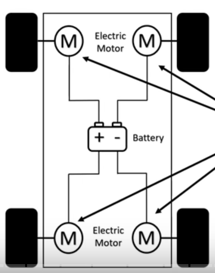
```

The **four-motor** configuration (Figure @fig-ev-quad-motor-13) dedicates one motor to each wheel. This is the ultimate traction and handling architecture.

- **Examples:** Rivian R1T pickup, Rivian R1S SUV
- **Advantages:** Maximum traction on any surface; full four-wheel torque vectoring; enables **tank-turn** capability (driving front wheels forward while rear wheels drive in reverse to spin the vehicle on its own axis); exceptional off-road capability
- **Disadvantages:** Highest component count, cost, and weight; four sets of power electronics; significant unsprung mass penalty if motors are at the wheels

::: {.callout-industry}
**Industry Application:** The Rivian R1T uses four independent motors — one per wheel — allowing each wheel's torque to be set independently by software. Off-road "rock crawl" mode applies extremely precise, low-speed torque to each individual wheel to maintain traction on uneven terrain, something that would be impossible to achieve mechanically with a single powertrain and conventional differentials.
:::

#### In-Hub (Wheel Hub) Motors {#sec-ev-inhub-13}

```{r fig-inhub-motor-photo-13, echo=FALSE, out.width="60%", fig.align="center", fig.cap="In-hub electric motor by NTN, installed directly inside the wheel assembly. The motor, reduction gearing, and brake disc are all packaged within the wheel rim, completely eliminating axle shafts, CV joints, and differentials."}
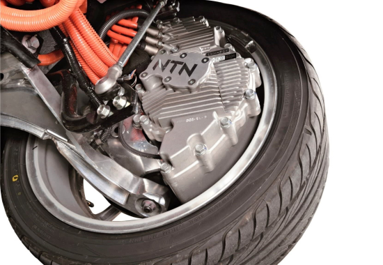
```

```{r fig-inhub-motor-exploded-13, echo=FALSE, out.width="65%", fig.align="center", fig.cap="Exploded view of an in-hub motor assembly, showing the rotor, stator, power electronics, bearing, capacitor ring, protective cover, and integrated brake disc and caliper — the complete drivetrain for one wheel, packaged entirely within the wheel rim."}
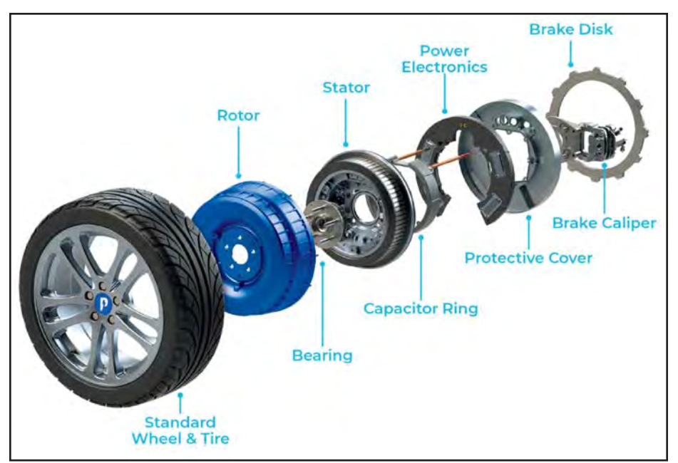
```

The most radical EV drivetrain concept places the motor **directly inside each wheel hub**. As Figures @fig-inhub-motor-photo-13 and @fig-inhub-motor-exploded-13 show, the entire motor is contained within the wheel assembly — the vehicle underbody is completely free of axles, differentials, and driveshafts.

**Advantages:**

- **Maximum mechanical simplicity** — no axles, driveshafts, CV joints, or differentials; every wheel is its own independent propulsion unit
- **Packaging freedom** — the entire floor can be used for a flat battery pack; no intrusion into cabin floor space
- **Ultimate torque vectoring** — every wheel's drive torque and regenerative braking are controlled fully independently
- **Regenerative braking per wheel** — energy recovery can be distributed optimally across all four corners

**Disadvantages:**

- **Unsprung mass** — the motor sits outboard of the suspension and must move with the wheel over every road irregularity. High unsprung mass worsens ride quality, steering feel, and high-frequency handling response. The wheel cannot respond quickly to road bumps when it is carrying motor mass.
- **Heat management** — motor heat is generated inside the wheel with no direct path to the vehicle cooling system. Sustained hard driving (mountain passes, track use) can cause thermal throttling.
- **Road shock to electronics** — potholes transmit impact loads directly into the motor windings and power electronics inside the wheel, creating reliability challenges not present with chassis-mounted motors.
- **Brake integration** — conventional friction brakes must be packaged inside the wheel alongside the motor, creating a complex, space-constrained design.
- **Production maturity** — as of 2025, no in-hub motor system has achieved high-volume mainstream automotive production. Companies such as Protean Electric, NTN, and Elaphe have demonstrated prototypes and low-volume systems, but the unsprung mass and thermal challenges remain active engineering problems.

```{r ev-config-comparison-13, fig.cap="Comparison of EV drivetrain configurations across five key attributes. Scores are indicative on a scale of 1 to 10, higher is better for that attribute. Note that no single configuration excels in all areas — the choice involves real engineering trade-offs.", fig.align='center', echo=FALSE}
library(ggplot2)
library(tidyr)

ev_data <- data.frame(
  Config            = c("Single Motor", "Dual Motor", "Triple Motor", "Quad Motor", "In-Hub"),
  Performance       = c(5, 8, 10, 9, 9),
  Traction_Control  = c(4, 8, 9, 10, 10),
  Cost              = c(9, 7, 5, 4, 4),
  Simplicity        = c(9, 7, 5, 4, 3),
  Energy_Range      = c(9, 7, 6, 5, 7)
)

ev_long <- pivot_longer(ev_data, -Config, names_to = "Attribute", values_to = "Score")
ev_long$Attribute <- gsub("_", " ", ev_long$Attribute)
ev_long$Config <- factor(ev_long$Config,
  levels = c("Single Motor", "Dual Motor", "Triple Motor", "Quad Motor", "In-Hub"))

ggplot(ev_long, aes(x = Attribute, y = Score, fill = Config)) +
  geom_col(position = "dodge") +
  scale_fill_manual(values = c("#264653", "#2A9D8F", "#E9C46A", "#F4A261", "#E76F51")) +
  scale_y_continuous(limits = c(0, 10), breaks = seq(0, 10, 2)) +
  labs(
    title    = "EV Drivetrain Configuration Comparison",
    subtitle = "Score out of 10 (higher = better for that attribute)",
    x        = NULL,
    y        = "Score",
    fill     = "Configuration"
  ) +
  theme_minimal() +
  theme(
    plot.title      = element_text(hjust = 0.5, size = 14, face = "bold"),
    plot.subtitle   = element_text(hjust = 0.5, size = 10),
    axis.text.x     = element_text(angle = 20, hjust = 1),
    legend.position = "bottom"
  )
```

***

### Key Takeaways {#sec-drivetrain-takeaways-13}

::: {.callout-check}
**Chapter Summary — Can you answer these questions?**

1. An ICE engine produces near-zero torque at idle. An electric motor produces maximum torque at zero speed. Why does this fundamental difference eliminate the need for a multi-speed transmission in EVs?

2. A torque converter contains a pump, turbine, and stator. What function does the stator serve, and why is it mounted on a one-way clutch rather than being fixed rigidly to the case?

3. A dual clutch transmission pre-selects the next gear before the shift occurs. Why does this result in shift times below 100 ms when a manual gearbox shift takes 300–500 ms?

4. Under hard acceleration, a CVT holds the engine at high RPM while the car accelerates. What mechanical reason causes this apparent RPM "plateau"?
:::

***

### Practice Problems {#sec-drivetrain-practice-13}

**Problem 1 — Drive Configuration Selection**

A compact pickup truck is being specified for the Canadian market. The truck will carry loads up to 800 kg in the bed, tow trailers up to 2,000 kg, and operate on paved roads (70%) and unpaved farm tracks (30%). Evaluate each drive configuration (FWD, RWD, AWD, 4WD) against these requirements and recommend one with full justification.

---

**Problem 2 — Gear Ratio and Vehicle Speed**

An engine produces a peak torque of 280 N·m at 3,200 RPM. The 6-speed transmission has gear ratios: 1st = 3.80, 2nd = 2.18, 3rd = 1.47, 4th = 1.03, 5th = 0.82, 6th = 0.65. The final drive ratio is 3.55:1. Tyre rolling radius is 0.315 m. Drivetrain efficiency is 88%.

(a) Calculate the maximum torque at the wheels in 1st gear.
(b) Calculate the maximum vehicle speed in 6th gear if the engine redlines at 6,500 RPM.
(c) At the torque peak (3,200 RPM), calculate the vehicle speed in each gear.

---

**Problem 3 — Torque Converter at Launch**

At launch, a torque converter produces a torque ratio of 2.15:1. The engine produces 320 N·m at 2,400 RPM. The transmission is in 1st gear (ratio 3.65:1) and the final drive is 3.73:1. Drivetrain efficiency is 86%.

(a) Calculate the torque at the output of the torque converter.
(b) Calculate the torque at the driven wheels.
(c) Calculate the tractive force at the wheels, assuming a rolling radius of 0.320 m.

---

**Problem 4 — EV Drivetrain Trade-off Analysis**

A manufacturer is developing a battery-electric SUV with the following performance targets:

- 0–100 km/h in under 5.0 seconds
- Range: 480 km (WLTP)
- Towing capacity: 3,000 kg
- Target price: under \$65,000 CAD

Evaluate single-motor, dual-motor, and quad-motor drivetrain configurations against these targets. Which configuration do you recommend? Identify the key engineering trade-offs for each configuration.

***

### Further Resources {#sec-drivetrain-resources-13}

```{r further-auto-trans-13, echo=FALSE, results='asis'}
embed_youtube("u_y1S8C0Hmc", "Automatic Transmission Deep Dive — Engineering Explained")
```

```{r further-torque-conv-13, echo=FALSE, results='asis'}
embed_youtube("z5G2zQ_3xTc", "Torque Converter Operation — Engineering Explained")
```

```{r further-manual-13, echo=FALSE, results='asis'}
embed_youtube("wCu9W9xNwtI", "Manual Transmission and Synchronizers — Engineering Explained")
```

```{r further-clutch-13, echo=FALSE, results='asis'}
embed_youtube("devo3kdSPQY", "Clutch Operation and Construction — Engineering Explained")
```

```{r further-dct-13, echo=FALSE, results='asis'}
embed_youtube("lFAtc-zOKZs", "Dual Clutch Transmission — How It Works")
```

```{r further-cvt-13, echo=FALSE, results='asis'}
embed_youtube("xHWqlfDZnmQ", "CVT Explained — Advantages, Disadvantages and How It Works")
```

```{r further-ev-13, echo=FALSE, results='asis'}
embed_youtube("6H5vtu5_SF4", "Electric Vehicle Drivetrain Configurations Compared")
```
