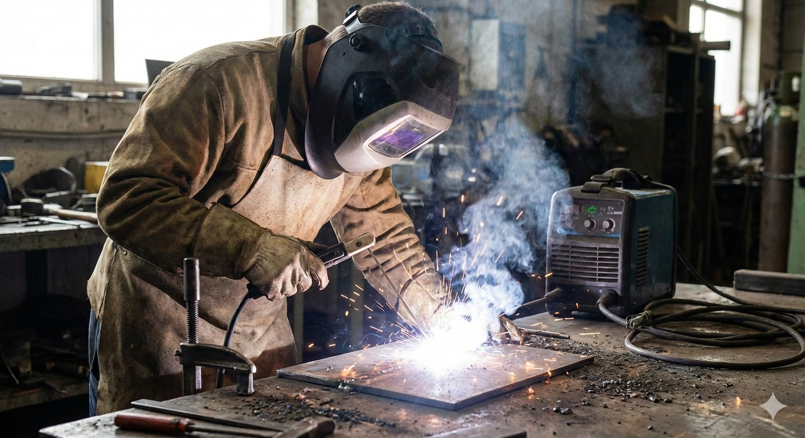
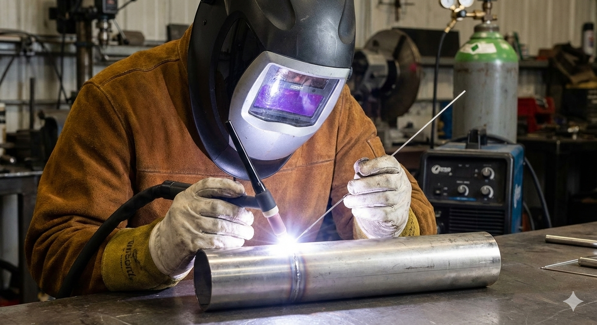

# Design for Joining {#chap-02-joining}

```{r setup-02, include=FALSE}
# include the helpers.R file for pdf output of youtube on pdfs as a clickable link
source("R/helpers.R")
# include the required packages to make sure the page can be built.
source("R/required_packages.R")
```

## Learning Objectives {#sec:objectives-02}

By the end of this chapter, you will be able to:

1. **Classify** joining methods by their bonding mechanism (fusion, filler, mechanical)
2. **Explain** the principles and applications of welding, brazing, and soldering
3. **Identify** appropriate joining methods for different material combinations and applications
4. **Compare** the advantages and limitations of permanent vs. non-permanent joining methods
5. **Evaluate** when to choose welding over mechanical fastening or adhesive bonding

::: {.callout-think}
**Before You Read:** Consider the products around you—your phone, car, furniture, and buildings. Each is made of multiple parts joined together. What different methods might have been used to join these parts, and why might engineers have chosen those particular methods?
:::

## Joining Processes: Uniting Materials for Function {#sec:joining-intro}

### Introduction {#sec:joining-overview}

The ability to permanently or temporarily unite two or more separate material components is fundamental to nearly every branch of engineering and manufacturing. Whether creating the fuselage of an aircraft, the circuitry of a smartphone, or the frame of a bicycle, **joining processes** are essential for assembling parts into functional products. 

Joining processes can be broadly categorized based on the method used to create the bond: those that use **heat and fusion** (welding), those that use **fillers** (brazing and soldering), those that use **chemical agents** (adhesives), and those that rely on **mechanical force** (fasteners). The selection of the appropriate joining method is a critical design decision, dictated by the materials being joined, the required strength, the operating environment (e.g., temperature, corrosion), and cost considerations.

---

### Classification of Joining Methods

Joining techniques are typically classified into three main groups based on how the bond is established:

#### Fusion and Cohesion

These processes create a continuous, strong bond by achieving atomic or molecular cohesion between the joined parts, often involving melting the base materials.

* **Welding:** This is a permanent joining process that involves heating the base metal parts to their melting point and allowing them to fuse together, often with the addition of a filler metal. Welding creates a joint that can be as strong, or even stronger, than the parent material itself. It is widely used in heavy industries like construction, shipbuilding, and pipe fabrication.

#### Chemical/Metallurgical Bonding with Fillers

These processes use a separate material (a filler) to create the bond between two materials without melting the base materials.

* **Brazing:** A joining process where a non-ferrous filler metal is melted and drawn into the joint gap by capillary action. The filler metal has a melting point **above $450^\circ\text{C}$ ($840^\circ\text{F}$)**, but below the melting point of the base metals. Brazing creates strong, leak-tight joints with minimal thermal distortion to the base parts.
* **Soldering:** Similar to brazing, soldering uses a filler metal (solder) that melts at a temperature **below $450^\circ\text{C}$ ($840^\circ\text{F}$)**. This process is primarily used in electronics and sheet metal work where strong mechanical bonds are less critical than electrical conductivity or a leak-proof seal.

#### Mechanical and Chemical Adhesion

These methods rely on either a sticky substance or physical interlocking to hold parts together.

* **Adhesive Joining:** This method uses chemical compounds (adhesives, glues, epoxies) that cure to form a chemical bond between the surfaces. Adhesives can join dissimilar materials (like metal to plastic), distribute stress over a wide area, and provide excellent sealing.
* **Mechanical Fasteners:** These are non-permanent methods that use hardware to hold materials together. This category includes common items like **bolts, screws, rivets, nuts, pins, and clips**. The primary advantage of mechanical fasteners is that they allow for easy disassembly and reassembly for maintenance or repair.

## The Welding Process {#sec:welding-process}

### Introduction to Welding

Welding is a **fusion joining process** that creates a permanent, monolithic bond between two or more separate metal parts. Unlike brazing or soldering, welding typically involves heating the base metal parts to their melting temperature and allowing them to fuse together, often with the addition of a **filler material** 

```{r, echo=FALSE, out.width="50%", fig.align="center", fig.cap="Welding"}
knitr::include_graphics("images/Gemini_Generated_Image_o2yyb9o2yyb9o2yy.png")
```

The primary goal of welding is to create a joint that is as strong as, or even stronger than, the original parent materials. This makes it an indispensable process in heavy fabrication and structural engineering, including the construction of ships, bridges, pipelines, and pressure vessels.

How is it possible that a weld is stronger than the original parent materials?

---

### Classification and Types of Welding Processes

Welding processes are broadly classified based on the source of energy used to achieve the necessary heat for fusion. The three major categories are:

#### 1. Arc Welding

Arc welding is the most common category, utilizing an electrical arc to generate the heat required to melt the metals. A power source creates an arc between an electrode and the base metal, generating temperatures high enough to melt both.

* **Shielded Metal Arc Welding (SMAW or Stick Welding):** Uses a consumable electrode coated with flux. The flux vaporizes during welding, creating a protective gas shield and slag, which prevents atmospheric contamination of the molten weld pool. It is highly versatile and used widely for structural steel. 

```{r, echo=FALSE, out.width="50%", fig.align="center", fig.cap="Shielded Metal Arc Welding (SMAW)"}

```

* **Gas Metal Arc Welding (GMAW or MIG Welding):** Uses a continuous, consumable wire electrode fed through a welding gun, while an externally supplied shielding gas (e.g., Argon, $\text{CO}_2$) protects the arc and weld pool. It is known for its speed and suitability for automated systems. 
* **Gas Tungsten Arc Welding (GTAW or TIG Welding):** Uses a non-consumable tungsten electrode and an inert shielding gas (usually Argon). It typically requires a separate filler rod. TIG welding produces the highest quality welds, often used for critical applications and joining thin metals or reactive metals like aluminum and titanium. 

```{r, echo=FALSE, out.width="50%", fig.align="center", fig.cap="Gas Tungsten Arc Welding (GATW)"}

```


#### 2. Resistance Welding

Resistance welding uses the heat generated by the electrical resistance of the materials themselves when a current is passed through them under pressure.

* **Spot Welding:** The most common resistance method. It uses two electrodes to clamp sheets of metal together. A high current is passed through, locally heating and fusing the metal at a small "spot." It is widely used in the automotive industry for joining body panels.

```{r, echo=FALSE, out.width="50%", fig.align="center", fig.cap="Spot Welding"}
knitr::include_graphics("images/Picture299.jpg")
```

#### 3. High-Energy Beam Welding

These advanced processes use highly concentrated energy sources for deep, narrow, and precise welds.

* **Laser Beam Welding (LBW):** Uses a focused beam of coherent light (laser) to heat and fuse the materials. It is excellent for high-speed, precise welding in mass production.
* **Electron Beam Welding (EBW):** Uses a beam of high-velocity electrons to provide the heat source. This process requires a vacuum chamber, but produces extremely high-quality welds with very low heat input, ideal for aerospace and nuclear components.

---

### When to Choose Welding

Welding is not always the best solution, but it is the superior choice over other joining processes like mechanical fastening, brazing, or adhesives in several key scenarios:

1.  **Requirement for Monolithic Strength:**
    * **Permanent Joint:** Welding creates a permanent, continuous metallurgical bond, effectively making the joint an integral part of the structure.
    * **High Load/Stress:** For applications subjected to high dynamic or static loads (e.g., bridge structures, pressure vessels, vehicle chassis), the strength and rigidity offered by a fully fused weld joint are unmatched by mechanical fasteners or adhesives.

2.  **Structural Integrity and Sealing:**
    * **Leak-Proof Seals:** Welding is essential for creating completely leak-proof joints, which is critical for containers, tanks, and pipelines holding liquids or gases under pressure.
    * **Weight Reduction:** By eliminating overlapping flanges or bolted plates, welding can often result in lighter overall structures compared to mechanical fastening.

3.  **Specific Material and Geometry Requirements:**
    * **Thick Sections:** Welding is highly effective for joining very thick metal plates, where fasteners would be impractical or structurally insufficient.
    * **Material Compatibility:** While welding *can* join dissimilar metals, it is best suited for scenarios where the material properties of the filler metal can be carefully matched to the base metals to maintain structural and chemical properties.

#### Comparison to Other Processes:

| Process | Primary Advantage Over Welding | Why Welding is Chosen Instead |
| :--- | :--- | :--- |
| **Mechanical Fasteners** | Allows for **disassembly** and repair. | When a joint must be **permanent** and transmit **structural forces** without the risk of loosening under vibration. |
| **Brazing / Soldering** | Lower heat input prevents distortion/damage to base metal. | When the joint needs the **full strength** of the parent metal, and the service temperature exceeds the filler metal's melting point. |
| **Adhesive Bonding** | Joins dissimilar materials; distributes stress over a wide area. | When high strength is required in **high-temperature environments** where most adhesives would degrade, or when a **rapidly cured joint** is necessary. |