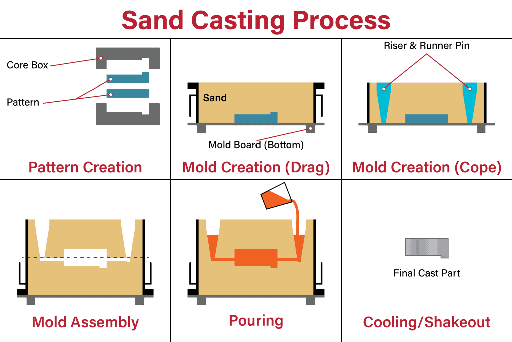
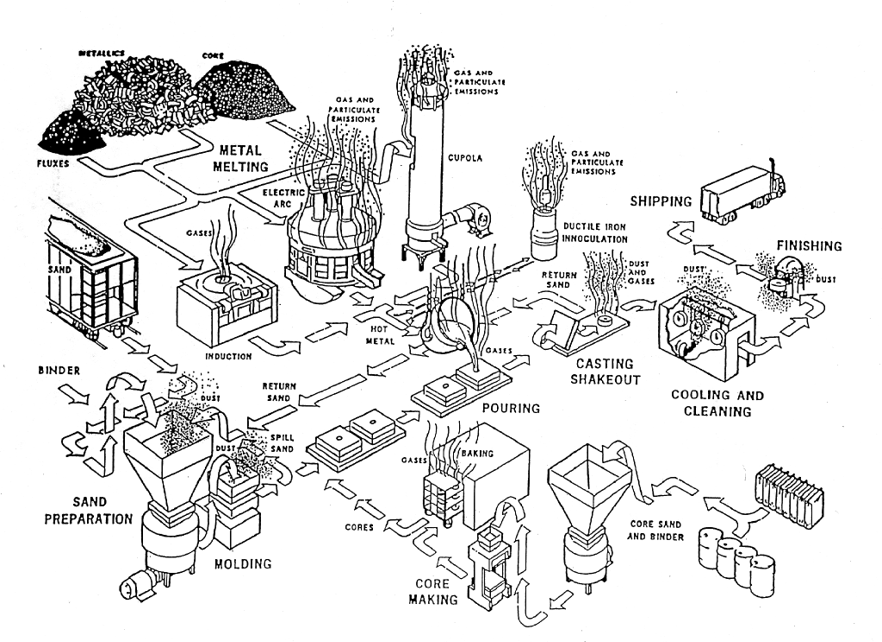
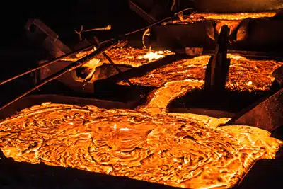
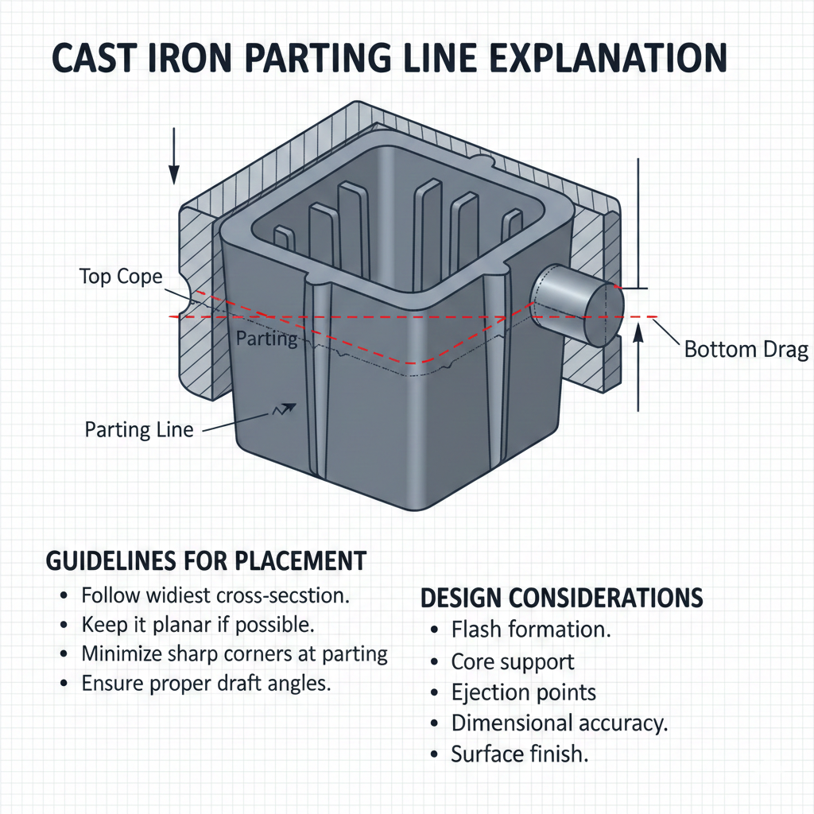

## Design for Casting {#chap-casting}

```{r setup-01, include=FALSE}
## include the helpers.R file for pdf output of youtube on pdfs as a clickable link
source("R/helpers.R")
## include the required packages to make sure the page can be built.
source("R/required_packages.R")
```

### Learning Objectives {#sec:objectives-01}

By the end of this chapter, you will be able to:

1. **Explain** the fundamental principles and steps of the casting process
2. **Identify** the essential components required for casting operations
3. **Compare** different casting methods and their appropriate applications
4. **Apply** design considerations for castings including draft angles, parting lines, and wall thickness
5. **Recognize** common casting defects and their causes

::: {.callout-think}
**Before You Read:** Have you ever noticed the small raised lines or marks on metal objects like engine blocks or cast iron cookware? What do you think causes these marks during manufacturing?
:::

### Introduction to the Casting Process {#sec:casting-intro}

Casting is one of the oldest and most fundamental processes in manufacturing, dating back thousands of years. It involves pouring a liquid material, typically a molten metal, into a mold cavity where it is allowed to solidify in the desired shape. The resulting solidified object is called a **casting**. 

The significance of casting lies in its ability to produce complex, intricate shapes—including those with internal cavities or non-symmetrical geometries—that would be difficult or impossible to create using methods like machining or forging. This makes casting essential for industries ranging from aerospace and automotive to jewelry and construction.

---

### Essential Components of Casting {#sec:casting-components}

Every casting operation requires two basic elements:

1.  **The Casting Material:** This is the material, usually metal (such as iron, steel, aluminum, or bronze), that is melted into a liquid state.
2.  **The Mold:** This is the container that holds the liquid material and determines the final shape of the part. The mold contains a cavity that is the inverse of the part being made.

### The Basic Steps of Casting {#sec:casting-steps}

While the specifics vary greatly depending on the material and method (e.g., sand casting vs. die casting), the fundamental steps remain consistent:

1.  **Melting:** The casting material is heated to a liquid state in a furnace.
2.  **Pouring:** The molten material is introduced into the mold cavity.
3.  **Solidification:** The material is allowed to cool and solidify within the mold, taking the shape of the cavity.
4.  **Removal (Fettling):** The solidified casting is removed from the mold.
5.  **Cleaning and Finishing:** The casting is cleaned of any excess material (like gates or risers) and prepared for its intended use.

### Applications and Scope {#sec:casting-applications}

The versatility of casting allows it to produce parts ranging in size from a few grams (e.g., dental crowns) to hundreds of tons (e.g., steam turbine housings). The choice of a specific casting method—such as sand casting, investment casting, die casting, or continuous casting—depends on the required surface finish, dimensional accuracy, batch size, and the type of material being processed.


### Sand Mould Casting: The Versatile Workhorse

#### Introduction {#sec:sand-casting-intro}

Sand casting, also known as sand mould casting, is the oldest and most frequently used metal casting process, responsible for producing over 70% of all metal castings. It is highly valued for its **versatility** and **cost-effectiveness**, making it the foundational method for manufacturing a vast array of metal components, from massive engine blocks and turbine parts to small fittings and decorative items.

The basic principle is simple: create a mould using sand, pour molten metal into the cavity, let it solidify, and then break the mould to retrieve the part.

---

#### Components and Steps of the Process {#sec:sand-casting-steps}

The sand casting process is typically performed in two halves and involves five main steps.

```{r, echo=FALSE, out.width="50%", fig.align="center", fig.cap="Sand Casting Process"}

```

##### Mold Preparation 

The mold is created inside a metal frame called a **flask** (or molding box). The flask has two halves: the **cope** (top half) and the **drag** (bottom half).

* **Pattern:** A pattern, which is a reusable, full-sized model of the part to be cast (often made of wood, plastic, or metal), is placed inside the flask.
* **Gating System:** Additional shapes are included with the pattern to form the channels through which the molten metal will flow:
    * **Sprue:** The vertical channel where the molten metal is poured.
    * **Runners:** Horizontal channels leading from the sprue to the mold cavity.
    * **Risers:** Reservoirs that feed extra molten metal back into the mold cavity as the metal shrinks during solidification.
* **Compacting:** Molding sand—typically a mix of sand, clay (bentonite), and water or other bonding agents—is packed tightly around the pattern inside the flask.
* **Pattern Removal:** The flask is separated, and the pattern is carefully removed, leaving the inverse cavity of the part.

##### Core Placement (Optional)

If the casting requires **internal features** (like a hollow pipe or engine cylinder), a pre-formed core (usually made of a different, rigid sand mix) is placed into the mold cavity. This core remains suspended inside the cavity and prevents the molten metal from filling that space.

##### Mold Closure and Pouring

* The cope and drag are sealed and clamped together.
* Molten metal is poured from a ladle down the **sprue** and through the gating system until the mold cavity and risers are completely filled.

##### Solidification, Cooling, and Shakeout

The metal cools and solidifies within the sand mold. Since sand molds are non-reusable (they are broken to remove the part), this step is often called **shakeout**.

##### Finishing

The final casting is removed, and the metal from the sprue, runners, and risers (the non-part material) is cut away (a process called **fettling**) and typically recycled.

---

#### Advantages and Disadvantages {#sec:sand-casting-pros-cons}

| Feature | Advantage | Disadvantage |
| :--- | :--- | :--- |
| **Cost** | **Low tool and equipment cost**, making it economical for small batches or prototypes. | **Labor-intensive** and requires significant energy for sand processing and handling. |
| **Material/Size** | **Highly versatile:** can handle almost all metals and produce castings ranging from very small to very large (up to 200 tons). | **Poor surface finish** and **low dimensional accuracy** compared to die casting or investment casting. |
| **Mold** | Molds are rapidly made and disposable, facilitating complex shapes. | Low production rate due to the non-reusable nature of the mold. |

```{r, echo=FALSE, out.width="50%", fig.align="center", fig.cap="Typical Casting Company."}

```
<details>
  <summary>This diagram illustrates the integrated flow of a metal casting facility, tracing the journey from raw scrap and sand to a finished product. </summary>
  
  The process is characterized by two main streams: **Metal Melting** and **Sand/Core Preparation**, which converge at the pouring stage.

  
##### Primary Metal Melting Methods {-}
  
  The image identifies three distinct industrial furnaces. Each uses a different physical principle to reach the melting point of the metal (often exceeding 1,370°C or 2,500°F for iron).
  
###### Electric Arc Furnace (EAF) {-}
  * **Mechanism:** This furnace uses high-voltage electric arcs to melt the charge. Large graphite electrodes are lowered toward the metal scrap; electricity "arcs" from the electrodes to the metal, generating intense thermal energy.
  * **Emissions:** As indicated by the "Gas and Particulate Emissions" label, this process is volatile. The arc can cause rapid vaporization of surface contaminants on the scrap metal.
  
###### Induction Furnace {-}
  * **Mechanism:** This method utilizes a high-voltage electrical source passed through a copper coil. This creates a rapidly reversing magnetic field that induces "eddy currents" inside the metal. The metal’s own electrical resistance generates the heat internally.
  * **Characteristics:** It is generally cleaner than the EAF and provides a natural "stirring" action due to electromagnetic forces, which ensures a consistent alloy mix.
  
###### Cupola Furnace {-}
  * **Mechanism:** A Cupola is a vertical, cylindrical furnace. It is a "combustion" furnace where layers of **Coke** (fuel), **Flux**, and **Metallics** are layered. A blower forces air into the bottom to facilitate the burning of the coke, which melts the metal as it drops through the stack.
  * **Characteristics:** This is a continuous melting process. The diagram shows a tall stack to manage the significant volume of flue gases produced by the burning fuel.
  
  
##### Mold and Core Preparation {-}
  
  For a casting to have a specific shape, the molten metal must be poured into a "negative" space.
  
  * **Sand Preparation:** Raw sand is mixed with a **Binder** (like clay or chemical resin) to ensure it holds its shape.
  * **Molding:** The sand is packed around a pattern to create the external shape of the part.
  * **Core Making & Baking:** **Cores** are used to create hollow internal cavities (like the inside of an engine block). These are often "baked" in an oven to harden the binder so the core doesn't collapse when hit by molten metal.
  
  
##### Post-Melting and Finishing {-}
  
  Once the metal is liquid and the molds are ready, the final steps of production occur:
  
  1.  **Ductile Iron Inoculation:** The metal is treated with alloys (like Magnesium) to improve its strength and ductility.
  2.  **Pouring:** The "Hot Metal" is poured into the molds.
  3.  **Casting Shakeout:** Once solidified, the sand mold is vibrated until it breaks apart, releasing the metal casting. 
      * *Note: The "Return Sand" is sent back to the start of the process to be recycled.*
  4.  **Cooling and Cleaning:** The casting is cooled and cleaned of any remaining sand or "flash" (excess metal).
  5.  **Finishing:** Final grinding or machining is performed before **Shipping**.
  
  ---
  
**Environmental Note:** The diagram emphasizes that every stage of the foundry—from melting to shakeout—generates dust and gases, highlighting the need for robust industrial ventilation systems.
</details>


```{=html}
<div style="position: relative; padding-bottom: 56.25%; height: 0; overflow: hidden; max-width: 100%;">
  <iframe 
    style="position: absolute; top: 0; left: 0; width: 100%; height: 100%;"
    src="https://www.youtube.com/embed/2CIcvB72dmk" 
    title="YouTube video player" 
    frameborder="0" 
    allow="accelerometer; autoplay; clipboard-write; encrypted-media; gyroscope; picture-in-picture; web-share" 
    referrerpolicy="strict-origin-when-cross-origin" 
    allowfullscreen>
  </iframe>
</div>
```

```{=html}
<div style="position: relative; padding-bottom: 56.25%; height: 0; overflow: hidden; max-width: 100%;">
  <iframe 
    style="position: absolute; top: 0; left: 0; width: 100%; height: 100%;"
    src="https://www.youtube.com/embed/pwaXCko_Tkw" 
    title="YouTube video player" 
    frameborder="0" 
    allow="accelerometer; autoplay; clipboard-write; encrypted-media; gyroscope; picture-in-picture; web-share" 
    referrerpolicy="strict-origin-when-cross-origin" 
    allowfullscreen>
  </iframe>
</div>
```

Further reading:

[Reliance Foundry](https://www.reliance-foundry.com/blog/sand-casting)

[3DPCasting](https://www.3dpcasting.com/blogs/sand-casting-8-key-steps-in-detail/)

[General Kinematics](https://www.generalkinematics.com/blog/sand-casting/)

[Design Rules](https://diecasting.zinc.org/properties/en/design/eng_prop_d_design-rules/)


### Full Mould Casting Casting


### Investment Casting

---

### Design for Casting [@reliance-casting-design]

#### Engineering Metal Castings for Quality and Value {#sec:engineering-castings}

Good metal casting design aims to create the simplest mold that will produce the desired shape. This process requires expert knowledge of metals and casting methods to strike the best balance between quality and value in the final product.

Engineers and designers select metals and casting methods based on the mechanical requirements of the end-user. They must determine how the cast object will behave under load, when struck, and in different heat conditions—specifically, whether it will crack, warp, or deform over time. Metal designs may also require a specific grade of finishing for either mechanical or aesthetic reasons.

Ultimately, the designer uses their experience of how material properties and casting methods influence each other in the foundry to create the final design. A key skill is knowing the behavior of metal in its liquid, cooling, and solid states to create a design that minimizes production problems.

#### Variables in Metal Casting Design {#sec:casting-variables}

Several characteristics of the metal itself and the physics of heat transfer significantly affect the outcome of a casting design.

##### Metal Castability

Four main metal characteristics influence the casting process:

* **Fluidity:** This describes the ease with which a molten metal flows. Metals with high fluidity are better able to capture small details within a mold.
* **Shrinkage:** This is the rate at which molten metal contracts as it cools. Shrinkage is categorized by three stages:
    * **Liquid Shrinkage:** Contraction rate when the metal first begins to cool.
    * **Solidification Shrinkage:** Contraction rate when the metal is actively freezing from a liquid to a solid state.
    * **Solid Shrinkage:** Contraction rate once the metal has fully set.
    * These rates help predict strains and defects, especially if parts of the design freeze much faster than others, which can challenge the casting's integrity.
* **Slag or Dross Formation:** This describes the presence of non-metallic inclusions in the casting. Slag/dross on the surface may be acceptable, but sub-surface inclusions are detrimental. 

```{r, echo=FALSE, out.width="50%", fig.align="center", fig.cap="Slag is the dark layer floating on this titanium as it flows from an arc furnace during de-slagging."}

```


* **Pouring Temperature:** This is the specific temperature at which an alloy can be poured. Generally, the hotter the metal, the more production challenges are introduced.

##### Heat Transfer and Solidification Patterns

Solidification is controlled by how heat is transferred and dispersed:

* **Heat Transfer Rates:** Two rates affect solidification speed:
    1.  The dispersion of heat through the metal itself.
    2.  The rate of heat transfer from the casting surface to the mold.
* These rates determine the overall temperature differential across the casting, which can lead to differential cooling as sections change state at different times.
* **Solidification Pattern:** A casting usually crystallizes from the edge inward, cooling quickly where it touches the mold.
* Engineers use the crystallization, heat transfer, and shrinkage rates to predict the solidification pattern and design the mold accordingly to minimize shrinkage problems.
    * **Chills:** Molds may be designed with chills to create more rapid shrinkage in a specific section.
    * **Risers:** Reservoirs, called risers, are connected to the cooling casting to slowly feed liquid metal into it, preventing cavities from forming as the metal shrinks.


#### Design Considerations for Shape and Mold {#sec:design-considerations}

Designers must structure the geometry of the casting and the mold components to manage heat and metal flow.

##### Shape and Section Size Changes

* **Hot Spots:** Increased thickness in material can create hot spots in cooling castings.
* **Uniform Thickness:** Where possible, designing castings with uniform thickness is helpful.
* **Tapering:** For large diameter changes, sections should be tapered slowly to prevent cooling strain.
* **Smoothing and Cores:** Engineers prevent high-volume hotspots by smoothing sharp angles and adding cores.

```{r, echo=FALSE, out.width="50%", fig.align="center", fig.cap="Metal castings with large diameter changes should be tapered slowly to prevent cooling strain."}
knitr::include_graphics("images/metal-casting-wall-slope.png")
```

```{r, echo=FALSE, out.width="50%", fig.align="center", fig.cap="By smoothing sharp angles and adding cores, engineers prevent high-volume hotspots from forming."}
knitr::include_graphics("images/metal-casting-volume-change.png")
```


##### Junctions Between Sections

* **Volume Consistency:** Sharp angles where two or more sections meet can create a larger volume of metal (a hotspot) at the junction.
* **Rounding Corners:** Designers can smooth these corners, rounding them away from sharp angles, to make the metal volume at the junction more consistent with the surrounding metal volumes.

##### Mold Stability and Surface Finish

* **Mold Integrity:** The mold material must be able to withstand the metal's behavior (expansion, contraction, and off-gassing) while it cools, without fracturing or collapsing.
* **Surface Finish Capability:** The molding method dictates the final surface finish.
    * Fine finishes often require more expensive molding processes.
    * For parts requiring precision finishes only in certain areas, the casting can be machined afterward, but the metal must be easily machinable.
    * While intensive molding processes yield smoother finishes and are often costly, for large objects, this can be less expensive than machining the entire surface.

##### Other Mold Design Considerations

To achieve an excellent casting at a good price, the designer should try to minimize or eliminate deep drafts, expensive cores, and irregular parting.

* **Drafts:** These are necessary tapers on the vertical walls of a casting. They ensure the pattern (the positive image of the object) can be removed from the mold without disturbing the walls.

```{r, echo=FALSE, out.width="50%", fig.align="center", fig.cap="Design with Draft Angles"}
knitr::include_graphics("images/Gemini_Generated_Image_b6qi6zb6qi6zb6qi.png")
```


* **Cores:** Cores are used to create intentional voids or holes inside a casting.  They can be costly to produce, but can sometimes be avoided by changing the orientation of the casting or the mold's parting line.

```{r, echo=FALSE, out.width="50%", fig.align="center", fig.cap="A sand mold with a core. Where the halves of the mold come together is the parting line."}
knitr::include_graphics("images/sand-mold-with-core.jpg")
```

* **Parting Lines:** This is the line where the two halves of the mold meet. Risers and gates are often placed along the parting line.

```{r, echo=FALSE, out.width="50%", fig.align="center", fig.cap="Parting Lines"}

```

    * **Flash:** Metal may leak into the parting line, creating a thin, flat excess called flash, which requires removal after casting.

##### Excellence in Casting Design {#sec:casting-excellence}

Designing a superior product at the lowest price requires understanding the complex dependencies between materials and methods. The required mechanical properties of the final product determine the metal needed, and that metal's liquid, cooling, and solid behavior dictates the necessary mold features.

* **Example:** Brittle metals are less suited for designs with sharp edges prone to chipping. Metals with low fluidity require molds with less small detail.
* **Process Challenges:** A high melting point (like that of steel) demands a higher level of monitoring and precision throughout the process.

Experience and clear communication among designers, engineers, and metalworkers are crucial for creating a product of quality and value.

---

### Defects in Casting process