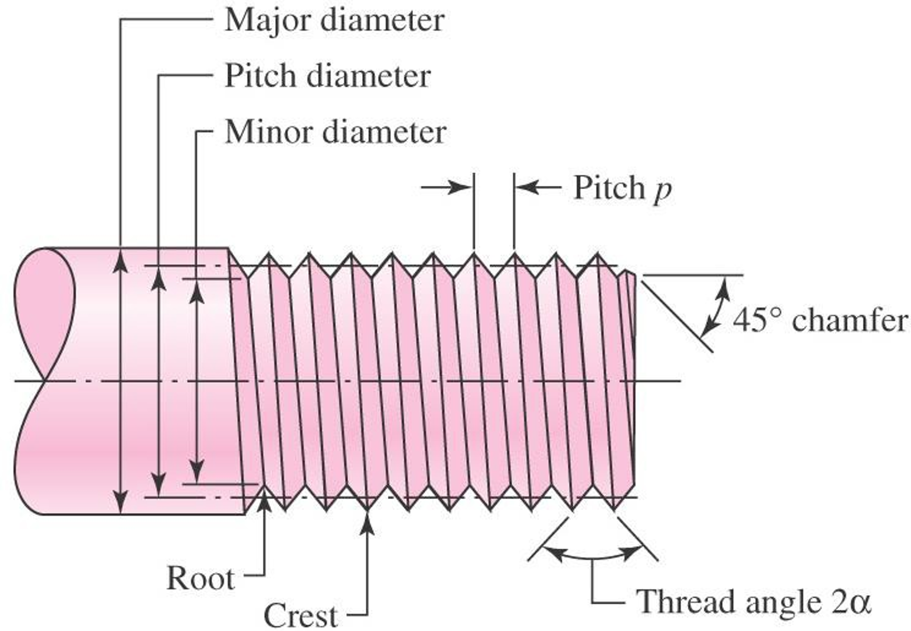
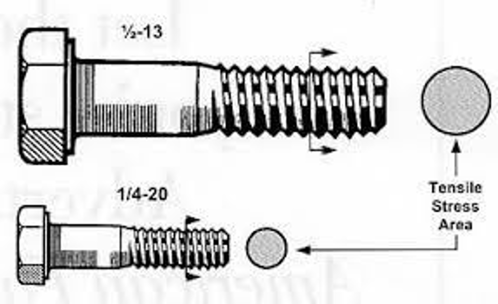
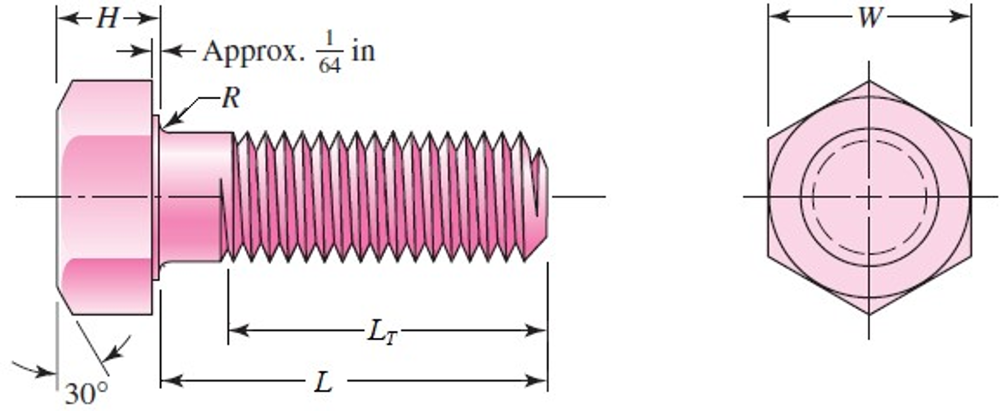
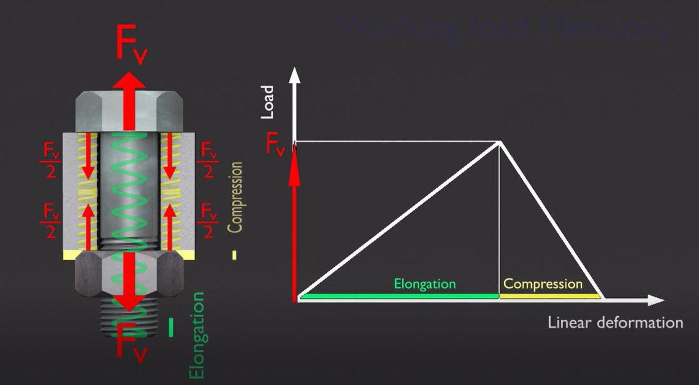

# Strength of Bolt Joint Calculations 

```{r setup-03, include=FALSE}
# include the helpers.R file for pdf output of youtube on pdfs as a clickable link
source("R/helpers.R")
# include the required packages to make sure the page can be built.
source("R/required_packages.R")
```


## Mechanics of Bolted Joint Integrity. {-#bolted-joints}

Bolted joints are among the most common elements in mechanical design, yet they are often the most frequent points of failure. Ensuring the strength of a bolted joint requires a delicate balance between the physical properties of the bolt, the stiffness of the clamped members, and the applied external loads. Fundamentals of Bolt Preload
When a bolt is tightened, it undergoes axial extension, creating a clamping force known as preload ($F_p$). This preload is essential because it keeps the joint members in compression, preventing separation and reducing the amplitude of cyclic loading on the bolt itself. 
The relationship between the applied torque ($T$) and the resulting preload is typically approximated by the "short-form" torque equation:$$T = K \cdot D \cdot F_p$$
Where: $T$ is the tightening torque.$K$ is the torque coefficient (often ~0.2 for unlubricated steel).$D$ is the nominal diameter of the bolt. $F_p$ is the desired preload. Note: Relying solely on torque to determine preload is notoriously imprecise due to friction variables. Advanced applications may use the "turn-of-nut" method or ultrasonic tension sensors [@shigley2020]. Load Distribution and Joint Stiffness. When an external tensile load ($P$) is applied to a joint, only a fraction of that load is actually felt by the bolt. The rest is absorbed by the decompression of the clamped members. This is defined by the joint stiffness constant, $C$:$$C = \frac{k_b}{k_b + k_m}$$ In this equation, $k_b$ represents the stiffness of the bolt and $k_m$ represents the stiffness of the members. The total force acting on the bolt ($F_b$) after the external load is applied is:$$F_b = F_p + C \cdot P$$ Visualizing Factor of Safety to ensure the joint does not fail via yielding or separation, we must calculate the factor of safety. The following R code demonstrates how the bolt force increases relative to the external load until the point of joint separation.

```{r bolt-plot, echo=FALSE, message=FALSE, warning=FALSE, fig.cap="Relationship between Bolt Force and External Load."}
library(ggplot2)
library(rlang)
library(vctrs)

# Parameters
preload <- 5000  # Newtons
C <- 0.25        # Stiffness constant
ext_load <- seq(0, 10000, by = 100)

# Calculate Bolt Force
# Before separation: Fb = Fp + C*P
# After separation: Fb = P (once P > Fp/(1-C))
sep_point <- preload / (1 - C)
bolt_force <- ifelse(ext_load < sep_point, preload + C * ext_load, ext_load)

df <- data.frame(ExternalLoad = ext_load, BoltForce = bolt_force)

ggplot(df, aes(x = ExternalLoad, y = BoltForce)) +
  geom_line(color = "#2c3e50", linewidth = 1) +
  geom_vline(xintercept = sep_point, linetype = "dashed", color = "red") +
  annotate("text", x = sep_point, y = max(bolt_force), label = "Joint Separation", 
           hjust = 1.1, color = "red") +
  labs(title = "Bolted Joint Load Response",
       x = "External Applied Load (N)",
       y = "Total Force on Bolt (N)") +
  theme_minimal()
```

As illustrated in Figure ~\@ref(fig:bolt-plot), the bolt force increases much more slowly while the joint is clamped ($C < 1$). Once the external load exceeds the separation point, the bolt must carry the entire load, significantly increasing the risk of fatigue or tensile failure. 

**Summary Checklist for Designers**

* Determine required clamping force to prevent sliding or separation.
* Select bolt grade based on proof strength requirements.
* Calculate stiffness-es ($k_b, k_m$) to find the joint constant.
* Verify safety factors against yielding, joint separation, and fatigue.

## Bolt Definitions {#bolt-definitions}

Key terminology used to describe the geometry of a bolt.

```{r, echo=FALSE, out.width="70%", fig.align="center", fig.cap="Thread Standards"}

```

* **Pitch** – distance between adjacent threads.	Reciprocal of  threads per inch.
* **Major diameter** – largest diameter of  thread
* **Minor diameter** – smallest diameter of  thread
* **Pitch diameter** – theoretical diameter between major and minor diameters, where  tooth and gap are same width

```{r basic-profile, echo=FALSE, out.width="70%", fig.align="center", fig.cap="Basic Thread Profile"}
knitr::include_graphics("images/BasicProfile.png")
```

> **Note:** The dimensions and geometry in the Figure ~\@ref(fig:basic-profile) are only used for 3d modeling and drawing the threads, they are not dimensions to manufacture to!

The tensile stress area, $A_t$, is the area of an unthreaded rod  with the same tensile strength as a threaded rod.

```{r, echo=FALSE, out.width="70%", fig.align="center", fig.cap="Tensile Stress Area"}

```

It is the effective area of a threaded rod to be used for stress  calculations.  
The diameter of this unthreaded rod is the average of the  pitch diameter and the minor diameter of the threaded rod.

#### English Bolt - Tensile Cross Sectional Area {-}

```{r english-cross-section-area-table, echo=FALSE, message=FALSE, warning=FALSE}
library(knitr)
library(dplyr)
library(kableExtra)
# Creating the fastener data frame
fastener_lookup <- tibble::tribble(
  ~Size,  ~Nominal_D, ~UNC_N, ~UNC_At, ~UNC_Ar, ~UNF_N, ~UNF_At, ~UNF_Ar,
  "0",    0.0600,     NA,     NA,      NA,      80,     0.00180, 0.00151,
  "1",    0.0730,     64,     0.00263, 0.00218, 72,     0.00278, 0.00237,
  "2",    0.0860,     56,     0.00370, 0.00310, 64,     0.00394, 0.00339,
  "3",    0.0990,     48,     0.00487, 0.00406, 56,     0.00523, 0.00451,
  "4",    0.1120,     40,     0.00604, 0.00496, 48,     0.00661, 0.00566,
  "5",    0.1250,     40,     0.00796, 0.00672, 44,     0.00880, 0.00716,
  "6",    0.1380,     32,     0.00909, 0.00745, 40,     0.01015, 0.00874,
  "8",    0.1640,     32,     0.0140,  0.01196, 36,     0.01474, 0.01285,
  "10",   0.1900,     24,     0.0175,  0.01450, 32,     0.0200,  0.0175,
  "12",   0.2160,     24,     0.0242,  0.0206,  28,     0.0258,  0.0226,
  "1/4",  0.2500,     20,     0.0318,  0.0269,  28,     0.0364,  0.0326,
  "5/16", 0.3125,     18,     0.0524,  0.0454,  24,     0.0580,  0.0524,
  "3/8",  0.3750,     16,     0.0775,  0.0678,  24,     0.0878,  0.0809,
  "7/16", 0.4375,     14,     0.1063,  0.0933,  20,     0.1187,  0.1090,
  "1/2",  0.5000,     13,     0.1419,  0.1257,  20,     0.1599,  0.1486,
  "9/16", 0.5625,     12,     0.182,   0.162,   18,     0.203,   0.189,
  "5/8",  0.6250,     11,     0.226,   0.202,   18,     0.256,   0.240,
  "3/4",  0.7500,     10,     0.334,   0.302,   16,     0.373,   0.351,
  "7/8",  0.8750,     9,      0.462,   0.419,   14,     0.509,   0.480,
  "1",    1.0000,     8,      0.606,   0.551,   12,     0.663,   0.625
)

# Prepare headers with line breaks
english_cols <- c(
    "Size", 
    "Nominal D<br>in", 
    "UNC<br>N", 
    "UNC $A_t$<br>$in^2$", 
    "UNC $A_r$<br>$in^2$", 
    "UNF<br>N", 
    "UNF $A_t$<br>$in^2$", 
    "UNF $A_r$<br>$in^2$"
)

# Render the table for the report
fastener_lookup %>%
  kbl( 
      caption = "Fastener Dimensions: UNC and UNF Series",
      booktabs = TRUE,
      digits = 5,
      align = "c",
      escape = FALSE, # This allows the LaTeX $in^2$ to render correctly
      col.names = english_cols
        
      ) %>%
  kable_styling(latex_options = c("hold_position"), full_width = FALSE) %>%
  # Highlight columns 3, 4, and 5 (UNC columns)
  column_spec(3:5, background = "#F9E7F0") %>% 

  # Adding the grouping header row
  add_header_above(c(" " = 1, " " = 1, "Coarse Series (UNC)" = 3, "Fine Series (UNF)" = 3))
```


#### Metric Bolt - Tensile Cross Sectional Area {-}

```{r metric-cross-section-area-table, echo=FALSE, message=FALSE, warning=FALSE}
library(knitr)
library(dplyr)
library(kableExtra)

metric_lookup <- tibble::tribble(
  ~Nominal_D, ~C_Pitch, ~C_At, ~C_Ar, ~F_Pitch, ~F_At, ~F_Ar,
  1.6,        0.35,     1.27,  1.07,  NA,       NA,    NA,
  2.0,        0.40,     2.07,  1.79,  NA,       NA,    NA,
  2.5,        0.45,     3.39,  2.98,  NA,       NA,    NA,
  3.0,        0.50,     5.03,  4.47,  NA,       NA,    NA,
  3.5,        0.60,     6.78,  6.00,  NA,       NA,    NA,
  4.0,        0.70,     8.78,  7.75,  NA,       NA,    NA,
  5.0,        0.80,     14.2,  12.7,  NA,       NA,    NA,
  6.0,        1.00,     20.1,  17.9,  NA,       NA,    NA,
  8.0,        1.25,     36.6,  32.8,  1.00,     39.2,  36.0,
  10.0,       1.50,     58.0,  52.3,  1.25,     61.2,  56.3,
  12.0,       1.75,     84.3,  76.3,  1.25,     92.1,  86.0,
  14.0,       2.00,     115.0, 104.0, 1.50,     125.0, 116.0,
  16.0,       2.00,     157.0, 144.0, 1.50,     167.0, 157.0,
  20.0,       2.50,     245.0, 225.0, 1.50,     272.0, 259.0,
  24.0,       3.00,     353.0, 324.0, 2.00,     384.0, 365.0,
  30.0,       3.50,     561.0, 519.0, 2.00,     621.0, 596.0,
  36.0,       4.00,     817.0, 759.0, 2.00,     915.0, 884.0,
  42.0,       4.50,     1120.0,1050.0,2.00,     1260.0,1230.0,
  48.0,       5.00,     1470.0,1380.0,2.00,     1670.0,1630.0,
  56.0,       5.50,     2030.0,1910.0,2.00,     2300.0,2250.0,
  64.0,       6.00,     2680.0,2520.0,2.00,     3030.0,2980.0
)

# Prepare headers with line breaks
metric_cols <- c(
  "Nominal<br>Diameter d<br>(mm)", 
  "Pitch<br>p<br>(mm)", 
  "Tensile<br>Stress Area $A_t$<br>(mm$^2$)", 
  "Minor<br>Diameter Area $A_r$<br>(mm$^2$)", 
  "Pitch<br>p<br>(mm)", 
  "Tensile<br>Stress Area $A_t$<br>(mm$^2$)", 
  "Minor<br>Diameter Area $A_r$<br>(mm$^2$)"
)

# Render table
metric_lookup %>%
  kbl(
    caption = "Metric Fastener Dimensions: Coarse-Pitch and Fine-Pitch Series",
    booktabs = TRUE,
    escape = FALSE,
    align = "c",
    col.names = metric_cols
  ) %>%
  kable_styling(latex_options = c("hold_position"), full_width = FALSE) %>%
  column_spec(2:4, background = "#F9E7F0") %>% # Light pink background for Coarse Series
  add_header_above(c(" " = 1, "Coarse-Pitch Series" = 3, "Fine-Pitch Series" = 3))

```

For the purpose of this course we limit to Hexagon-Head bolts.

* **Hexagon-head bolts** are one of the most common for engineering applications.
* $W$ is usually about $1.5$ times nominal diameter:
  $$\text{round}(W \cdot 1.5)$$
  * **Example:** $\text{Dia} = 7/16 \Rightarrow \text{round}(7 \cdot 1.5) \Rightarrow \text{round}(10.5) = 11$
    $\therefore W = 11/16$


```{r, echo=FALSE, out.width="70%", fig.align="center", fig.cap="Bolt Dimensions"}

```
* Bolt length $L$ is measured from **below the head**.
* Thread length $L_T$.

Although many other thread lengths exist, to standardize the bolts used in this course, we only use a tread length determined by the equations below.

##### English Units: {-#thread-lengths-english}
$$
L_{T} = \begin{cases} 
2d + \frac{1}{4} \text{ in} & L \le 6 \text{ in} \\ 
2d + \frac{1}{2} \text{ in} & L > 6 \text{ in} 
\end{cases}
$$

##### Metric Units: {-#thread-lengths-metric}
$$
L_T = \begin{cases} 
2d + 6 & L \le 125, \quad d \le 48 \\ 
2d + 12 & 125 < L \le 200 \\ 
2d + 25 & L > 200 
\end{cases}
$$

### Nut Dimensions

* First three threads of nut carry majority of load
* Localized plastic strain in the first thread is likely, so **nuts  should not be re-used in critical applications**.


```{r, echo=FALSE, out.width="100%", fig.align="center", fig.cap="Nuts"}
knitr::include_graphics("images/Nuts.png")
```

```{r english-nut-dimensions-table, echo=FALSE, message=FALSE, warning=FALSE}
library(knitr)
library(dplyr)
library(kableExtra)

# Creating the nut dimensions data frame
nut_dimensions <- tibble::tribble(
  ~Nominal_Size, ~Width_W, ~Height_Regular, ~Height_Thick, ~Height_JAM,
  "1/4",    "7/16",   "7/32",    "9/32",   "5/32",
  "5/16",   "1/2",    "17/64",   "21/64",  "3/16",
  "3/8",    "9/16",   "21/64",   "13/32",  "7/32",
  "7/16",   "11/16",  "3/8",     "29/64",  "1/4",
  "1/2",    "3/4",    "7/16",    "9/16",   "5/16",
  "9/16",   "7/8",    "31/64",   "39/64",  "5/16",
  "5/8",    "15/16",  "35/64",   "23/32",  "3/8",
  "3/4",    "1 1/8",  "41/64",   "13/16",  "27/64",
  "7/8",    "1 5/16", "3/4",     "29/32",  "31/64",
  "1",      "1 1/2",  "55/64",   "1",      "35/64",
  "1 1/8",  "1 11/16","31/32",   "1 5/32", "39/64",
  "1 1/4",  "1 7/8",  "1 1/16",  "1 1/4",  "23/32",
  "1 3/8",  "2 1/16", "1 11/64", "1 3/8",  "25/32",
  "1 1/2",  "2 1/4",  "1 9/32",  "1 1/2",  "27/32"
)

# Prepare headers with line breaks
nut_headers <- c(
  "Nominal<br>Size, in", 
  "Width<br>W", 
  "Regular<br>Hexagonal", 
  "Thick or<br>Slotted", 
  "JAM"
)

# Render table
nut_dimensions %>%
  kbl(
    caption = "Dimensions of Hexagonal Nuts",
    booktabs = TRUE,
    escape = FALSE,
    align = "c",
    col.names = nut_headers
  ) %>%
  kable_styling(latex_options = c("hold_position"), full_width = FALSE) %>%
  add_header_above(c(" " = 1, " " = 1, "Height H" = 3)) %>%
  row_spec(0, background = "#D81B60", color = "white") # Matching the pink header style
```
  
  
```{r metric-nut-dimensions-table, echo=FALSE, message=FALSE, warning=FALSE}
library(knitr)
library(dplyr)
library(kableExtra)

# Creating the metric nut data frame from image_35b3e5.png
metric_nuts <- tibble::tribble(
  ~Nominal_Size, ~Width_W, ~Height_Regular, ~Height_Thick, ~Height_JAM,
  "M5",  8,  4.7,  5.1,  2.7,
  "M6",  10, 5.2,  5.7,  3.2,
  "M8",  13, 6.8,  7.5,  4.0,
  "M10", 16, 8.4,  9.3,  5.0,
  "M12", 18, 10.8, 12.0, 6.0,
  "M14", 21, 12.8, 14.1, 7.0,
  "M16", 24, 14.8, 16.4, 8.0,
  "M20", 30, 18.0, 20.3, 10.0,
  "M24", 36, 21.5, 23.9, 12.0,
  "M30", 46, 25.6, 28.6, 15.0,
  "M36", 55, 31.0, 34.7, 18.0
)

# Prepare headers with line breaks for better fit
metric_nut_headers <- c(
  "Nominal<br>Size, mm", 
  "Width<br>W", 
  "Regular<br>Hexagonal", 
  "Thick or<br>Slotted", 
  "JAM"
)

# Render table
metric_nuts %>%
  kbl(
    caption = "Dimensions of Metric Hexagonal Nuts",
    booktabs = TRUE,
    escape = FALSE,
    align = "c",
    col.names = metric_nut_headers
  ) %>%
  kable_styling(latex_options = c("hold_position"), full_width = FALSE) %>%
  add_header_above(c(" " = 1, " " = 1, "Height H (mm)" = 3)) %>%
  row_spec(0, background = "#D81B60", color = "white") # Matches source pink header
```

### Washer Dimensions

```{r english-washer-dimensions-table, echo=FALSE, message=FALSE, warning=FALSE}
library(knitr)
library(dplyr)
library(kableExtra)

# Creating the Washer Dimensions data frame from Table A-32
washer_data <- tibble::tribble(
  ~Fastener_Size, ~Washer_Size, ~ID, ~OD, ~Thickness,
  "#6",    0.138, 0.156, 0.375, 0.049,
  "#8",    0.164, 0.188, 0.438, 0.049,
  "#10",   0.190, 0.219, 0.500, 0.049,
  "#12",   0.216, 0.250, 0.562, 0.065,
  "1/4 N",  0.250, 0.281, 0.625, 0.065,
  "1/4 W",  0.250, 0.312, 0.734, 0.065,
  "5/16 N", 0.312, 0.344, 0.688, 0.065,
  "5/16 W", 0.312, 0.375, 0.875, 0.083,
  "3/8 N",  0.375, 0.406, 0.812, 0.065,
  "3/8 W",  0.375, 0.438, 1.000, 0.083,
  "7/16 N", 0.438, 0.469, 0.922, 0.065,
  "7/16 W", 0.438, 0.500, 1.250, 0.083,
  "1/2 N",  0.500, 0.531, 1.062, 0.095,
  "1/2 W",  0.500, 0.562, 1.375, 0.109,
  "9/16 N", 0.562, 0.594, 1.156, 0.095,
  "9/16 W", 0.562, 0.625, 1.469, 0.109,
  "5/8 N",  0.625, 0.656, 1.312, 0.095,
  "5/8 W",  0.625, 0.688, 1.750, 0.134,
  "3/4 N",  0.750, 0.812, 1.469, 0.134,
  "3/4 W",  0.750, 0.812, 2.000, 0.148,
  "7/8 N",  0.875, 0.938, 1.750, 0.134,
  "7/8 W",  0.875, 0.938, 2.250, 0.165,
  "1 N",    1.000, 1.062, 2.000, 0.134,
  "1 W",    1.000, 1.062, 2.500, 0.165
)

# Render the table with professional formatting
washer_data %>%
  kbl(
    caption = "Basic Dimensions of American Standard Plain Washers (Inches)",
    booktabs = TRUE,
    align = "c",
    col.names = c("Fastener Size", "Washer Size", "ID", "OD", "Thickness")
  ) %>%
  kable_styling(latex_options = c("hold_position", "striped"), full_width = FALSE) %>%
  add_header_above(c(" " = 2, "Diameter" = 2, " " = 1)) %>%
  row_spec(0, background = "#D81B60", color = "white") %>%
  footnote(general = "N = narrow; W = wide; use W when not specified.",
           general_title = "Note: ", 
           footnote_as_chunk = TRUE)
```
  
  
```{r metric-washer-dimensions, echo=FALSE, message=FALSE, warning=FALSE}
library(knitr)
library(dplyr)
library(kableExtra)

# Creating the Metric Washer data frame from Table A-33
# Data spans two visual columns in the source image; merged here for a single data table
metric_washer_data <- tibble::tribble(
  ~Washer_Size, ~Min_ID, ~Max_OD, ~Max_Thickness,
  "1.6 N", 1.95,  4.00,  0.70,
  "1.6 R", 1.95,  5.00,  0.70,
  "1.6 W", 1.95,  6.00,  0.90,
  "2 N",   2.50,  5.00,  0.90,
  "2 R",   2.50,  6.00,  0.90,
  "2 W",   2.50,  8.00,  0.90,
  "2.5 N", 3.00,  6.00,  0.90,
  "2.5 R", 3.00,  8.00,  0.90,
  "2.5 W", 3.00,  10.00, 1.20,
  "3 N",   3.50,  7.00,  0.90,
  "3 R",   3.50,  10.00, 1.20,
  "3 W",   3.50,  12.00, 1.40,
  "4 N",   4.70,  10.00, 1.20,
  "4 R",   4.70,  12.00, 1.40,
  "4 W",   4.70,  16.00, 2.30,
  "5 N",   5.50,  11.00, 1.40,
  "5 R",   5.50,  15.00, 1.75,
  "5 W",   5.50,  20.00, 2.30,
  "6 N",   6.65,  13.00, 1.75,
  "6 R",   6.65,  18.80, 1.75,
  "6 W",   6.65,  25.40, 2.30,
  "8 N",   8.90,  18.80, 2.30,
  "8 R",   8.90,  25.40, 2.30,
  "8 W",   8.90,  32.00, 2.80,
  "10 N",  10.85, 20.00, 2.30,
  "10 R",  10.85, 28.00, 2.80,
  "10 W",  10.85, 39.00, 3.50,
  "12 N",  13.30, 25.40, 2.80,
  "12 R",  13.30, 34.00, 3.50,
  "12 W",  13.30, 44.00, 3.50,
  "16 N",  17.25, 32.00, 3.50,
  "16 R",  17.25, 44.00, 4.00,
  "16 W",  17.25, 56.00, 4.60,
  "20 N",  21.80, 39.00, 4.00,
  "20 R",  21.80, 50.00, 4.60,
  "20 W",  21.80, 66.00, 5.10,
  "24 N",  25.60, 44.00, 4.60,
  "24 R",  25.60, 56.00, 5.10,
  "24 W",  25.60, 72.00, 5.60,
  "30 N",  32.40, 56.00, 5.10,
  "30 R",  32.40, 72.00, 5.60,
  "30 W",  32.40, 90.00, 6.40,
  "36 N",  38.30, 66.00, 5.60,
  "36 R",  38.30, 90.00, 6.40,
  "36 W",  38.30, 110.00, 8.50
)

# This tells kableExtra exactly how to behave for the current output type
# It prevents the "\makecell" text from appearing in HTML previews
options(knitr.table.format = if (knitr::is_html_output()) "html" else "latex")

# Prepare headers with line breaks for scannability
metric_washer_headers <- c(
  "Washer<br>Size*", 
  "Minimum<br>ID", 
  "Maximum<br>OD", 
  "Maximum<br>Thickness"
)

# Render table
metric_washer_data %>%
  kbl(
    caption = "Dimensions of Metric Plain Washers (Millimeters)",
    booktabs = TRUE,
    escape = FALSE,
    align = "c",
    col.names = metric_washer_headers
  ) %>%
  kable_styling(latex_options = c("hold_position", "striped"), full_width = FALSE) %>%
  row_spec(0, background = "#D81B60", color = "white") %>%
  footnote(general = "N = narrow; R = regular; W = wide. *Same as screw or bolt size.",
           general_title = "Note: ",
           footnote_as_chunk = TRUE)
```


\newpage

## Understanding Bolt Joints and Force Triangles {#bolt-joints}
In bolted joints, the force triangle is a conceptual tool used to visualize and analyze the distribution of forces between the bolt and the clamped members under preload and external working loads. This representation helps engineers understand how forces are balanced to maintain joint integrity and prevent failure modes such as separation or fatigue [@shigley2020].
When a bolt is tightened to apply a preload $F_p$, it elongates the bolt shaft by a small amount $\delta_b$, governed by the bolt's stiffness $k_b$ according to Hooke's law: $\delta_b = F_p / k_b$. Simultaneously, this preload compresses the clamped members (e.g., plates or flanges) by an equivalent amount $\delta_m = F_p / k_m$, where $k_m$ is the stiffness of the members. The preload creates an initial tensile force in the bolt and a compressive force in the members, establishing equilibrium in the joint before any external load is applied.
The introduction of an external working force $F_w$ alters this balance. In a typical force triangle diagram, the preload forms the base, and the working force is distributed between the bolt and members based on their relative stiffnesses. The change in bolt force becomes $\Delta F_b = (k_b / (k_b + k_m)) F_w$, while the change in member force is $\Delta F_m = -(k_m / (k_b + k_m)) F_w$. Thus, the bolt experiences an increase in tension, and the members see a reduction in compression. If the working force exceeds a critical threshold, it may lead to joint separation when the member compression approaches zero.
For a visual representation, consider the force triangle plot shown in Figure \@ref(fig:force-triangle-plot), which illustrates the vector addition of forces in a simplified bolted joint scenario.


>Note: The stiffness ratio $k_b / k_m$ significantly influences how the working force is shared; stiffer bolts absorb more of the load variation, enhancing joint reliability.

**Key Considerations in Design**

* Preload Selection: Choose $F_p$ to be sufficiently high to prevent separation under maximum $F_w$.
* Material Properties: Account for yield strength and fatigue limits in calculations.
* Safety Factors: Apply appropriate margins to avoid over-stressing components.

The following animation demonstrates bolt force development during tightening:


```{=html}
<div style="position: relative; padding-bottom: 56.25%; height: 0; overflow: hidden;">
  <iframe 
    src="https://player.vimeo.com/video/93192874" 
    style="position: absolute; top: 0; left: 0; width: 100%; height: 100%;" 
    frameborder="0" 
    allow="autoplay; fullscreen; picture-in-picture" 
    allowfullscreen>
  </iframe>
</div>
```
  
  

```{r force-triangle-plot, echo=FALSE, out.width="70%", fig.align="center", fig.cap="Force Triangle"}

```

This image illustrates the Joint Diagram (often called a "Force Triangle" or "Frustum") for a bolted connection. It visualizes how forces and deformations are distributed between the bolt and the clamped members when a preload is applied.

##### 1. The Physical Model (Left) {-}

On the left of Figure ~\@ref(fig:force-triangle-plot), the bolt is modeled as a tension spring (green coil) and the clamped members are modeled as a compression spring (yellow coils). Preload ($F_v$): When the nut is tightened, the bolt is pulled into tension (elongation), and the members are squeezed into compression. Equilibrium: The red arrows represent the internal forces. The force pulling the bolt ($F_v$) is exactly equal to the force pushing against the members.

##### 2. The Force-Deformation Graph (Right) {-}

The graph translates these physical movements into a geometric diagram where the slopes represent stiffness ($k = \frac{Force}{Deformation}$).
* **Elongation (Green Line):** This is the bolt's behavior. As the load increases, the bolt stretches. Because a bolt is typically long and thin, it is relatively "stretchy," resulting in a shallower slope.
* **Compression (Yellow Line):** This is the members' behavior. It is plotted starting from the right and moving toward the center. Clamped members (like steel plates) are usually much stiffer than the bolt, so this line has a steeper slope.
* **The Intersection Point ($F_v$):** The peak of the triangle represents the state after tightening but before any external "working load" is applied. At this point, the bolt tension and member compression are balanced at the preload value $F_v$.

##### Key Engineering Takeaway {-} 

The "triangle" shows that for any given preload, the members will deform less (linear distance) than the bolt because they are stiffer. This is crucial for fatigue resistance: when an external load is applied to the joint, the "stiff" members absorb most of the force change, protecting the "stretchy" bolt from large fluctuations in tension that could lead to failure.

```{r joint-working-load, echo=FALSE, warning=FALSE, fig.cap="Joint Diagram with External Working Load"}
library(ggplot2)

# Parameters
preload <- 30000 
kb <- 431027    # Bolt stiffness from previous calc
km <- kb * 4    # Member stiffness
external_p <- 15000 # New external force (N)

# Calculate Load Sharing
Phi <- kb / (kb + km)
bolt_increase <- Phi * external_p
member_decrease <- (1 - Phi) * external_p

# Data for the "Force Triangle"
# Base triangle (Preload only)
base_tri <- data.frame(
  x = c(0, preload/kb, (preload/kb + preload/km)),
  y = c(0, preload, 0),
  group = "Preload Only"
)

# New state (with Working Load P)
# The bolt elongates by (Phi * P / kb)
# The member compression reduces
new_delta_b <- (preload + bolt_increase) / kb
new_y <- preload + bolt_increase

working_load_tri <- data.frame(
  x = c(0, new_delta_b, (preload/kb + preload/km)),
  y = c(0, new_y, preload - member_decrease),
  group = "With Working Load"
)

plot_data <- rbind(base_tri, working_load_tri)

ggplot(plot_data, aes(x = x, y = y, color = group, linetype = group)) +
  geom_line(size = 1) +
  geom_hline(yintercept = preload, linetype = "dotted", alpha = 0.5) +
  annotate("segment", x = new_delta_b, y = preload, xend = new_delta_b, yend = new_y, 
           arrow = arrow(length = unit(0.2, "cm")), color = "red") +
  labs(title = "Effect of Working Load on Joint Diagram",
       subtitle = paste("Bolt Force Increase:", round(bolt_increase), "N"),
       x = "Deformation (mm)",
       y = "Force (N)",
       color = "Scenario", linetype = "Scenario") +
  theme_minimal()
```
### How to Interpret the Result
* **The "Triangle" stretches upward:** The peak moves from $F_i$ (preload) to $F_b$ (total bolt load).
* **The Red Arrow:** This represents the additional tension the bolt carries. Notice that it is much smaller than the total external force ($P = 15,000$). This is because the members "gave up" some of their compression to support the load.
* **Member Safety:** As long as the yellow line (member compression) does not reach $y = 0$, the joint remains "clamped." If the line hits zero, the members separate, and the bolt must carry 100% of the load, usually leading to rapid fatigue failure.

\newpage

## Advanced Analysis of Bolted Joints with applicable Formulas {#bolted-analysis-formulas}

The reliability of a bolted joint depends on understanding the stiffness relationship between the fastener and the clamped members. This chapter details the analytical steps required to ensure joint integrity based on the force triangle principles.

### Fastener Stiffness ($k_b$) {#kb}

A bolt is not a perfectly rigid body; it acts as a series of springs with different cross-sections. To calculate the total fastener stiffness ($k_b$), we must account for both the unthreaded shank and the threaded portion within the grip.

The stiffness is calculated using the following formula:

$$k_b = \frac{A_d A_t E}{A_d l_t + A_t l_d}$$

**Where:**

* $A_d$: Area of the unthreaded portion.
* $A_t$: Tensile stress area of the threaded portion.
* $l_d$: Length of the unthreaded portion ($L - L_T$).
* $l_t$: Length of the threaded portion in the grip ($L_{grip} - l_d$).
* $E$: Modulus of elasticity.

---

### Member Stiffness ($k_m$) and Substitute Cylinders {#km}

Calculating the stiffness of the clamped members ($k_m$) is complex because the compressive stress spreads out from the bolt head rather than remaining a uniform cylinder. We use the **Area of a substitute cylinder** ($A_s$) to model this behavior.

The general formula for member stiffness is:
$$k_m = \frac{EA_s}{l_j}$$

The calculation of $A_s$ depends on the relationship between the joint diameter ($D_J$) and the head diameter ($D_H$):

1. **Small Joint ($D_J < D_H$):**
   $$A_s = \frac{\pi}{4}(D_c^2 - D_h^2)$$
2. **Medium Joint ($D_H < D_J < 3D_H$):**
   $$A_s = \frac{\pi}{4}(D_H^2 - D_h^2) + \frac{\pi}{8}\left(\frac{D_J}{D_H} - 1\right)\left(\frac{D_H l_j}{5} + \frac{l_j^2}{100}\right)$$
3. **Large Joint ($3D_H < D_J$):**
   $$A_s = \frac{\pi}{4}\left[(D_H + 0.1l)^2 - D_h^2\right]$$

---

### Joint Forces and Tightening Torque 

The **Joint Stiffness Constant** ($C$) determines how much of an external load $P$ is shared by the bolt.

$$C = \frac{k_b}{k_b + k_m}$$

#### Force Distribution {-}
The total force in the bolt ($F_b$) and the remaining clamping force in the member ($F_m$) are calculated as follows:
* $F_b = C \cdot P + F_i$
* $F_m = (1 - C) \cdot P - F_i$

#### Preload {-}
The initial preload ($F_i$) is typically set to 75% of the proof load ($F_p$):
$$F_i = 0.75 F_p = 0.75 \cdot A_t S_p$$

#### Torque {-}
To achieve this preload, the required tightening torque ($T$) is calculated using the nominal diameter ($d$) and a friction factor ($K$):
$$T = K \cdot d \cdot F_i$$

According to standard tables, the friction factor $K$ varies by bolt condition:

* **Non-plated, black finish:** $0.20 - 0.30$
* **Zinc-plated:** $0.17 - 0.22$
* **Lubricated:** $0.12 - 0.16$


### Stress Analysis and Safety Factors

The tensile stress in the bolt ($\sigma$) is the total bolt force divided by the tensile area:
$$\sigma = \frac{F_b}{A_t} = \frac{CP + F_i}{A_t}$$

To ensure a safe design, we evaluate three safety factors:

| Factor | Name | Purpose | Formula |
| :--- | :--- | :--- | :--- |
| $n_P$ | **Yield Safety** | Guards against static stress exceeding proof strength | $n_P = \frac{S_p A_t}{CP + F_i}$ |
| $n_L$ | **Load Factor** | Guards against general overloading | $n_L = \frac{S_p A_t - F_i}{CP}$ |
| $n_o$ | **Separation Factor** | Guards against physical joint separation | $n_o = \frac{F_i}{P(1 - C)}$ |

\newpage

---

## Applied Example: Bolted Joint Safety Calculation {#bolt-example}

To ensure the reliability of a bolted joint, we must move from theoretical equations to practical application. In this example, we will calculate the safety factors for a specific joint configuration by retrieving standard dimensions from the tables provided in Chapter \@ref(bolt-definitions) and applying the stiffness formulas derived in Chapter \@ref(bolted-analysis-formulas).

#### Problem Statement {-}

We are designing a bolted connection to clamp two plates together: one made of **Steel** and one made of **Cast Iron**. The joint is subjected to an external tensile load $P$.

**Design Parameters:**

* **Fastener:** 1/2 in - 13 x 3 UNC Carbon Steel Bolt (SAE Grade 5).
* **Washer:** 1/2 in Narrow Flat Washer (placed under the bolt head).
* **Plate 1 (Top):** Steel, thickness $t_1 = 1.25$ in.
* **Plate 2 (Bottom):** Cast Iron, thickness $t_2 = 0.75$ in.
* **Hole Clearance:** 0.0625 in.
* **External Load ($P$):** 4,000 lbs.
* **Modulus of Elasticity:**
    * Steel ($E_s$): $30 \times 10^6$ psi.
    * Cast Iron ($E_{ci}$): $14.5 \times 10^6$ psi.
    * Bolt ($E_b$): $29 \times 10^6$ psi.
* **Bolt Proof Strength ($S_p$):** 85,000 psi (SAE Grade 5).

#### Step 1: Retrieving Table Data {-}

First, we need to gather the geometric properties of the hardware. Instead of guessing, we look up the exact values from the reference tables.

1.  **Tensile Stress Area ($A_t$):** From Table \@ref(tab:english-cross-section-area-table) for a "1/2" size UNC bolt.
2.  **Washer Thickness ($t_w$):** From Table \@ref(tab:english-washer-dimensions-table) for a "1/2 N" washer.

#### Step 2: Calculation {-}

```{r design-data, echo=FALSE, message=FALSE}
library(tibble)
library(dplyr)
library(knitr)
library(kableExtra)

# 1. Define the Design Parameters
design_params <- tribble(
  ~Parameter,      ~Value,       ~Unit,   ~Description,
  "Load_P",        4000,         "lbf",   "External Tensile Load",
  "E_Bolt",        29e6,         "psi",   "Modulus Elasticity (Carbon Steel)",
  "E_Steel",       30e6,         "psi",   "Modulus Elasticity (Plate 1)",
  "E_CastIron",    14.5e6,       "psi",   "Modulus Elasticity (Plate 2)",
  "Proof_Str",     85000,        "psi",   "Proof Strength (Grade 5)",
  "Plate1_Thick",  1.25,          "in",    "Thickness of Steel Plate",
  "Plate2_Thick",  0.75,          "in",    "Thickness of Cast Iron Plate"
)

# 2. Lookup Table Extraction
# We manually extract these values from the text's reference tables
# Table 3 (Fastener Lookup) & Table 5 (Washer Dimensions)
table_lookups <- tribble(
  ~Component, ~Size,     ~Property,     ~Value,  ~Source_Table,
  "Bolt",     "1/2 UNC", "Area_At",     0.1419,  "Table 3: Fastener Dimensions",
  "Washer",   "1/2 N",   "Thickness",   0.095,   "Table 5: Washer Dimensions"
)

# Display the data for verification
kable(table_lookups, caption = "Design Values Retrieved from Standards Tables")

# --- 1. Extract Variables for Readability ---
P   <- design_params$Value[design_params$Parameter == "Load_P"]
Eb  <- design_params$Value[design_params$Parameter == "E_Bolt"]
Sp  <- design_params$Value[design_params$Parameter == "Proof_Str"]
t1  <- design_params$Value[design_params$Parameter == "Plate1_Thick"]
t2  <- design_params$Value[design_params$Parameter == "Plate2_Thick"]

# From Lookups
At  <- table_lookups$Value[table_lookups$Property == "Area_At"]
tw  <- table_lookups$Value[table_lookups$Property == "Thickness"]

# --- 2. Geometry Calculations ---
d_nom <- 0.5           # Nominal diameter
Grip  <- t1 + t2 + tw  # Total Grip Length (l)

# Thread Length (Standard Formula for L <= 6in)
# Lt = 2*d + 0.25
L_total <- 3.0         # Selected Bolt Length
Lt      <- 2 * d_nom + 0.25 

# Length of unthreaded shank (l_d) and threaded portion in grip (l_t)
l_d_total <- L_total - Lt      # Total unthreaded length of bolt
l_d       <- min(l_d_total, Grip) # Unthreaded portion INSIDE the grip
l_t       <- Grip - l_d        # Threaded portion INSIDE the grip

# Bolt Area (Unthreaded)
Ad <- (pi / 4) * d_nom^2

# --- 3. Stiffness Calculations ---

# Bolt Stiffness (kb)
kb <- (Ad * At * Eb) / (Ad * l_t + At * l_d)

# Member Stiffness (km)
# We use the 'Medium Joint' substitute area approximation 
# Assumption: Joint Diameter Dj is roughly equal to the Hex Width (W)
# From Nut Table: W for 1/2 is 3/4 inch. 
Hex_W <- 0.75 
Dh    <- 0.5 + 0.0625 # Hole diameter clearance (standard rule of thumb)
Dj    <- Hex_W       # Approximation for joint stress distribution

# Substitute Area (As) formula for Large Joint
# As = (pi/4)*(Dj^2 - Dh^2)
As <- (pi / 4) * ((Hex_W + 0.1 * Grip)^2 - Dh^2)

# Equivalent Modulus (Em) - Weighted Harmonic Mean for Series Springs
# 1/km_total = 1/k_steel + 1/k_iron + 1/k_washer
# To keep this example concise, we use a weighted average E based on thickness
E_avg <- (design_params$Value[3]*t1 + design_params$Value[4]*t2) / (t1 + t2)

km <- (E_avg * As) / Grip

# Joint Constant (C)
C_joint <- kb / (kb + km)

# --- 4. Force Analysis ---

# Preload (Fi) - Targeted at 75% of Proof Load
Fi <- 0.75 * At * Sp

# Total Bolt Load (Fb)
Fb <- C_joint * P + Fi

# --- 5. Factors of Safety ---

# Yield Factor (nP)
nP <- (Sp * At) / Fb

# Load Factor (nL)
nL <- (Sp * At - Fi) / (C_joint * P)

# Separation Factor (n0)
n0 <- Fi / (P * (1 - C_joint))

# Organize Results into a readable Tribble
results <- tribble(
  ~Metric,                  ~Value,    ~Status,
  "Grip (in)",              Grip,      "Calculated",
  "Thread Length (in)",     Lt,        "Calculated",
  "Shank Length (in)",      l_d_total, "Calculated",
  "Shank Cross Section (Ad) [in^2]",              Ad,        "Calculated",
  "Bolt Stiffness (kb) [psi]",kb,      "Calculated",
  "Surrogate Area in Member (As) [in^2]", As,  "Calculated",
  "Member Stiffness (km) [psi]",km,      "Calculated",
  "Joint Constant (C)",       C_joint,   "Calculated",
  "Preload (Fi) [lbf]",       Fi,        "Calculated",
  "Boltload (Fb) [lbf]",      Fb,        "Calculated",
  "Yield Safety (nP)",      nP,        ifelse(nP > 1, "SAFE", "FAIL"),
  "Load Factor (nL)",       nL,        ifelse(nL > 1, "SAFE", "FAIL"),
  "Separation Factor (n0)", n0,        ifelse(n0 > 1, "SAFE", "FAIL")
)

results %>%
  mutate(Value = formatC(Value, format = "f", digits = 2)) %>%
  kbl(caption = "Bolted Joint Safety Analysis Results", booktabs = TRUE) %>%
  kable_styling(latex_options = "hold_position") %>%
  row_spec(which(results$Status == "SAFE"), color = "green", bold = TRUE) %>%
  row_spec(which(results$Status == "FAIL"), color = "red", bold = TRUE)
```

Results and Conclusion 
The calculation results are summarized below. The Joint Constant ($C$) indicates the fraction of the external load carried by the bolt. A lower $C$ value is generally preferred, as it means the rigid members absorb more of the load, protecting the bolt from fatigue.


---

## Example 2

In this example we are verifying if the bolts can hold the applied load and how big the safety factors are.

**Bolt material: SAE J429 Grade 5** properties  [Fastenal Technical Reference Guide](http://www-eng.lbl.gov/~shuman/NEXT/MATERIALS&COMPONENTS/Pressure_vessels/FastenalTechnicalReferenceGuide.pdf)

| Strength Property | Minimum Value |
| :--- | :--- |
| Minimum Proof Strength | 85,000 psi |
| Minimum Tensile Strength | 120,000 psi |
| Minimum Yield Strength | 92,000 psi |

```{r, echo=FALSE, out.width="100%", fig.align="center", fig.cap="2 Plate Example"}
knitr::include_graphics("images/BoltJointExample.png")
```

:::{.question}
##### **1)** What is the spring constant of the bolt $k_b$? {-}
:::

::: {.answer}
The bolt stiffness ($k_b$) is calculated using the following formula:

$$k_b = \frac{A_d A_t E}{A_d l_t + A_t l_d}$$

Where the individual parameters are determined as follows:

**Length of the unthreaded portion ($l_d$):**

$$l_d = L - L_T = 1.5 - (2 \cdot 0.5 + 0.25) = 0.25 \text{ in}$$

**Length of the threaded portion ($l_t$):**

$$l_t = 0.5 + 0.75 + 0.095 - 0.25 = 1.095 \text{ in}$$

**Tensile stress area ($A_t$):**

$$A_t = 0.1599 \text{ in}^2$$

**Major diameter area ($A_d$):**

$$A_d = \frac{\pi}{4}(0.5)^2 = 0.1963 \text{ in}^2$$

**Modulus of elasticity ($E$):**

$$E = 29 \cdot 10^6 \frac{\text{lbf}}{\text{in}^2}$$

Substituting these values back into the main formula for $k_b$:

$$k_b = \frac{0.1963 \cdot 0.1599 \cdot 29 \cdot 10^6}{0.1963 \cdot 1.095 + 0.1599 \cdot 0.25} = 3.57 \cdot 10^6 \frac{\text{lbf}}{\text{in}}$$
:::

::: {.question}
##### **2)** What is the spring constant of the compressed joint $k_m$? {-}
:::

::: {.answer}
**Spring Rate of Compressed Joint Case : $3D_{head} < D_{joint}$**

The area $A_s$ is given by the formula:
$$ A_s = \frac{\pi}{4} \cdot \left[ (D_H + 0.1 l_j)^2 - D_h^2 \right] $$

Given values:
$$ D_h = 0.510 \, \text{in} $$
$$ D_H = W \text{ on Page 8} = 1.5 \cdot 0.5 = 0.75 \, \text{in} $$
$$ l_j = 0.5 + 0.75 + 0.095 = 1.345 \, \text{in} $$
where $l_{j}$ is the entire joint length.

Substituting the values into the area formula:
$$ A_s = \frac{\pi}{4} \left[ (0.75 + 0.1 \cdot 1.345)^2 - 0.510^2 \right] = 0.4102 \, \text{in}^2 $$

The stiffness $k_j$ is calculated as:
$$ k_j = \frac{E A_s}{l_{material}} $$
where $l_{material}$ is the length of the substitute cylinder of each material.

* **Steel Spring Constant**
Length for steel, combine top plate and washer:
$$ l_{steel} = 0.5 + 0.095 $$

Stiffness for steel:
$$ k_{steel} = \frac{29 \cdot 10^6 \cdot 0.4102}{(0.5 + 0.095)} = 20 \cdot 10^6 \, \frac{\text{lbf}}{\text{in}} $$


* **Cast Iron Spring Constant**
Given values for cast iron:
$$ E = 13 \cdot 10^6 \, \text{psi} $$
$$ l_{cast iron} = 0.75 $$

Stiffness for cast iron:
$$ k_{iron} = \frac{13 \cdot 10^6 \cdot 0.4102}{0.75} = 7.1 \cdot 10^6 \, \frac{\text{lbf}}{\text{in}} $$

* **Combine springs in series:**
The equivalent spring constant $k_m$ is found using:
$$ \frac{1}{k_m} = \frac{1}{k_1} + \frac{1}{k_2} + \dots + \frac{1}{k_n} $$

Substituting the calculated stiffness values:
$$ \frac{1}{k_m} = \frac{1}{20 \cdot 10^6} + \frac{1}{7.1 \cdot 10^6} = \frac{1}{1.908 \cdot 10^7} $$

Solving for $k_m$:
$$ k_m = 5.24 \cdot 10^6 \, \frac{\text{lbf}}{\text{in}} $$

**Spring rate of compressed joint:**
$$ k_m = 5.24 \cdot 10^6 \, \frac{\text{lbf}}{\text{in}} $$
:::


::: {.question}
##### **3)** What is the initial load in the bolt $F_i$? {-}
:::

::: {.answer}

##### Joint Stiffness Constant (C) {-}
The stiffness constant **C** defines how the external load is shared between the bolt and the clamped members:
$$ C = \frac{k_b}{k_b + k_m} = \frac{3.57 \cdot 10^6}{3.57 \cdot 10^6 + 5.24 \cdot 10^6} = 0.405 $$


##### Load and Preload Parameters {-}
* **Portion of Load (P):** The external load shared by the individual fastener:
    $$ P = \frac{10000 \text{ lbf}}{4} = 2500 \text{ lbf} $$
* **Initial Preload ($F_i$):** Calculated based on the *Fastenal Technical Reference Guide*[@fastenal_guide]:
    $$ F_i = 0.75 \cdot 0.1599 \cdot 85000 = 10194 \text{ lbf} $$
:::

::: {.question}
##### **4)** What is the tensile force in the bolt $F_b$? {-}
:::

::: {.answer}

##### Resulting Forces {-}
**Force in the Bolt ($F_b$):**
The total tension in the bolt after the external load is applied:
$$ F_b = C \cdot P + F_i $$
$$ F_b = 0.405 \cdot 2500 + 10194 = 11207 \text{ lbf} $$
:::


::: {.question}
##### **5)** What is the compression force in the members $F_m$? {-}
:::
::: {.answer}

**Force in the Member ($F_m$):** The force remaining in the clamped members:
$$ F_m = (1 - C) \cdot P - F_i $$
$$ F_m = (1 - 0.405) \cdot 2500 - 10194 = -8707 \text{ lbf} $$

> **Note:** The negative result for $F_m$ indicates that the members are in **compression**.

:::

:::{.question}
##### **6)** Tensile Stress in Bolt  {-}
:::
::: {.answer}

The following calculations determine the tensile stress and various safety factors for the bolt assembly.

**Tensile Stress ($\sigma_b$):**
$$\sigma_b = \frac{F_b}{A_t} = \frac{11207}{0.1599 \, in^2} = 70 \, ksi$$

:::
:::{.question}
##### **7)** What are the safety factors $n_L$, $n_P$, $n_O$?   {-}
:::
::: {.answer}
**1. Proof Load Safety Factor ($n_p$):**
$$n_p = \frac{S_p A_t}{CP + F_i} = \frac{85000 \cdot 0.1599}{0.405 \cdot 2500 + 10194} = 1.21$$

**2. Load Factor ($n_L$):**
$$n_L = \frac{S_p \cdot A_t - F_i}{CP} = \frac{85000 \cdot 0.1599 - 10194}{0.405 \cdot 2500} = 3.36$$

**3. Separation Safety Factor ($n_o$):**
$$n_o = \frac{F_i}{P(1 - C)} = \frac{10194}{2500(1 - 0.405)} = 6.85$$

:::

:::{.question}
##### **8)** Torque Requirements and Lubrication Effects  {-}
:::
::: {.answer}

This question evaluates the torque required to achieve the initial tension ($F_i$) and the impact of lubrication on bolt integrity.

**Torque required to achieve $F_i$:**
$$T = K \cdot d \cdot F_i$$
$$T = 0.2 \cdot 0.5 \cdot 10194 = 1019 \, in \cdot lbf = 85 \, ft \cdot lbs$$

> **Note:** ($in \cdot lbf$) are not common units. Therefore answer in ($ft \cdot lbs$) instead.

**Impact of Lubrication ($K = 0.1$):**
What is $F_i$ if the operator lubricates the bolt?
$$F_i = \frac{T}{K \cdot d} = \frac{1019}{0.1 \cdot 0.5} = 20380 \, lbf$$

**Resulting Stress ($\sigma$):**
$$\sigma = \frac{F_i}{A_t} = \frac{20380}{0.1599} = 127454 \, psi$$

> **Conclusion:** The stress exceeds tensile strength! \
> **Result:** Bolt will break while tightening.

:::


